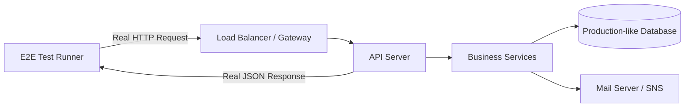

# 🏁 E2E Testing for APIs: The Full User Journey
> **Objective:** Validate the entire application stack from request to database | **Language:** Hinglish | **Standard:** 2026 Expert Framework

---

## 🧭 1. Beginner-Friendly Hinglish Explanation
E2E (End-to-End) Testing ka matlab hai "Shuru se ant tak poora system check karna".

- **The Problem:** Unit tests engine check karte hain, Integration tests gearbox check karte hain. Par kya poori Car road par chal rahi hai?
- **The Concept:** E2E test ek "Real Client" (jaise Postman ya ek Script) bankar aapke API ko real request bhejta hai. Ye check karta hai ki:
  1. Login hua?
  2. Profile update hui?
  3. Database mein record change hua?
  4. Email notify hua?
- **The Result:** Ye sabse zyada "Confidence" deta hai kyunki ye asli user behavior ko simulate karta hai.

---

## 🧠 2. Deep Technical Explanation
### 1. Difference from Integration Testing:
- **Integration:** Tests internal parts and mocks external APIs.
- **E2E:** Starts the actual server, connects to a real (test) database, and might even call external sandbox APIs.

### 2. The Black-Box Approach:
In E2E testing, we treat the API as a "Black Box". We don't care how the code works inside; we only care about the Input (Request) and Output (Response + Side effects).

### 3. Tools:
- **Playwright/Cypress:** Usually for UI, but excellent for API E2E too.
- **Supertest:** Running against a live staging server.
- **Newman:** Running Postman collections as tests in CLI.

---

## 🏗️ 3. Architecture Diagrams (The Black-Box Flow)


---

## 💻 4. Production-Ready Examples (Postman/Newman Style)
```typescript
// 2026 Standard: E2E Scenario - Complete User Lifecycle

import request from 'supertest';
const BASE_URL = process.env.API_URL || 'http://localhost:3000';

describe('User Lifecycle E2E', () => {
  let token: string;
  const user = { email: `test_${Date.now()}@susa.com`, password: 'Password123!' };

  test('Step 1: Register New User', async () => {
    const res = await request(BASE_URL).post('/auth/register').send(user);
    expect(res.status).toBe(201);
  });

  test('Step 2: Login and Get Token', async () => {
    const res = await request(BASE_URL).post('/auth/login').send(user);
    expect(res.status).toBe(200);
    token = res.body.token;
    expect(token).toBeDefined();
  });

  test('Step 3: Update Profile', async () => {
    const res = await request(BASE_URL)
      .patch('/user/profile')
      .set('Authorization', `Bearer ${token}`)
      .send({ name: 'Susa GPT' });
    
    expect(res.status).toBe(200);
    expect(res.body.name).toBe('Susa GPT');
  });

  // 💡 Pro Tip: E2E tests are 'Stateful'. Step 3 depends on Step 2.
});
```

---

## 🌍 5. Real-World Use Cases
- **Checkout Process:** Testing the whole flow from "Add to Cart" to "Payment Success".
- **Onboarding:** Ensuring a new user can sign up, verify email, and reach the dashboard.
- **Critical Patches:** Running E2E tests before a big production deploy to ensure nothing is broken.

---

## ❌ 6. Failure Cases
- **Database Pollution:** E2E tests create real data. If you don't clean up, your DB will be full of "test_user_123". **Fix: Use a dedicated staging DB and periodic wipes.**
- **Network Flakiness:** If a 3rd party API (like Twilio) is slow, your E2E test fails even if your code is fine.
- **Brittle Selectors:** In UI E2E, if a button changes ID, the test fails. (For APIs, this happens if JSON structure changes).

---

## 🛠️ 7. Debugging Section
| Problem | Diagnostic | Solution |
| :--- | :--- | :--- |
| **Test fails on CI but passes locally** | Env Differences | Check if CI has access to the Test DB and Env Secrets. |
| **Random Failures** | Race Conditions | Use `await` and 'Wait-for' patterns instead of fixed `sleep()`. |
| **Timeout** | Slow Staging Server | Increase the timeout for E2E suites (e.g., 30s per test). |

---

## ⚖️ 8. Tradeoffs
- **Confidence vs Cost:** E2E gives the most confidence but is the most expensive to write, run, and maintain.

---

## 🛡️ 9. Security Concerns
- **Exposing Test Endpoints:** Never leave "Test-only" endpoints (like `/test/delete-all-users`) enabled in production. **Fix: Use `if(env !== 'prod')` or separate builds.**

---

## 📈 10. Scaling Challenges
- **Parallelism:** Running 10 E2E tests at once on the same DB can cause "Unique Constraint" errors. **Fix: Use unique data for every test run.**

---

## 💸 11. Cost Considerations
- **Staging Infrastructure:** You need a production-like environment (DB, Redis, S3) just for tests, which increases cloud costs.

---

## ✅ 12. Best Practices
- **Run E2E tests in a Staging environment**, not on your local machine.
- **Use unique identifiers for test data** (e.g., `test_user_${Date.now()}`).
- **Focus on the "Critical Paths"** (Login, Payment, Signup).
- **Automate E2E on every 'Release' branch.**

---

## ⚠️ 13. Common Mistakes
- **Testing every single edge case in E2E.** (That's what Unit tests are for).
- **Not cleaning up test data.**

---

## 📝 14. Interview Questions
1. "What is the difference between an Integration test and an E2E test?"
2. "How do you handle external dependencies (like Stripe) in E2E tests?"
3. "What are the disadvantages of having too many E2E tests?"

---

## 🚀 15. Latest 2026 Production Patterns
- **Ephemeral Environments:** Spinning up a full, temporary cloud environment (Preview Branch) for every PR to run E2E tests.
- **Visual Regression for APIs:** Comparing the JSON response "Schema" and "Content" against a baseline snapshot.
- **Synthetics Monitoring:** Running E2E tests every 5 minutes against your real Production site to ensure it's still working (e.g., Datadog Synthetics).
漫
