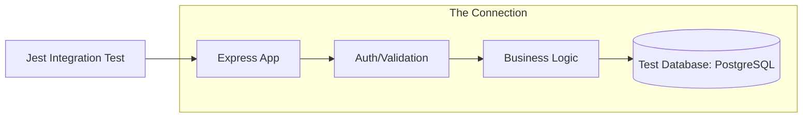

# 🔗 Integration Testing: Testing the Connection
> **Objective:** Ensure different modules of your system work together correctly | **Language:** Hinglish | **Standard:** 2026 Expert Framework

---

## 🧭 1. Beginner-Friendly Hinglish Explanation
Integration Testing ka matlab hai "Check karna ki chote-chote parts milkar sahi kaam kar rahe hain ya nahi".

- **The Problem:** Maan lijiye aapka "User Service" perfect hai aur aapka "Database" perfect hai. Par kya wo dono milkar sahi data save kar rahe hain? Kya connection timeout handle ho raha hai? 
- **The Difference:**
  - **Unit Test:** Engine check kiya (Isoloation).
  - **Integration Test:** Engine ko gearbox se connect karke dekha ki pahiya (wheel) ghoom raha hai ya nahi.
- **The Core:** Isme hum "Real" or "Semi-Real" dependencies use karte hain (jaise ek real test database).

---

## 🧠 2. Deep Technical Explanation
### 1. What to Test?
- **Database Integration:** Checking if queries actually work against a real Postgres/Mongo schema.
- **API Integration:** Testing an Express route from request to response (including middlewares).
- **Service-to-Service:** Testing if the "Order Service" correctly calls the "Payment Service".

### 2. The Setup:
Integration tests require a "Clean State".
- **Before Test:** Create a fresh database table or clear the cache.
- **Run Test:** Send a request or call a method.
- **After Test:** Wipe the data so it doesn't affect the next test.

### 3. Supertest:
A library commonly used with Jest to test Express APIs without actually starting a network server.

---

## 🏗️ 3. Architecture Diagrams (The Integration Boundary)


---

## 💻 4. Production-Ready Examples (Testing an Endpoint)
```typescript
// 2026 Standard: Integration Testing with Supertest and Prisma

import request from 'supertest';
import app from '../app';
import { prisma } from '../prisma';

describe('POST /api/v1/users', () => {
  
  // 1. Cleanup before every test
  beforeEach(async () => {
    await prisma.user.deleteMany();
  });

  test('should create a new user and save to DB', async () => {
    const userData = { email: 'test@example.com', password: 'password123' };

    const response = await request(app)
      .post('/api/v1/users')
      .send(userData);

    // 2. Check HTTP Response
    expect(response.status).toBe(201);
    expect(response.body.email).toBe(userData.email);

    // 3. Verify in the actual Database
    const userInDb = await prisma.user.findUnique({ where: { email: userData.email } });
    expect(userInDb).not.toBeNull();
  });

});
```

---

## 🌍 5. Real-World Use Cases
- **Signup Flow:** Ensuring the user is saved, a token is generated, and a welcome email event is emitted.
- **Search Filtering:** Testing that `GET /products?price_min=100` actually returns items from the database with price > 100.
- **File Uploads:** Ensuring the file is correctly stored on S3 and the URL is saved in the DB.

---

## ❌ 6. Failure Cases
- **Shared Test DB:** Two developers running tests at the same time on the same DB, causing data conflicts. **Fix: Use individual Test DBs or Docker.**
- **Leaking Data:** Forgetting to clear the database after a test, causing the next test to fail because a "Unique Email" already exists.
- **Network Dependency:** Relying on a real external API (like Stripe) which might be slow or down. **Fix: Use 'Prism' or 'MSW' to mock external network calls.**

---

## 🛠️ 7. Debugging Section
| Tool | Purpose | Tip |
| :--- | :--- | :--- |
| **Testcontainers** | Docker in Tests | Automatically spins up a fresh Postgres Docker container for your tests and kills it after. |
| **Prisma Migrate Reset** | Fresh DB | `npx prisma migrate reset --force` to wipe the test DB. |
| **`--detectOpenHandles`** | Cleanup | Tells you if you forgot to close a DB connection or server. |

---

## ⚖️ 8. Tradeoffs
- **Realism vs Speed:** Integration tests are much slower than unit tests because they involve I/O (Disk/Network).

---

## 🛡️ 9. Security Concerns
- **Auth in Tests:** How to test protected routes? **Solution: Create a 'Test User', generate a real JWT, and send it in the header.**

---

## 📈 10. Scaling Challenges
- **Massive Test Data:** If your integration tests need 1GB of data to run, they will be extremely slow. **Fix: Use 'Seeds' to create only the minimum data needed.**

---

## 💸 11. Cost Considerations
- **Database Hosting:** Running a dedicated "Staging/Testing" database in the cloud can add to your monthly costs.

---

## ✅ 12. Best Practices
- **Use a dedicated Test Database** (Never use Dev or Prod!).
- **Keep tests independent.**
- **Test the "Happy Path" and the "Error Path".**
- **Use `supertest` for API testing.**

---

## ⚠️ 13. Common Mistakes
- **Not closing DB connections** (Jest will hang).
- **Hardcoding IDs** in tests. (Always use the ID returned by the `create` operation).

---

## 📝 14. Interview Questions
1. "How do you test an Express API route from end-to-end (Integration)?"
2. "Why shouldn't you use your local development database for integration tests?"
3. "What is 'Supertest' and how does it work?"

---

## 🚀 15. Latest 2026 Production Patterns
- **Database Snapshots:** Quickly restoring a DB state from a filesystem snapshot for ultra-fast integration tests.
- **In-Memory Databases:** Using `sqlite` in-memory or `mongodb-memory-server` to avoid disk I/O during tests.
- **API Contract Testing:** Ensuring that the API response matches the OpenAPI/Swagger definition exactly.
漫
