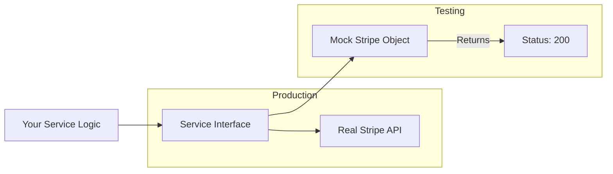

# 🎭 Mocking and Stubbing: Simulating Reality
> **Objective:** Isolate your code from external dependencies for deterministic testing | **Language:** Hinglish | **Standard:** 2026 Expert Framework

---

## 🧭 1. Beginner-Friendly Hinglish Explanation
Mocking aur Stubbing ka matlab hai "Asli cheez ki jagah nakli cheez (Duplicate) lagana".

- **The Problem:** Maan lijiye aapka code user ko email bhejta hai. Agar aap 100 baar test chalayenge, toh kya aap 100 real emails bhejenge? Nahi. 
- **The Solution:** Hum ek "Fake" Email Service banate hain jo sirf ye record karti hai ki "Haan, mujhe email bhejne ko kaha gaya tha".
- **The Difference:**
  - **Stub:** Ye sirf "Dumb" data return karta hai. (e.g., "Kuch bhi ho, user found return karo").
  - **Mock:** Ye behavior check karta hai. (e.g., "Check karo ki Email Service ko 'Welcome' message ke saath call kiya gaya ya nahi").
  - **Spy:** Ye asli function ko chalne deta hai par chupke se nazar rakhta hai ki kitni baar call hua.

Intuition: Ek film set par asli bomb ki jagah nakli bomb use karna "Mocking" hai.

---

## 🧠 2. Deep Technical Explanation
### 1. Why Mock?
- **Speed:** Mocks are in-memory and instant; real DBs/APIs take time.
- **Reliability:** External services (like Stripe) might be down or have rate limits.
- **Isoloation:** Testing ONLY your code logic, not the library's logic.

### 2. Mocking Levels:
- **Function Mocking:** `jest.fn()` to replace a single function.
- **Module Mocking:** `jest.mock('./api')` to replace an entire file/module.
- **Timer Mocking:** `jest.useFakeTimers()` to simulate 24 hours passing in 1ms.

### 3. Verification:
Checking if the mock was called correctly:
- `expect(mockFn).toHaveBeenCalled()`
- `expect(mockFn).toHaveBeenCalledWith(expectedData)`

---

## 🏗️ 3. Architecture Diagrams (The Mock Boundary)


---

## 💻 4. Production-Ready Examples (Mocking a Dependency)
```typescript
// 2026 Standard: Mocking an External API with Jest

import { PaymentService } from './payment.service';
import { StripeClient } from './stripe.client';

// 1. Mock the entire Stripe module
jest.mock('./stripe.client');

describe('PaymentService', () => {
  let paymentService: PaymentService;
  let mockStripeClient: jest.Mocked<StripeClient>;

  beforeEach(() => {
    mockStripeClient = new StripeClient() as any;
    paymentService = new PaymentService(mockStripeClient);
  });

  test('should charge user successfully', async () => {
    // 2. Setup a Stub (Return value)
    mockStripeClient.charge.mockResolvedValue({ status: 'succeeded', id: 'ch_123' });

    const result = await paymentService.processOrder('user_1', 100);

    // 3. Assertions
    expect(result.success).toBe(true);
    // 4. Verify Behavior (Mock)
    expect(mockStripeClient.charge).toHaveBeenCalledWith('user_1', 100);
  });
});
```

---

## 🌍 5. Real-World Use Cases
- **Payment Gateways:** Simulating success, failure, and network timeouts.
- **Third-Party Auth:** Mocking Google/GitHub OAuth responses.
- **File System:** Mocking `fs.readFile` so you don't actually need to create files on disk.
- **Current Time:** Mocking `Date.now()` to test logic that depends on the day of the week.

---

## ❌ 6. Failure Cases
- **Over-Mocking:** Mocking so much that you're not actually testing anything useful. (e.g., mocking the function you are supposed to test!).
- **Mocks Out of Sync:** Real API structure changes but your mock stays old. **Fix: Use TypeScript to ensure mocks match the interface.**
- **Fragile Tests:** Mocking internal implementation details that change often.

---

## 🛠️ 7. Debugging Section
| Method | Purpose | Tip |
| :--- | :--- | :--- |
| **`jest.clearAllMocks()`** | Reset call counts | Use this in `afterEach` to ensure tests don't leak call data. |
| **`jest.spyOn(obj, 'method')`** | Partial Mock | Useful when you want to mock one method but keep the rest of the object real. |
| **`mockFn.mock.calls`** | Inspection | See exactly what arguments were passed in every call. |

---

## ⚖️ 8. Tradeoffs
- **Mocking (Fast/Safe) vs Integration (Real/Slow):** Use Mocks for external things you don't control; use Integration for things you do control (like your DB).

---

## 🛡️ 9. Security Concerns
- **Logic Holes:** If your mock returns `true` for `isAuthorized` too easily, you might miss a security bug in your code logic.

---

## 📈 10. Scaling Challenges
- **Dependency Hell:** If a class has 10 dependencies, setting up 10 mocks is painful. **Fix: Use Dependency Injection and Factory functions.**

---

## 💸 11. Cost Considerations
- **Third-party usage:** Mocking saves you money on API credits (e.g., every OpenAI call costs money; mocks are free).

---

## ✅ 12. Best Practices
- **Mock only what you don't own** (External APIs, File System).
- **Use TypeScript** to keep mocks in sync with real classes.
- **Keep mocks simple.**
- **Prefer `jest.fn()`** for simple callbacks.

---

## ⚠️ 13. Common Mistakes
- **Testing the Mock:** `expect(mockResult).toBe(mockResult)`. (Useless test!).
- **Forgetting to mock an expensive dependency.**

---

## 📝 14. Interview Questions
1. "What is the difference between a Mock and a Stub?"
2. "When should you use `jest.spyOn` instead of `jest.fn`?"
3. "What are the risks of mocking internal private methods?"

---

## 🚀 15. Latest 2026 Production Patterns
- **MSW (Mock Service Worker):** Mocking at the network level instead of the code level. This works for both Node and Browser.
- **Prism (Stoplight):** Automatically generating mock servers from your OpenAPI/Swagger definition.
- **Deep Mocks:** Using libraries like `jest-mock-extended` to automatically mock complex interfaces with one line of code.
漫
