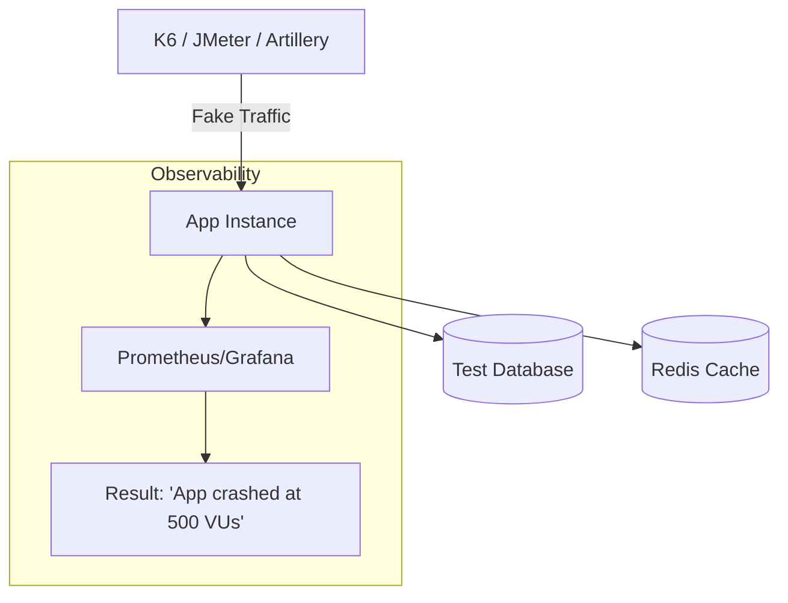

# ⚡ Performance Testing: Finding the Breaking Point
> **Objective:** Ensure your application can handle real-world traffic without slowing down or crashing | **Language:** Hinglish | **Standard:** 2026 Expert Framework

---

## 🧭 1. Beginner-Friendly Hinglish Explanation
Performance Testing ka matlab hai "App par bojh (Load) daal kar dekhna ki wo kab toot-ta hai".

- **The Problem:** Aapka app 1 user ke liye bahut fast chalta hai. Par kya hoga jab 1,000 log ek saath click karenge? Kya wo slow ho jayega? Kya database crash ho jayega?
- **The Solution:** Humein production par jane se pehle "Fake Traffic" generate karke test karna chahiye.
- **The Types:** 
  1. **Load Test:** Normal traffic mein kaisa chalta hai?
  2. **Stress Test:** Limit se zyada traffic mein kya hota hai?
  3. **Spike Test:** Agar traffic 1 second mein $10x$ ho jaye toh kya hoga?
  4. **Soak Test:** 24 ghante tak heavy load mein memory leak toh nahi ho rahi?
- **Intuition:** Ye ek "Bridge" banane jaisa hai. Aap use kholne se pehle us par bhari trucks (Traffic) chala kar dekhte hain taaki wo baad mein na gire.

---

## 🧠 2. Deep Technical Explanation
### 1. Key Metrics:
- **Latency (Response Time):** Time to finish one request (P95/P99 is what matters).
- **Throughput (TPS):** Transactions per second (How much work can be done?).
- **Saturation:** How much of the CPU/RAM is being used?

### 2. The Golden Rule of Performance:
Never trust your local machine. Test in an environment that is a "Mirror" of production.

### 3. Virtual Users (VUs):
Tools create "Virtual Users" that simulate real human behavior (Log in -> Click Search -> Add to Cart -> Logout).

---

## 🏗️ 3. Architecture Diagrams (The Performance Test Lab)


---

## 💻 4. Production-Ready Examples (Testing with K6)
```javascript
// 2026 Standard: K6 Script for Load Testing

import http from 'k6/http';
import { check, sleep } from 'k6';

export const options = {
  stages: [
    { duration: '30s', target: 20 }, // Ramp up to 20 users
    { duration: '1m', target: 20 },  // Stay at 20 users
    { duration: '30s', target: 0 },  // Ramp down to 0
  ],
};

export default function () {
  const res = http.get('https://test-api.susa.com/v1/products');
  
  check(res, {
    'status is 200': (r) => r.status === 200,
    'latency < 200ms': (r) => r.timings.duration < 200,
  });
  
  sleep(1);
}
```

---

## 🌍 5. Real-World Use Cases
- **Flash Sales:** Testing if the checkout can handle 50,000 orders in 1 minute.
- **New Feature Launch:** Checking if the new "AI Recommendation" engine slows down the home page.
- **Cost Optimization:** Finding out if you can run the app on a smaller server to save money.

---

## ❌ 6. Failure Cases
- **Test Database Mismatch:** Your test DB has 100 rows, but Prod has 100 million. Your test will be fast, but Prod will be slow. **Fix: Use 'Data Generation' to fill the test DB.**
- **Network Bottleneck:** The test tool itself is slow and can't generate enough traffic.
- **Cache Warming:** Testing an app with a full cache vs an empty cache gives very different results.

---

## 🛠️ 7. Debugging Section
| Problem | Diagnostic | Solution |
| :--- | :--- | :--- |
| **P99 > 2s** | DB Locks | Check for long-running SQL queries using "Slow Query Logs". |
| **App crashes at 100 VUs** | Memory Leak | Check the "Heap Usage" graph. If it only goes UP and never DOWN, you have a leak. |

---

## ⚖️ 8. Tradeoffs
- **High Realistic Testing (Expensive)** vs **Quick Synthetic Testing (Cheap but less accurate).**

---

## 🛡️ 9. Security Concerns
- **DDoS Trigger:** Never run a performance test against a server that has "Anti-DDoS" active, or you will get blocked! Use a private test environment.

---

## 📈 10. Scaling Challenges
- **Distributed Testing:** If you need to simulate 1 million users, one test machine isn't enough. You need a "Cluster" of machines running the test.

---

## 💸 11. Cost Considerations
- **Cloud Bill:** Generating 1 million requests can cost hundreds of dollars in bandwidth and server time.

---

## ✅ 12. Best Practices
- **Define clear SLAs** (e.g., "99% of requests must be < 500ms").
- **Test on a mirror of production.**
- **Monitor the system during the test.**
- **Run performance tests after every major release.**

---

## ⚠️ 13. Common Mistakes
- **Testing on your laptop.**
- **Ignoring the 'Long Tail'** (P99/P99.9 latency).
- **Not testing the Database.**

---

## 📝 14. Interview Questions
1. "What is the difference between Load testing and Stress testing?"
2. "Why is P99 latency more important than Average latency?"
3. "How do you identify a memory leak during a soak test?"

---

## 🚀 15. Latest 2026 Production Patterns
- **Continuous Profiling:** Tools that constantly monitor the CPU usage of every function in production to find "Performance Regressions" automatically.
- **Shadow Traffic:** Copying REAL user traffic from production and sending it to a test server to see how it handles real-world complexity.
- **Performance Budgets in CI:** If a Pull Request makes the build 10ms slower, the CI fails.
漫
