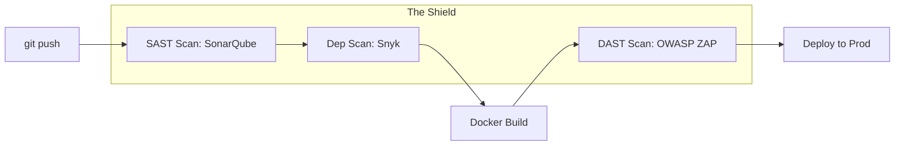

# 🛡️ Security Testing: Thinking Like a Hacker
> **Objective:** Proactively find and fix vulnerabilities in your code and infrastructure | **Language:** Hinglish | **Standard:** 2026 Expert Framework

---

## 🧭 1. Beginner-Friendly Hinglish Explanation
Security Testing ka matlab hai "Apne app ko hack karne ki koshish karna".

- **The Problem:** Ek dev sirf "Features" ke baare mein sochta hai. Ek hacker "Galti" dhoondhta hai. Agar aapne testing nahi ki, toh aapko tab pata chalega jab data leak ho chuka hoga.
- **The Solution:** Humein automation aur manual checks chahiye vulnerabilities dhoondhne ke liye.
- **The Types:** 
  1. **SAST (Static Analysis):** Code ko padhkar galti dhoondhna (like ESLint for security).
  2. **DAST (Dynamic Analysis):** Running app par attacks karke dekhna.
  3. **Dependency Scanning:** Missing updates aur purani libraries dhoondhna.
  4. **Penetration Testing:** Ek expert hacker ko hire karna attack karne ke liye.
- **Intuition:** Ye "Fire Drill" ki tarah hai. Aap aag lagne ka intezar nahi karte, aap khud check karte hain ki saare doors khul rahe hain aur alarm baj raha hai ya nahi.

---

## 🧠 2. Deep Technical Explanation
### 1. The OWASP Top 10:
The standard list of the 10 most critical web security risks. Your testing should cover:
- Broken Access Control.
- Cryptographic Failures.
- Injection (SQL/NoSQL).
- Insecure Design.

### 2. SAST vs DAST:
- **SAST (Static Application Security Testing):** Scans the source code. Fast, catches issues early (CI/CD).
- **DAST (Dynamic Application Security Testing):** Scans the live URL. Catches configuration issues and runtime bugs.

### 3. Vulnerability Scanning:
Automated tools that scan your system for known CVEs (Common Vulnerabilities and Exposures).

---

## 🏗️ 3. Architecture Diagrams (Security in CI/CD)


---

## 💻 4. Production-Ready Examples (Scanning with NPM Audit)
```bash
# 2026 Standard: Automated Security Checks

# 1. Check for known vulnerabilities in libraries
npm audit

# 2. Fix them automatically (if possible)
npm audit fix

# 3. Use 'Snyk' for deeper analysis
npx snyk test

# 4. Check for hardcoded secrets (API keys) in code
npx gitleaks detect --source . -v
```

---

## 🌍 5. Real-World Use Cases
- **Compliance (SOC2/ISO):** Mandatory security testing before you can sell to big companies.
- **Data Privacy:** Ensuring no PII (User data) is being leaked in API responses.
- **Auth Hardening:** Testing if someone can bypass the login screen by changing a cookie value.

---

## ❌ 6. Failure Cases
- **False Positives:** A tool says "Security Risk!" but it's actually safe. Developers start ignoring the tool. **Fix: Fine-tune the rules.**
- **Testing only 'Main':** A hacker finds a hole in the "Dev" or "Staging" server and jumps into the production database.
- **Outdated Scanners:** Using a 2024 scanner in 2026. Hackers are always 1 step ahead.

---

## 🛠️ 7. Debugging Section
| Tool | Purpose | Tip |
| :--- | :--- | :--- |
| **Checkmarx / Snyk** | SAST | Great for finding XSS or SQLi directly in your TypeScript code. |
| **OWASP ZAP** | DAST | An open-source tool that acts like a browser and tries to hack your URL. |

---

## ⚖️ 8. Tradeoffs
- **Full Security (Slow releases)** vs **Speed (High risk).** The goal is "DevSecOps"—security as part of the speed.

---

## 🛡️ 9. Security Concerns
- **Sensitive Results:** If your security test finds a major hole, store the results securely! If a hacker gets the test report, you are dead.

---

## 📈 10. Scaling Challenges
- **Massive Repos:** Scanning 1 million lines of code can take hours. **Fix: Only scan changed files (Incremental scans).**

---

## 💸 11. Cost Considerations
- **Pentesting Cost:** A professional human pentest can cost ₹5 Lakhs to ₹20 Lakhs per year.

---

## ✅ 12. Best Practices
- **Shift Left:** Test for security as early as possible (on the developer's laptop).
- **Update your dependencies weekly.**
- **Never hardcode secrets.**
- **Use 'Security Headers' (Helmet.js).**
- **Log all security-related events** (e.g., failed login attempts).

---

## ⚠️ 13. Common Mistakes
- **Assuming 'No warnings' means 'Safe'.**
- **Ignoring the security of the 'Build Server' (CI/CD).**

---

## 📝 14. Interview Questions
1. "What is the difference between SAST and DAST?"
2. "Name three items from the OWASP Top 10."
3. "How do you prevent hardcoded secrets from reaching GitHub?"

---

## 🚀 15. Latest 2026 Production Patterns
- **IAST (Interactive Analysis):** A hybrid of SAST and DAST that watches the code while it's being tested by a QA person.
- **Secret Scanning by Default:** GitHub/GitLab now automatically block your `git push` if they detect an AWS key in your code.
- **AI-red Teaming:** Using specialized LLMs to try and find logical flaws in your API and business logic.
漫
