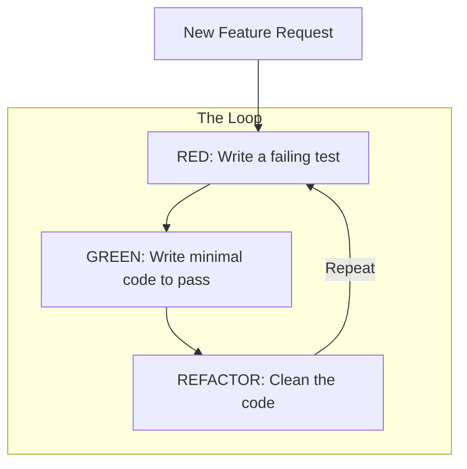

# 🏎️ Test-Driven Development (TDD): Design by Testing
> **Objective:** Write better code by writing tests first | **Language:** Hinglish | **Standard:** 2026 Expert Framework

---

## 🧭 1. Beginner-Friendly Hinglish Explanation
TDD (Test-Driven Development) ka matlab hai "Pehele sawaal (Test) likho, phir uska jawaab (Code)".

- **The Problem:** Aksar hum code pehle likhte hain aur test baad mein. Isse do nuksan hote hain:
  1. Hum sirf "Happy Path" test karte hain.
  2. Humara code "Hard to test" ban jata hai.
- **The Solution (The 3 Steps):**
  1. **RED:** Ek aisa test likho jo fail ho (kyunki abhi code hi nahi hai).
  2. **GREEN:** Sirf utna code likho jisse test pass ho jaye (no extra features).
  3. **REFACTOR:** Code ko saaf karo (clean code) aur check karo ki test abhi bhi green hai.
- **Intuition:** Ye ek "Safety Net" ki tarah hai. Aap tabhi aage badhte hain jab pichla step bilkul sahi ho.

---

## 🧠 2. Deep Technical Explanation
### 1. The Philosophy:
TDD is not about testing; it's about **Design**. It forces you to think about the API and requirements before you start implementing.

### 2. Benefits:
- **Zero Fear:** You can refactor large parts of the system because the tests will catch any mistakes instantly.
- **Living Documentation:** The tests describe exactly how the code should behave.
- **Modular Code:** Since you have to test every function, you naturally write smaller, decoupled functions.

### 3. The Rules:
- You are not allowed to write any production code unless it is to make a failing unit test pass.
- You are not allowed to write more of a unit test than is sufficient to fail.

---

## 🏗️ 3. Architecture Diagrams (The TDD Cycle)


---

## 💻 4. Production-Ready Examples (The TDD Workflow)
```typescript
// Scenario: Build a function that masks emails: "test@gmail.com" -> "t***@gmail.com"

// 🔴 STEP 1: RED (The Test)
test('should mask email correctly', () => {
  expect(maskEmail('aryan@gmail.com')).toBe('a***@gmail.com');
});
// Result: FAIL (ReferenceError: maskEmail is not defined)

// 🟢 STEP 2: GREEN (The Minimal Code)
function maskEmail(email: string) {
  const [user, domain] = email.split('@');
  return `${user[0]}***@${domain}`;
}
// Result: PASS!

// 🔵 STEP 3: REFACTOR (Make it robust)
function maskEmail(email: string) {
  if (!email.includes('@')) return email;
  const [user, domain] = email.split('@');
  if (user.length < 2) return email;
  return `${user[0]}***@${domain}`;
}
// Result: STILL PASSING!
```

---

## 🌍 5. Real-World Use Cases
- **Financial Calculations:** Ensuring that tax logic is 100% correct before writing the logic.
- **Data Parsers:** Testing edge cases of CSV/JSON parsing first.
- **Bug Fixing:** When a bug is reported, first write a test that *reproduces* the bug (Red), then fix the code (Green).

---

## ❌ 6. Failure Cases
- **Slow TDD:** Spending too much time testing trivial things (like getters and setters).
- **Fragile Tests:** Writing tests that are too close to the implementation. If the test says "Check if `Array.sort` was called," it's a bad test. It should say "Check if result is sorted."
- **Skipping Refactor:** Going from Red to Green and then moving to the next feature without cleaning the code.

---

## 🛠️ 7. Debugging Section
| Problem | Diagnostic | Solution |
| :--- | :--- | :--- |
| **"I don't know what to test first"** | Requirement check | Start with the simplest possible case (e.g., empty input). |
| **Code is hard to test** | Tight Coupling | Use **Dependency Injection**. |

---

## ⚖️ 8. Tradeoffs
- **Velocity vs Quality:** TDD feels slower in the first week, but by the first month, you are faster than non-TDD developers because you don't spend time on "Bug fixing".

---

## 🛡️ 9. Security Concerns
- **TDD for Security:** Write tests for invalid inputs (Negative Testing) to ensure your app handles them safely.

---

## 📈 10. Scaling Challenges
- **Massive Refactors:** In a large system, TDD is the only way to refactor safely. Without it, you are "Coding by Coincidence".

---

## 💸 11. Cost Considerations
- **Testing Debt:** If you don't use TDD, the cost of adding features increases exponentially over time as the code becomes a "Mess".

---

## ✅ 12. Best Practices
- **Keep tests small.**
- **Don't skip the Refactor step.**
- **Use a 'Watch Mode' (jest --watch) to see results instantly.**

---

## ⚠️ 13. Common Mistakes
- **Writing too much code in the Green step.** (Only write what is needed to pass).
- **Not testing Edge Cases** (null, empty, large numbers).

---

## 📝 14. Interview Questions
1. "Explain the Red-Green-Refactor cycle."
2. "How does TDD lead to better software architecture?"
3. "Is 100% code coverage a good goal for TDD?"

---

## 🚀 15. Latest 2026 Production Patterns
- **AI-Copilot for TDD:** Using AI to generate the 'Green' implementation after the developer writes the 'Red' test.
- **Property-Based Testing:** Writing one test that generates 100 random inputs to find edge cases automatically.
漫
