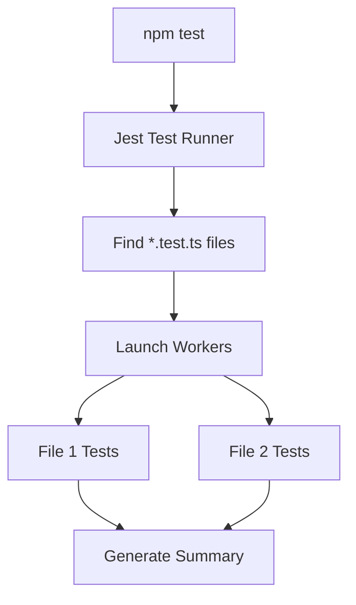

# 🃏 Unit Testing with Jest: The Testing Standard
> **Objective:** Master the industry-standard testing framework for Node.js | **Language:** Hinglish | **Standard:** 2026 Expert Framework

---

## 🧭 1. Beginner-Friendly Hinglish Explanation
Jest Node.js ecosystem ka sabse popular "Testing Tool" hai. 

- **Why Jest?** Ye "All-in-one" hai. Aapko alag se assertion library (Chai) ya spy library (Sinon) ki zaroorat nahi padti.
- **The Concept:** Unit Testing ka matlab hai code ke sabse chote hisse (Unit) ko isoloation mein test karna. Maan lijiye ek car hai, toh engine ko alag se test karna "Unit Testing" hai.
- **Features:** 
  - **Fast:** Parallel mein tests chalta hai.
  - **Snapshots:** UI ya JSON structure change hone par turant batata hai.
  - **Mocks:** External cheezon (DB/API) ko "Fake" karne mein expert hai.

---

## 🧠 2. Deep Technical Explanation
### 1. Key Matchers:
- `toBe(value)`: Exact equality (`===`).
- `toEqual(object)`: Deep equality (Checks object properties).
- `toContain(item)`: Checks if an array contains an item.
- `toThrow(error)`: Checks if a function throws an error.

### 2. Lifecycles:
- `beforeAll / afterAll`: Runs once for the entire file.
- `beforeEach / afterEach`: Runs before/after every single `test()` or `it()` block. Used to reset state.

### 3. Asynchronous Testing:
Jest handles `async/await` perfectly. You can just return a promise or use `done()` callback.

---

## 🏗️ 3. Architecture Diagrams (The Jest Execution)


---

## 💻 4. Production-Ready Examples (Testing a Service)
```typescript
// 2026 Standard: Unit Testing a Business Logic Service

import { AuthService } from './auth.service';

describe('AuthService', () => {
  let authService: AuthService;

  beforeEach(() => {
    // Initialize before every test to avoid state pollution
    authService = new AuthService();
  });

  describe('generateHash()', () => {
    test('should create a valid hash for a password', async () => {
      const password = 'my-secret-password';
      const hash = await authService.generateHash(password);
      
      expect(hash).toBeDefined();
      expect(hash).not.toBe(password); // Should be encrypted
    });
  });

  describe('validateEmail()', () => {
    test('should return true for valid email', () => {
      expect(authService.validateEmail('test@gmail.com')).toBe(true);
    });

    test('should return false for invalid email', () => {
      expect(authService.validateEmail('invalid-email')).toBe(false);
    });
  });
});
```

---

## 🌍 5. Real-World Use Cases
- **Validation Logic:** Testing complex Regex or Zod schemas.
- **Utility Functions:** Testing date formatting, price calculations, or string manipulation.
- **State Management:** Testing how an object changes after multiple method calls.

---

## ❌ 6. Failure Cases
- **Slow Unit Tests:** If a unit test calls a database, it's not a unit test anymore. It's an integration test. **Fix: Mock the database.**
- **Hidden State:** Using global variables that one test changes and another test relies on. **Fix: Use `beforeEach` to reset.**
- **Testing Private Methods:** Trying to test `private` functions. **Fix: Only test the public API; the private logic is covered by the public calls.**

---

## 🛠️ 7. Debugging Section
| Problem | Diagnostic | Solution |
| :--- | :--- | :--- |
| **"ReferenceError: jest is not defined"** | Environment | Ensure `jest` is in your `devDependencies` and `ts-jest` is configured. |
| **Timeout Error** | Slow async logic | Increase `jest.setTimeout(10000)` or fix the slow code. |
| **Mocks not working** | Hoisting issue | Ensure `jest.mock()` is at the very top of the file. |

---

## ⚖️ 8. Tradeoffs
- **Jest vs Vitest:** Jest is more stable and established; Vitest is much faster and uses the same API.

---

## 🛡️ 9. Security Concerns
- **Mocking Sensitive Functions:** Ensure your mocks accurately reflect the security behavior (e.g., if a real function throws on `null`, your mock should too).

---

## 📈 10. Scaling Challenges
- **Memory Leaks:** Large test suites can run out of memory. **Fix: Use `--runInBand` or `--logHeapUsage` to debug.**

---

## 💸 11. Cost Considerations
- **Maintenance:** Writing unit tests for code that changes every day can be expensive. Only test stable business logic.

---

## ✅ 12. Best Practices
- **Follow the AAA pattern:** Arrange (Setup), Act (Run code), Assert (Check result).
- **One assertion per test** (Ideally).
- **Use `it.each`** for testing multiple data inputs in one block.

---

## ⚠️ 13. Common Mistakes
- **Forgetting `await`** in async tests.
- **Testing built-in libraries** (e.g., testing if `Array.push` works).

---

## 📝 14. Interview Questions
1. "What is the difference between `toBe` and `toEqual`?"
2. "How do you handle testing an asynchronous function in Jest?"
3. "Why is `beforeEach` important in unit testing?"

---

## 🚀 15. Latest 2026 Production Patterns
- **Jest + SWC:** Using a Rust-based compiler (`@swc/jest`) to run tests 10x faster than traditional `ts-jest`.
- **Snapshot Testing for APIs:** Taking snapshots of large JSON responses to detect unexpected field changes.
漫
