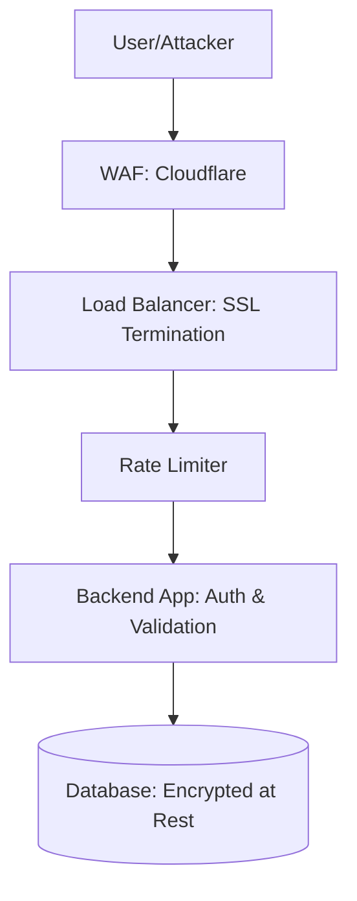

# 🛡️ Backend Security Checklist: Hardening your Server
> **Objective:** Ensure your production system is protected against common attacks | **Language:** Hinglish | **Standard:** 2026 Expert Framework

---

## 🧭 1. Beginner-Friendly Hinglish Explanation
Security ka matlab hai "Apne app ke darwaze aur khidkiyan band rakhna" taaki koi chor (hacker) andar na aa sake.

- **The Mindset:** Hacker humesha sabse kamzor kadi (weakest link) dhundhta hai. Bhale hi aapka auth strong ho, agar aapne server ke purane versions update nahi kiye, toh aap khatre mein hain.
- **The Checklist:** Ye ek list hai un saari cheezon ki jo ek "Production-ready" backend mein honi chahiye.
- **The Goal:** Security ek "Feature" nahi hai, ye ek "Process" hai. Ise day one se dhyan mein rakhna chahiye.

---

## 🧠 2. Deep Technical Explanation
Security in 2026 is based on the **Defense in Depth** principle—multiple layers of security so if one fails, others protect the system.

### 1. Data Security:
- **Hashing:** Use Argon2 for passwords.
- **Encryption:** Use AES-256 for sensitive PII (Personally Identifiable Information) in the DB.
- **TLS:** Always use HTTPS.

### 2. Dependency Security:
- **SCA (Software Composition Analysis):** Checking your `package.json` for libraries with known vulnerabilities (CVEs).

### 3. Network Security:
- **WAF (Web Application Firewall):** Blocking bad IPs and SQL injection at the edge.
- **Rate Limiting:** Preventing brute-force attacks.

---

## 🏗️ 3. Architecture Diagrams (Layers of Defense)


---

## 💻 4. Production-Ready Examples (Security Headers)
```typescript
// 2026 Standard: Using Helmet for Essential Security Headers

import express from 'express';
import helmet from 'helmet';

const app = express();

// 1. Apply Helmet to set various HTTP headers for security
app.use(helmet());

// 2. Custom CSP (Content Security Policy)
app.use(
  helmet.contentSecurityPolicy({
    directives: {
      defaultSrc: ["'self'"],
      scriptSrc: ["'self'", "trusted-scripts.com"],
      objectSrc: ["'none'"],
      upgradeInsecureRequests: [],
    },
  })
);

// 3. Disable X-Powered-By to hide Express
app.disable('x-powered-by');
```

---

## 🌍 5. Real-World Use Cases
- **Fintech Apps:** Mandatory compliance with PCI-DSS standards.
- **Healthcare:** Ensuring HIPAA compliance by encrypting all patient data.
- **Public APIs:** Protecting against "Scraping" using advanced rate limiting.

---

## ❌ 6. Failure Cases
- **Exposed `.env` files:** Uploading your secrets to GitHub.
- **Insecure Default Configurations:** Using default passwords for Redis or MongoDB.
- **Lack of Logging:** Being hacked but not knowing it because you don't have audit logs.

---

## 🛠️ 7. Debugging Section
| Tool | Purpose | Tip |
| :--- | :--- | :--- |
| **npm audit** | Dependency Scan | Run it after every `npm install`. |
| **Snyk** | Vulnerability Database | Integrates with GitHub to auto-fix security bugs. |
| **OWASP ZAP** | Penetration Testing | A free tool to "Attack" your own server and find holes. |

---

## ⚖️ 8. Tradeoffs
- **Security vs User Friction:** 2FA is secure but can be annoying for users.
- **Security vs Performance:** Complex encryption and deep packet inspection add latency.

---

## 🛡️ 9. Security Concerns
- **Social Engineering:** The most secure code can't protect against a developer giving their password to a "Fake IT Support" person.

---

## 📈 10. Scaling Challenges
- **Secret Distribution:** Managing secrets across 100 microservices. **Fix: Use HashiCorp Vault or AWS Secrets Manager.**

---

## 💸 11. Cost Considerations
- **Security Scanners:** Tools like Snyk or GitHub Advanced Security can be expensive for large teams.

---

## ✅ 12. Best Practices (The Quick Checklist)
- [ ] Use HTTPS only.
- [ ] Implement Rate Limiting.
- [ ] Hash passwords with Argon2.
- [ ] Sanitize all user inputs.
- [ ] Set `HttpOnly` and `Secure` on cookies.
- [ ] Hide server version headers.
- [ ] Use a Web Application Firewall (WAF).
- [ ] Regularly update dependencies.

---

## ⚠️ 13. Common Mistakes
- **Assuming Internal Network is safe.**
- **Using older versions of Node.js** that have unpatched security holes.

---

## 📝 14. Interview Questions
1. "What is the 'Principle of Least Privilege'?"
2. "How would you protect a Node.js server against a DDoS attack?"
3. "What is 'Defense in Depth'?"

---

## 🚀 15. Latest 2026 Production Patterns
- **Zero Trust Architecture:** Never trust any request, even from inside the internal network. Every call must be authenticated.
- **AI-Driven Threat Detection:** Using models to detect unusual patterns in API traffic (e.g., a user trying to access 1000 records in 1 second).
- **Immutable Infrastructure:** Deploying servers that cannot be modified after launch, preventing hackers from installing backdoors.
漫
