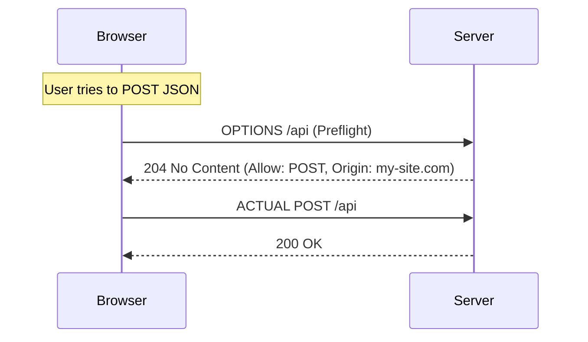

# 🌐 CORS and Security Headers: Controlling Access
> **Objective:** Master browser-level security policies | **Language:** Hinglish | **Standard:** 2026 Expert Framework

---

## 🧭 1. Beginner-Friendly Hinglish Explanation
CORS (Cross-Origin Resource Sharing) aur Security Headers aapke server ke "Permission Slips" hain jo browser ko batate hain ki use kya allow karna hai aur kya nahi.

- **The Problem:** Browser ki ek "Same-Origin Policy" hoti hai. Agar aapki website `a.com` par hai, toh wo `b.com` se data nahi maang sakti bina permission ke (Security reason: taaki koi malicious site aapka session na chura sake).
- **The Solution (CORS):** Backend ko batana padta hai: "Haan, `my-frontend.com` ko allow karo mere APIs use karne ke liye".
- **Security Headers:** Ye headers browser ko order dete hain: "Sirf HTTPS use karo," "Is site ko iframe mein mat dikhao," etc.

---

## 🧠 2. Deep Technical Explanation
### 1. The CORS Preflight:
For "Complex" requests (like those with JSON or custom headers), the browser sends an `OPTIONS` request first to see if the server allows the actual request. This is the **Preflight**.

### 2. Key CORS Headers:
- `Access-Control-Allow-Origin`: Which domains can access.
- `Access-Control-Allow-Methods`: Which verbs (GET, POST, etc.) are allowed.
- `Access-Control-Allow-Headers`: Which custom headers are allowed.

### 3. Essential Security Headers (via Helmet):
- **HSTS (Strict-Transport-Security):** Forces the browser to use HTTPS.
- **X-Frame-Options:** Prevents "Clickjacking" by not allowing the site to be put in an `<iframe>`.
- **X-Content-Type-Options:** Prevents the browser from "guessing" the content type (MIME sniffing).

---

## 🏗️ 3. Architecture Diagrams (The CORS Preflight)


---

## 💻 4. Production-Ready Examples (Configuring CORS)
```typescript
// 2026 Standard: Strict CORS Configuration

import cors from 'cors';

const allowedOrigins = ['https://susa-gpt.com', 'https://admin.susa-gpt.com'];

const corsOptions = {
  origin: (origin: string | undefined, callback: any) => {
    // Allow requests with no origin (like mobile apps or curl)
    if (!origin) return callback(null, true);
    
    if (allowedOrigins.indexOf(origin) !== -1) {
      callback(null, true);
    } else {
      callback(new Error('Not allowed by CORS'));
    }
  },
  methods: ['GET', 'POST', 'PUT', 'DELETE', 'PATCH'],
  allowedHeaders: ['Content-Type', 'Authorization'],
  credentials: true, // Allow cookies to be sent
  maxAge: 86400 // Cache preflight response for 24 hours
};

app.use(cors(corsOptions));
```

---

## 🌍 5. Real-World Use Cases
- **Public APIs:** Setting `origin: '*'` to allow anyone to use the API (e.g., Weather API).
- **Internal Tools:** Setting strict origins to only allow your specific frontend.
- **Microservices:** Managing CORS when the Frontend, Auth, and API are on different subdomains.

---

## ❌ 6. Failure Cases
- **The Wildcard Mistake:** Setting `origin: '*'` on an API that uses Cookies. This is **Forbidden** and will crash the request.
- **Case-Sensitivity:** `HTTPS` vs `https` mismatch in the allowed origins.
- **Missing `Vary: Origin` Header:** Causing CDN caching issues where one user's CORS response is served to another.

---

## 🛠️ 7. Debugging Section
| Problem | Diagnostic | Solution |
| :--- | :--- | :--- |
| **CORS Error in Browser** | Check Network -> Console | See exactly which header is missing. |
| **Preflight fails (405)** | Check `OPTIONS` handler | Ensure your server handles `OPTIONS` requests (The `cors` middleware does this). |
| **Credentials not sent** | Check `credentials: true` | Must be set on both Frontend (Fetch/Axios) and Backend. |

---

## ⚖️ 8. Tradeoffs
- **Strict vs Permissive:** High security vs ease of development. (Tip: Use a permissive CORS for local dev but strict for production).

---

## 🛡️ 9. Security Concerns
- **Reflected Origin:** Never just echo back the `Origin` header from the request without validating it against a whitelist. This is a security hole.

---

## 📈 10. Scaling Challenges
- **Caching Preflights:** Thousands of `OPTIONS` requests can slow down your app. Use `maxAge` to cache them in the browser.

---

## 💸 11. Cost Considerations
- **Bandwidth:** `OPTIONS` requests add a tiny bit of bandwidth and latency. Caching them saves money and improves UX.

---

## ✅ 12. Best Practices
- **Use a Whitelist**, never `*` in production.
- **Use Helmet** for all other security headers.
- **Always use HTTPS.**
- **Set `credentials: true` only if needed.**

---

## ⚠️ 13. Common Mistakes
- **Forgetting subdomains** (e.g., `api.example.com` vs `example.com`).
- **Trailing slashes** in the origin URL (`https://site.com/` is different from `https://site.com`).

---

## 📝 14. Interview Questions
1. "What is a CORS preflight request and why is it needed?"
2. "Why can't you use a wildcard `*` with `credentials: true`?"
3. "What does the `Strict-Transport-Security` header do?"

---

## 🚀 15. Latest 2026 Production Patterns
- **COOP / COEP Headers:** Stricter isolation for cross-origin resources to prevent side-channel attacks (like Spectre).
- **Spec-defined CORS:** Using tools like **Kubernetes Ingress** or **Cloudflare Workers** to handle CORS at the edge, saving your Node.js CPU.
漫
