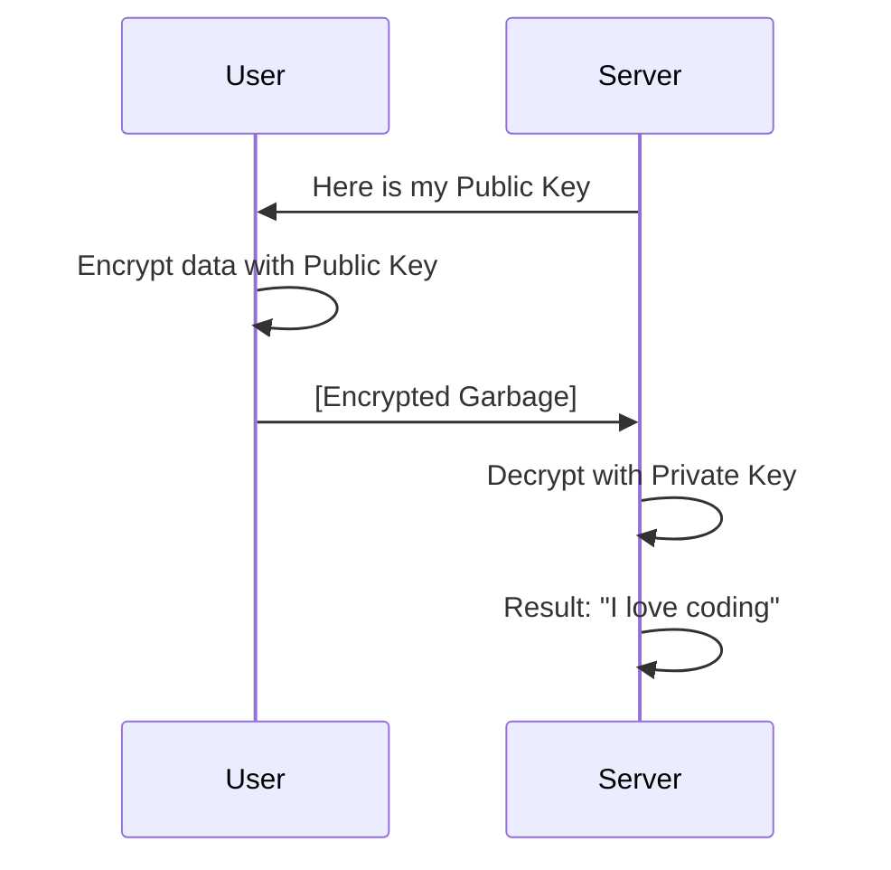

# 🔐 Data Encryption: Protecting the Secrets
> **Objective:** Master symmetric and asymmetric encryption to secure data at rest and in transit | **Language:** Hinglish | **Standard:** 2026 Expert Framework

---

## 🧭 1. Beginner-Friendly Hinglish Explanation
Data Encryption ka matlab hai "Data ko ek aisi secret language mein badalna jise sirf aap hi samajh sakein".

- **The Problem:** Agar koi hacker aapka database chura leta hai, aur usme users ke messages plain text mein hain, toh game over.
- **The Solution:** Hum data ko "Lock" (Encrypt) kar dete hain. Bina "Chabi" (Key) ke, wo data sirf garbage dikhta hai.
- **The Concept:** 
  1. **Plaintext:** Real data (e.g., "Hello").
  2. **Ciphertext:** Encrypted data (e.g., "x8&kL9").
  3. **Encryption:** Plaintext -> Ciphertext.
  4. **Decryption:** Ciphertext -> Plaintext.
- **Intuition:** Ye ek "Digital Locker" ki tarah hai. Aap apna saman andar rakhte hain aur ek password lagate hain. Bina password ke koi nahi dekh sakta andar kya hai.

---

## 🧠 2. Deep Technical Explanation
### 1. Symmetric Encryption:
Use the **SAME key** for both encryption and decryption.
- **Standard:** **AES-256** (Advanced Encryption Standard).
- **Pros:** Very fast.
- **Cons:** How do you safely share the key with someone else?

### 2. Asymmetric Encryption:
Uses a **Key Pair**:
- **Public Key:** Anyone can have it. Used to ENCRYPT.
- **Private Key:** Only you have it. Used to DECRYPT.
- **Standard:** **RSA** or **Elliptic Curve (ECC)**.
- **Intuition:** Anyone can put a letter in your mailbox (Public Key), but only you can open the mailbox (Private Key).

### 3. Encryption States:
- **In Transit:** Data moving over the network (HTTPS/TLS).
- **At Rest:** Data stored on a disk (Database encryption).

---

## 🏗️ 3. Architecture Diagrams (Asymmetric Key Exchange)


---

## 💻 4. Production-Ready Examples (AES Encryption in Node.js)
```typescript
// 2026 Standard: Secure AES-256-GCM Encryption

import crypto from 'crypto';

const algorithm = 'aes-256-gcm';
const secretKey = crypto.randomBytes(32); // Keep this very safe!
const iv = crypto.randomBytes(16); // Initialization Vector

const encrypt = (text: string) => {
  const cipher = crypto.createCipheriv(algorithm, secretKey, iv);
  let encrypted = cipher.update(text, 'utf8', 'hex');
  encrypted += cipher.final('hex');
  const authTag = cipher.getAuthTag().toString('hex');
  
  return { encrypted, iv: iv.toString('hex'), authTag };
};

const decrypt = (encrypted: string, ivHex: string, authTagHex: string) => {
  const decipher = crypto.createDecipheriv(algorithm, secretKey, Buffer.from(ivHex, 'hex'));
  decipher.setAuthTag(Buffer.from(authTagHex, 'hex'));
  let decrypted = decipher.update(encrypted, 'hex', 'utf8');
  decrypted += decipher.final('utf8');
  return decrypted;
};
```

---

## 🌍 5. Real-World Use Cases
- **Messaging Apps (WhatsApp):** End-to-End encryption (Asymmetric).
- **Databases:** Encrypting the "Credit Card Number" column (Symmetric).
- **Web Browsing:** HTTPS (TLS) uses asymmetric encryption to exchange a symmetric key.

---

## ❌ 6. Failure Cases
- **Weak Keys:** Using a simple password as an encryption key. **Fix: Use `crypto.randomBytes`.**
- **Hardcoding Keys:** Putting the key in `app.js`. **Fix: Use AWS Secrets Manager or Vault.**
- **Reusing IVs:** Using the same IV for every encryption makes the pattern predictable for hackers.

---

## 🛠️ 7. Debugging Section
| Problem | Diagnostic | Solution |
| :--- | :--- | :--- |
| **Decryption Error** | Auth Tag Mismatch | The data was tampered with or the wrong key/IV was used. |
| **Garbage Output** | Encoding | Ensure you are using consistent encoding (e.g., `hex` or `base64`) for both steps. |

---

## ⚖️ 8. Tradeoffs
- **Asymmetric (Secure but Slow)** vs **Symmetric (Fast but Key-sharing is hard).** Most systems use both together.

---

## 🛡️ 9. Security Concerns
- **Quantum Computing:** Future computers might break RSA. **Fix: Use 'Post-Quantum Cryptography' algorithms.**
- **Side-channel Attacks:** Measuring the time it takes to decrypt to guess the key.

---

## 📈 10. Scaling Challenges
- **Key Rotation:** Changing the key for 1 billion encrypted rows is extremely hard. **Fix: Use 'Envelope Encryption' (Master Key encrypts Data Keys).**

---

## 💸 11. Cost Considerations
- **CPU Overhead:** Constant encryption/decryption uses more CPU power.

---

## ✅ 12. Best Practices
- **Use AES-256-GCM (It's the safest).**
- **Use random IVs for every encryption.**
- **Never store keys in the database.**
- **Use a dedicated Key Management Service (KMS).**
- **Encrypt data before it hits the disk.**

---

## ⚠️ 13. Common Mistakes
- **Inventing your own encryption algorithm.** (NEVER DO THIS!).
- **Using 'MD5' or 'SHA1' for encryption.** (They are for hashing, not encryption).

---

## 📝 14. Interview Questions
1. "Explain the difference between Symmetric and Asymmetric encryption."
2. "What is an IV (Initialization Vector) and why is it needed?"
3. "How does HTTPS use both types of encryption?"

---

## 🚀 15. Latest 2026 Production Patterns
- **Homomorphic Encryption:** Performing math on encrypted data WITHOUT decrypting it first (The holy grail of privacy).
- **TEE (Trusted Execution Environments):** Decrypting data only inside a special, hardware-secured part of the CPU.
- **Zero-Knowledge Proofs:** Proving you have a secret without ever revealing the secret itself.
漫
