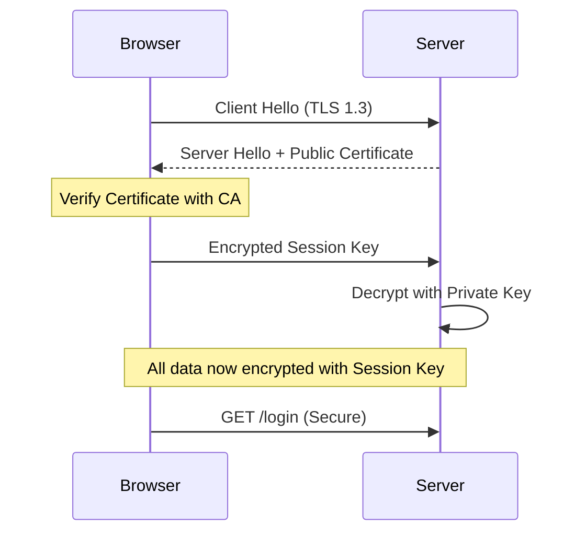

# 🔒 HTTPS and SSL: Encrypting the Tunnel
> **Objective:** Master end-to-end encryption for data in transit | **Language:** Hinglish | **Standard:** 2026 Expert Framework

---

## 🧭 1. Beginner-Friendly Hinglish Explanation
HTTPS (Hypertext Transfer Protocol Secure) ka matlab hai aapke browser aur server ke beech ek "Secret Tunnel" banana.

- **The Problem:** Jab aap HTTP use karte hain, toh data "Plain Text" mein travel karta hai. Agar koi beech mein baitha hai (jaise public Wi-Fi par), toh wo aapka password dekh sakta hai (Sniffing).
- **The Solution:** SSL/TLS (Secure Sockets Layer) data ko "Scramble" (Encrypt) kar deta hai. Sirf aapka browser aur server hi use "Unscramble" kar sakte hain.
- **The Padlock:** Browser mein wo chota sa "Tala" (Lock) dikhata hai ki ye site safe hai.

Intuition: HTTP ek "Postcard" hai jise koi bhi padh sakta hai. HTTPS ek "Sealed Envelope" hai jise sirf receiver khol sakta hai.

---

## 🧠 2. Deep Technical Explanation
### 1. The SSL Handshake:
1.  **Hello:** Client says "Hi, I support these encryption methods."
2.  **Certificate:** Server sends its **SSL Certificate** (Public Key).
3.  **Verification:** Browser checks if the certificate is signed by a trusted authority (like Let's Encrypt).
4.  **Key Exchange:** Client creates a temporary "Session Key" and encrypts it with the server's Public Key.
5.  **Secure Connection:** Both now use the Session Key for fast, symmetric encryption.

### 2. TLS vs SSL:
SSL is the old name; **TLS (Transport Layer Security)** is the modern, secure version. In 2026, you should only support **TLS 1.2** or **TLS 1.3**.

### 3. Certificates:
- **CA (Certificate Authority):** The "Police" that verifies you own the domain.
- **Let's Encrypt:** A free, automated CA that has made HTTPS universal.

---

## 🏗️ 3. Architecture Diagrams (The Handshake)


---

## 💻 4. Production-Ready Examples (Forcing HTTPS)
```typescript
// 2026 Standard: Redirecting HTTP to HTTPS in Express

app.use((req, res, next) => {
  // Check if the request is coming through a Load Balancer (like AWS or Nginx)
  if (req.headers['x-forwarded-proto'] !== 'https' && process.env.NODE_ENV === 'production') {
    return res.redirect(`https://${req.hostname}${req.url}`);
  }
  next();
});

// 💡 Pro Tip: Don't handle SSL certificates inside Node.js code. 
// Use a Reverse Proxy (Nginx) or a Cloud Provider (AWS/Cloudflare) 
// for 'SSL Termination'. It's much faster and easier to manage.
```

---

## 🌍 5. Real-World Use Cases
- **E-commerce:** Protecting credit card data.
- **Social Media:** Preventing session hijacking.
- **Google Search Rank:** Google gives a ranking boost to sites that use HTTPS.

---

## ❌ 6. Failure Cases
- **Expired Certificates:** If you forget to renew, users see a "Your connection is not private" red warning.
- **Mixed Content:** Loading an image or script via `http://` on an `https://` site. Browsers will block it.
- **Weak Cipher Suites:** Supporting old encryption methods that hackers can crack.

---

## 🛠️ 7. Debugging Section
| Tool | Purpose | Tip |
| :--- | :--- | :--- |
| **SSLLabs (Qualys)** | Security Rating | Paste your URL to get an A+ to F rating of your SSL setup. |
| **Certbot** | Management | The standard tool for Let's Encrypt certificate renewal. |
| **OpenSSL CLI** | Inspection | `openssl s_client -connect google.com:443` to see raw certificate data. |

---

## ⚖️ 8. Tradeoffs
- **Performance:** HTTPS adds a few milliseconds to the first connection (handshake), but modern **HTTP/2 and HTTP/3** (which require HTTPS) are actually *faster* than old HTTP.

---

## 🛡️ 9. Security Concerns
- **MITM (Man-In-The-Middle):** Someone pretending to be your server. **Fix: Use HSTS (HTTP Strict Transport Security) to tell the browser "Never talk to me via HTTP".**

---

## 📈 10. Scaling Challenges
- **SSL Termination:** Encrypting/Decrypting thousands of requests can use significant CPU. Move this task to a **Load Balancer** or **API Gateway**.

---

## 💸 11. Cost Considerations
- **Paid Certificates:** "Wildcard" or "Extended Validation (EV)" certificates can cost hundreds of dollars, but **Let's Encrypt** is free for 99% of use cases.

---

## ✅ 12. Best Practices
- **Use Let's Encrypt for auto-renewal.**
- **Terminate SSL at the Load Balancer / Edge.**
- **Enable HSTS.**
- **Only support TLS 1.2+**.

---

## ⚠️ 13. Common Mistakes
- **Forgetting to renew.**
- **Hardcoding `http://`** in your frontend code.
- **Ignoring "Insecure" warnings** during local development.

---

## 📝 14. Interview Questions
1. "Explain the SSL/TLS Handshake process."
2. "What is 'SSL Termination' and where should it happen?"
3. "What is the difference between a Public Key and a Private Key?"

---

## 🚀 15. Latest 2026 Production Patterns
- **Automatic SSL (Vercel/Netlify/Cloudflare):** Zero-config HTTPS where the platform handles everything.
- **mTLS (Mutual TLS):** Both the Client and Server must have certificates (Used for secure Microservice-to-Microservice communication).
- **QUIC (HTTP/3):** A faster, always-encrypted protocol that replaces TCP with UDP for lower latency.
漫
