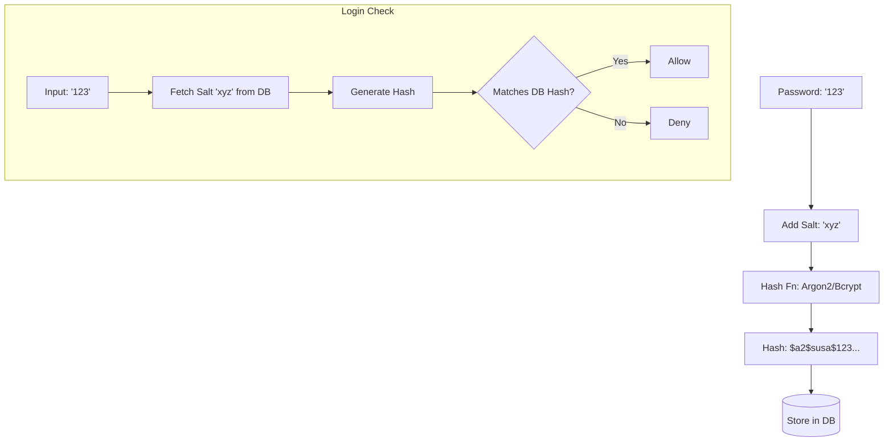

# 🧬 Hashing vs Encryption: The One-Way vs Two-Way Battle
> **Objective:** Understand when to hide data (Encryption) and when to fingerprint it (Hashing) | **Language:** Hinglish | **Standard:** 2026 Expert Framework

---

## 🧭 1. Beginner-Friendly Hinglish Explanation
Hashing vs Encryption ka matlab hai "Data ko wapas lana hai ya nahi?".

- **Encryption (Two-Way):** Ye ek "Lock" ki tarah hai. Aap data lock karte hain aur baad mein key se use wapas "Unlock" (Decrypt) kar sakte hain. Use for: Private Messages, Credit Cards.
- **Hashing (One-Way):** Ye ek "Paper Shredder" ki tarah hai. Aap data ko shred karte hain. Aap use kabhi wapas nahi jod sakte. Par ek hi input se hamesha ek hi jaisa shred (Hash) banta hai. Use for: Passwords.
- **The Core Difference:** 
  - **Encryption:** Purpose is **Privacy** (Reading later).
  - **Hashing:** Purpose is **Integrity** (Checking if it's the same).
- **Intuition:** Encryption ek "Safe" (Locker) ki tarah hai. Hashing ek "Fingerprint" ki tarah hai. Fingerprint se aap insaan ko wapas nahi bana sakte, par insaan ko pehchan sakte hain.

---

## 🧠 2. Deep Technical Explanation
### 1. Hashing Characteristics:
- **Deterministic:** "password123" will always produce the same hash.
- **Fast:** Very quick to calculate.
- **Irreversible:** You cannot get "password123" from the hash.
- **Collision Resistant:** Two different inputs should almost never produce the same hash.

### 2. Encryption Characteristics:
- **Reversible:** With the key, you get the original data back.
- **Key-dependent:** If you lose the key, the data is gone forever.

### 3. Salting (Crucial for Hashing):
If two users have the same password "123456", their hashes will be the same. Hackers use "Rainbow Tables" to guess these.
- **Salt:** A random string added to the password *before* hashing. Now even if two users have the same password, their hashes will be completely different.

---

## 🏗️ 3. Architecture Diagrams (Password Hashing Flow)


---

## 💻 4. Production-Ready Examples (Bcrypt Hashing)
```typescript
// 2026 Standard: Secure Password Hashing with Bcrypt

import bcrypt from 'bcrypt';

const hashPassword = async (password: string) => {
  const saltRounds = 12; // Complexity level
  // Bcrypt automatically generates a salt and includes it in the result
  const hash = await bcrypt.hash(password, saltRounds);
  return hash;
};

const verifyPassword = async (password: string, hash: string) => {
  const isMatch = await bcrypt.compare(password, hash);
  return isMatch;
};

// 💡 Why Bcrypt? It is slow by design, making it hard 
// for hackers to try millions of passwords per second.
```

---

## 🌍 5. Real-World Use Cases
- **Passwords (Hashing):** NEVER encrypt passwords. Always hash them with a salt.
- **File Integrity (Hashing):** Checking if a downloaded file is corrupted by comparing its MD5/SHA256 hash.
- **Private Messages (Encryption):** Encrypting chat data so only the receiver can read it.
- **Digital Signatures:** Using hashing + asymmetric encryption to prove who sent a document.

---

## ❌ 6. Failure Cases
- **Using MD5/SHA1 for Passwords:** These are too fast. A hacker can check billions of hashes per second. **Fix: Use Bcrypt, Argon2, or Scrypt.**
- **Encrypting Passwords:** If your encryption key is stolen, the hacker now has EVERY user's password in plain text.
- **No Salt:** Using raw hashing allows "Rainbow Table" attacks.

---

## 🛠️ 7. Debugging Section
| Method | Tool | Use Case |
| :--- | :--- | :--- |
| **`sha256sum`** | CLI | Quick check if two files are exactly the same. |
| **CyberChef** | Web Tool | A "Swiss Army Knife" to test encryption/decryption and hashing formats. |

---

## ⚖️ 8. Tradeoffs
- **Bcrypt (Slow - Secure)** vs **SHA256 (Fast - Not for passwords).**

---

## 🛡️ 9. Security Concerns
- **Pepper:** Similar to salt, but the string is stored in a separate server or environment variable (not in the DB). This adds one more layer of protection.

---

## 📈 10. Scaling Challenges
- **CPU Cost:** Hashing 1 million passwords per second during a DDoS attack can crash your CPU. **Fix: Use rate limiting on the login page.**

---

## ✅ 11. Best Practices
- **Passwords:** Use Argon2 or Bcrypt.
- **Data Privacy:** Use AES-256.
- **Always use a Salt.**
- **Keep Encryption keys separate from the data.**

---

## ⚠️ 13. Common Mistakes
- **Assuming 'Hashing' is 'Encryption'.**
- **Not using enough 'Salt Rounds'** (making it too fast for hackers).

---

## 📝 14. Interview Questions
1. "Can you decrypt a hash? Why or why not?"
2. "What is 'Salting' and why is it mandatory for passwords?"
3. "When would you use AES instead of Bcrypt?"

---

## 🚀 15. Latest 2026 Production Patterns
- **Argon2:** The winner of the Password Hashing Competition, now the recommended standard over Bcrypt for maximum security.
- **Hardware Security Modules (HSM):** Performing hashing and encryption on a dedicated physical chip that is impossible to hack remotely.
漫
