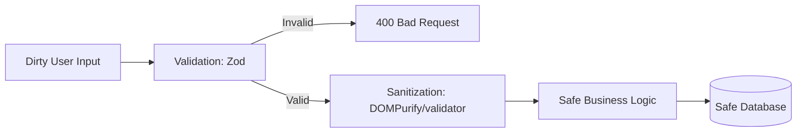

# 🧹 Input Sanitization: Cleaning the Data
> **Objective:** Prevent XSS, SQLi, and other injection attacks by cleaning untrusted data | **Language:** Hinglish | **Standard:** 2026 Expert Framework

---

## 🧭 1. Beginner-Friendly Hinglish Explanation
Input Sanitization ka matlab hai "Data ko server mein lene se pehle dho-ponchh kar saaf karna".

- **The Problem:** Maan lijiye aapka ek comment box hai. Agar user ne apna naam `<script>alert('hacked')</script>` rakh diya aur aapne use waise hi save kar liya, toh jab bhi koi doosra user us profile ko dekhega, uska browser wo script chala dega. Ye **XSS (Cross-Site Scripting)** hai.
- **The Solution:** Humein user ke bheje huye data se "Khatarnak" characters (jaise `<`, `>`, `&`) nikal dene chahiye ya unhe "Safe" (HTML Entities) mein badal dena chahiye.
- **Validation vs Sanitization:**
  - **Validation:** "Kya ye email hai?" (Haan/Nahi).
  - **Sanitization:** "Is text se saare `<script>` tags hata do".

---

## 🧠 2. Deep Technical Explanation
### 1. The Sanitization Pipeline:
1.  **Trimming:** Removing unnecessary whitespace.
2.  **Type Coercion:** Ensuring a number is actually a number.
3.  **Escaping:** Converting special characters to HTML entities (`<` becomes `&lt;`).
4.  **Stripping:** Completely removing blacklisted tags or attributes (like `onclick`).

### 2. Context-Aware Sanitization:
Sanitization depends on where the data is going:
- **For HTML:** Escape tags.
- **For SQL:** Use parameterized queries (escaping is not enough!).
- **For Shell Commands:** Use `execFile` instead of `exec` to avoid command injection.

### 3. Libraries:
- **Zod:** Excellent for validation and basic transformation.
- **DOMPurify:** The gold standard for cleaning HTML input (to prevent XSS).
- **validator.js:** A collection of string sanitizers (like `escape()`, `trim()`).

---

## 🏗️ 3. Architecture Diagrams (The Cleaning Layer)


---

## 💻 4. Production-Ready Examples (Sanitizing Input)
```typescript
// 2026 Standard: Robust Sanitization with Zod and Validator

import { z } from 'zod';
import validator from 'validator';
import createDOMPurify from 'dompurify';
import { JSDOM } from 'jsdom';

const window = new JSDOM('').window;
const DOMPurify = createDOMPurify(window);

// 1. Define Schema with Transformations
const CommentSchema = z.object({
  // Trim and Escape special characters
  content: z.string()
    .min(1)
    .max(500)
    .transform((val) => validator.escape(val.trim())),

  // For Rich Text (HTML), use DOMPurify
  biography: z.string()
    .transform((val) => DOMPurify.sanitize(val)),
    
  age: z.coerce.number().int().min(0) // Coerce string "25" to number 25
});

// 2. Usage in Controller
export const createComment = (req, res) => {
  const result = CommentSchema.safeParse(req.body);
  if (!result.success) return res.status(400).json(result.error);
  
  const cleanData = result.data;
  // Now 'cleanData.content' is safe to store and display
};
```

---

## 🌍 5. Real-World Use Cases
- **User Profiles:** Cleaning names and bios to prevent profile-page XSS.
- **Admin Dashboards:** Ensuring search filters don't contain SQL commands.
- **File Uploads:** Sanitizing filenames to prevent directory traversal attacks (e.g., `../../../etc/passwd`).

---

## ❌ 6. Failure Cases
- **Blacklisting instead of Whitelisting:** Trying to remove `<script>` but forgetting ``. **Fix: Always use a library that uses a whitelist.**
- **Sanitizing on Output ONLY:** If you don't sanitize on input, your database becomes a "Time Bomb". Always sanitize on Input AND Output (Defense in Depth).
- **Incorrect Context:** Escaping for HTML but then using the data in a shell command.

---

## 🛠️ 7. Debugging Section
| Symptom | Cause | Solution |
| :--- | :--- | :--- |
| **Data looks weird (e.g., `&lt;b&gt;`)** | Double Escaping | Ensure you're not escaping both on input AND every time you read it. |
| **Scripts still running** | Incomplete Sanitization | Check your DOMPurify config for allowed tags. |
| **Zod validation fails** | Type mismatch | Use `.coerce` for query parameters (which are always strings). |

---

## ⚖️ 8. Tradeoffs
- **Security vs Data Integrity:** Sanitization can sometimes remove valid data (e.g., a math formula `5 < 10` might lose the `<`).
- **Performance:** Complex HTML sanitization can be CPU-intensive for very large documents.

---

## 🛡️ 9. Security Concerns
- **Second-Order XSS:** Data that is safe in one part of the app but dangerous when used in another (e.g., as a URL parameter).

---

## 📈 10. Scaling Challenges
- **Large Batches:** Sanitizing 1000 records in a bulk upload. (Solution: Use a background worker/queue).

---

## 💸 11. Cost Considerations
- **Compute:** CPU usage for DOMPurify on every request.

---

## ✅ 12. Best Practices
- **Validate FIRST, Sanitize SECOND.**
- **Use Zod for almost everything.**
- **Never trust user input, even from 'Trusted' users.**
- **Use an established library; don't write your own Regex for sanitization.**

---

## ⚠️ 13. Common Mistakes
- **Forgetting to sanitize URL parameters** (`req.params` and `req.query`).
- **Thinking that `JSON.stringify` is enough sanitization.**

---

## 📝 14. Interview Questions
1. "What is the difference between validation and sanitization?"
2. "How would you prevent a stored XSS attack in a Node.js application?"
3. "Why should you prefer whitelisting over blacklisting for sanitization?"

---

## 🚀 15. Latest 2026 Production Patterns
- **Trusted Types API:** A modern browser feature that prevents XSS by only allowing "Trusted" strings to be inserted into the DOM.
- **Auto-escaping Engines:** Modern template engines (like EJS or React) that escape data by default.
漫
