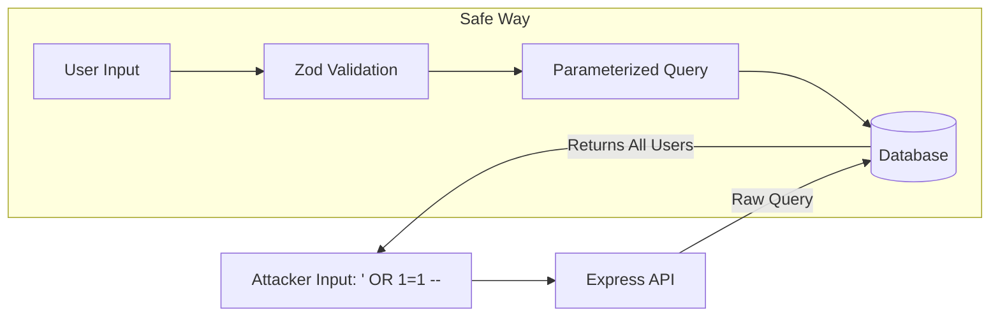

# 🛡️ OWASP Top 10 for Node.js: Defensive Engineering
> **Objective:** Defend against the most critical web application security risks | **Language:** Hinglish | **Standard:** 2026 Expert Framework

---

## 🧭 1. Beginner-Friendly Hinglish Explanation
OWASP Top 10 ek list hai un 10 tarikon ki jinse hackers sabse zyada websites ko nuksan pahunchate hain.

- **The Problem:** Agar aapko pata hi nahi ki chor kaise ghusta hai, toh aap darwaza kaise band karenge?
- **The Solution:** Node.js developers ke liye humein in 10 dangers ko samajhna aur unse bachna zaroori hai.
  - **Example 1 (Injection):** User input se database query ko modify karna.
  - **Example 2 (Broken Auth):** Kamzor passwords ya galat tarike se tokens handle karna.
- **The Goal:** Code likhte waqt hi in attacks ke baare mein sochna taaki baad mein rona na pade.

---

## 🧠 2. Deep Technical Explanation (Top 2026 Risks)
### 1. A01:2026 - Broken Access Control:
Users can access data outside of their intended permissions.
- **Node.js Fix:** Use middleware for RBAC/ABAC and ALWAYS check ownership of a resource (`req.user.id === resource.ownerId`).

### 2. A02:2026 - Cryptographic Failures:
Storing passwords in plaintext or using weak hashing like MD5.
- **Node.js Fix:** Use `argon2` or `bcrypt`. Use TLS for all data in transit.

### 3. A03:2026 - Injection:
Malicious data is sent to an interpreter (SQL, NoSQL, OS Command).
- **Node.js Fix:** Use Parameterized queries in SQL (Prisma/Drizzle) and sanitize inputs for NoSQL (Zod).

---

## 🏗️ 3. Architecture Diagrams (The Injection Attack)


---

## 💻 4. Production-Ready Examples (Fixing Injection)
```typescript
// ❌ DANGEROUS: SQL Injection Vulnerability
app.get('/user', (req, res) => {
  const query = `SELECT * FROM users WHERE id = ${req.query.id}`; // Vulnerable!
  db.execute(query);
});

// ✅ SAFE: Parameterized Query (2026 Standard)
app.get('/user', async (req, res) => {
  const userId = req.query.id;
  
  // The DB driver handles sanitization
  const user = await prisma.user.findUnique({
    where: { id: String(userId) }
  });
  
  res.json(user);
});
```

---

## 🌍 5. Real-World Use Cases
- **Blogging Platforms:** Preventing a guest from deleting someone else's post (Broken Access Control).
- **Admin Panels:** Ensuring the "Forgot Password" flow isn't guessable (Cryptographic Failures).
- **Search Engines:** Ensuring search terms can't be used to run commands on the server (Injection).

---

## ❌ 6. Failure Cases
- **Trusting the Frontend:** Thinking that since the UI blocks the "Delete" button, the API is safe.
- **Using `eval()`:** Running strings as code. This is a massive security hole in JS.
- **Log Injection:** Letting users write arbitrary data into your logs, which could execute scripts in your log viewer.

---

## 🛠️ 7. Debugging Section
| Problem | Diagnostic | Solution |
| :--- | :--- | :--- |
| **User can see Admin data** | Check Access Control | Audit your `authorize` middleware. |
| **Plaintext passwords in DB** | DB Inspection | Write a script to migrate and hash all existing passwords. |
| **Regex Denial of Service** | Performance spikes on specific inputs | Use **safe-regex** to check your patterns. |

---

## ⚖️ 8. Tradeoffs
- **Security vs Developer Speed:** Writing "Secure" code takes longer than "Working" code.
- **Performance:** Deep validation and encryption add overhead.

---

## 🛡️ 9. Security Concerns
- **SSRF (Server-Side Request Forgery):** A hacker tricking your server into calling internal services or metadata APIs. **Fix: Whitelist allowed domains for outgoing requests.**

---

## 📈 10. Scaling Challenges
- **Session Bloat:** Storing too much in sessions makes it hard to scale. Use stateless JWTs or a shared Redis session store.

---

## 💸 11. Cost Considerations
- **Data Breach Cost:** A single hack can cost a company millions in fines and lost trust. Investing in security is the best ROI.

---

## ✅ 12. Best Practices
- **Use Zod for all inputs.**
- **Use Helmet for security headers.**
- **Implement Rate Limiting.**
- **Never use `eval()` or `new Function()`.**
- **Keep Node.js and dependencies updated.**

---

## ⚠️ 13. Common Mistakes
- **Assuming internal APIs don't need auth.**
- **Hardcoding API keys in the codebase.**

---

## 📝 14. Interview Questions
1. "What is SQL Injection and how do you prevent it in Node.js?"
2. "Explain 'Broken Access Control' with an example."
3. "What are the security risks of using the `eval()` function?"

---

## 🚀 15. Latest 2026 Production Patterns
- **SCA Integration:** Automating `npm audit` in every Pull Request.
- **Content Security Policy (CSP) 3.0:** Stricter rules for where scripts can be loaded from.
- **Permissioned Node.js:** Running Node.js with the `--experimental-permission` flag to restrict access to the file system and network.
漫
