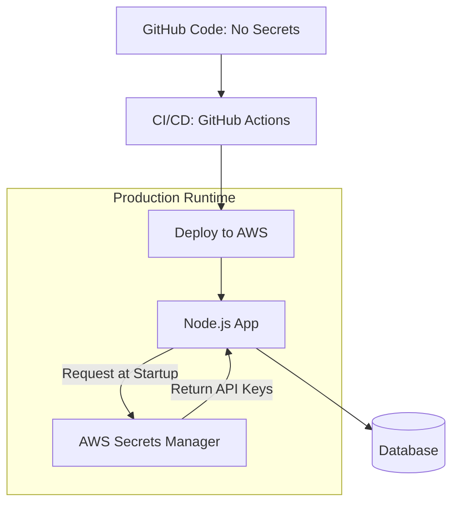

# 🔑 Secret Management: Guarding the Keys to the Kingdom
> **Objective:** Securely store and distribute API keys, database credentials, and certificates | **Language:** Hinglish | **Standard:** 2026 Expert Framework

---

## 🧭 1. Beginner-Friendly Hinglish Explanation
Secret Management ka matlab hai "Apni तिजोरी (Safe) ki chaabi kahan rakhni hai".

- **The Problem:** Aapke backend ko database ka password chahiye, Stripe ki API key chahiye, aur JWT secret chahiye. Agar aapne ye code mein likh diye (Hardcoding), toh jisne bhi aapka GitHub dekha, uske paas aapka poora server aa jayega.
- **The Solution:** Secrets ko code se alag rakho.
- **The Golden Rule:** **"Never commit secrets to Git"**. Use `.env` files locally aur production mein dedicated "Secret Managers" use karein.

---

## 🧠 2. Deep Technical Explanation
### 1. Environment Variables:
The standard way to pass configuration to a process. In Node.js, accessed via `process.env`.
- Local: `.env` file (Added to `.gitignore`).
- Production: Set via Cloud Console (Vercel/AWS/Heroku).

### 2. Secret Managers (Enterprise Grade):
Services designed specifically for secrets. They provide encryption, access logs, and auto-rotation.
- **AWS Secrets Manager**
- **HashiCorp Vault**
- **Google Secret Manager**

### 3. Dynamic Secrets:
Instead of a permanent password, the Secret Manager creates a "One-time" DB password that expires after 1 hour. This is the peak of security.

---

## 🏗️ 3. Architecture Diagrams (The Secret Flow)


---

## 💻 4. Production-Ready Examples (Using dotenv)
```typescript
// 2026 Standard: Safe Configuration Loading

import dotenv from 'dotenv';
import { z } from 'zod';

// 1. Load from .env
dotenv.config();

// 2. Validate Config (Ensure all secrets are present)
const configSchema = z.object({
  DATABASE_URL: z.string().url(),
  STRIPE_SECRET: z.string().min(10),
  JWT_SECRET: z.string().min(32),
  PORT: z.coerce.number().default(3000),
});

const result = configSchema.safeParse(process.env);

if (!result.success) {
  console.error("❌ Invalid environment variables:", result.error.format());
  process.exit(1); // Kill app if secrets are missing
}

export const env = result.data;

// Usage: env.DATABASE_URL
```

---

## 🌍 5. Real-World Use Cases
- **Database Credentials:** Passing the `DB_PASSWORD` securely to the app.
- **Third-Party APIs:** Storing API keys for OpenAI, Twilio, or SendGrid.
- **Certificate Management:** Storing SSL/TLS private keys.

---

## ❌ 6. Failure Cases
- **Hardcoding in Code:** `const apiKey = "sk_test_123..."`. (Instant hack if repo is public).
- **Insecure `.env` storage:** Sending the `.env` file to a teammate via Slack or Email.
- **Logging Secrets:** `console.log(process.env)` in a public log. **Fix: Use log masking.**

---

## 🛠️ 7. Debugging Section
| Problem | Diagnostic | Solution |
| :--- | :--- | :--- |
| **"Variable is undefined"** | Check `.env` path | Ensure `dotenv.config()` is called at the very top of your entry file. |
| **Git shows secret file** | `git status` | Add `.env` to your `.gitignore` IMMEDIATELY. |
| **Stale Secrets** | Check deployment cache | Re-deploy your app after changing secrets in the cloud console. |

---

## ⚖️ 8. Tradeoffs
- **`.env` files (Simple)** vs **Vault/Secrets Manager (Secure/Complex)**. Use `.env` for small projects; Secret Managers for teams.

---

## 🛡️ 9. Security Concerns
- **Environment Exposure:** If a hacker gets shell access to your server, they can run `printenv` and see everything. **Fix: Use specialized secret fetching in the code instead of env vars.**

---

## 📈 10. Scaling Challenges
- **Multiple Environments:** Managing different keys for `dev`, `staging`, and `production`. Use a centralized dashboard or tools like **Doppler**.

---

## 💸 11. Cost Considerations
- **AWS Secrets Manager:** Charges per secret per month plus API calls. Can get expensive for hundreds of small microservices.

---

## ✅ 12. Best Practices
- **Add `.env` to `.gitignore`.**
- **Use `.env.example`** to show teammates which variables are needed.
- **Rotate secrets every 90 days.**
- **Use Least Privilege:** Give the app access ONLY to the secrets it needs.

---

## ⚠️ 13. Common Mistakes
- **Committing `.env` to Git** and then trying to "Delete" the commit (It's still in the git history!). **Fix: Use BFG Repo-Cleaner to purge history.**

---

## 📝 14. Interview Questions
1. "Why should you never commit secrets to version control?"
2. "What is Secret Rotation and why is it important?"
3. "How do you handle secrets in a CI/CD pipeline?"

---

## 🚀 15. Latest 2026 Production Patterns
- **Doppler / Infisical:** Centralized "Secret Ops" platforms that sync secrets across all your tools (GitHub, Vercel, AWS).
- **Short-lived Credentials:** Automatically generating secrets that expire as soon as the function finishes.
- **Workload Identity:** Authenticating to cloud services (like DBs) using the "Identity" of the server, without needing a password at all.
漫
