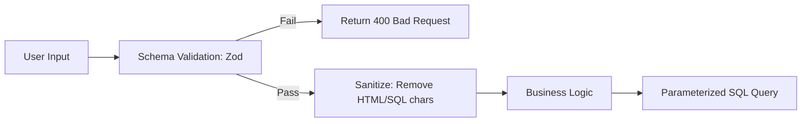

# 🛡️ Secure Coding Practices: Writing Unhackable Code
> **Objective:** Adopt a security-first mindset to prevent vulnerabilities at the source | **Language:** Hinglish | **Standard:** 2026 Expert Framework

---

## 🧭 1. Beginner-Friendly Hinglish Explanation
Secure Coding ka matlab hai "Shuru se hi aisa code likhna jise todna namumkin ho".

- **The Problem:** Aksar developers sirf ye sochte hain ki "Feature kaise chalega". Wo ye bhul jate hain ki "User ghalat data daal kar system ko kaise gira sakta hai".
- **The Solution:** Humein hamesha bura sochna chahiye (Defensive Programming).
- **The Core Rule:** "Don't Trust Anyone". Chahe data user se aaye, ya kisi dusre API se, use hamesha validate aur sanitize karo.
- **Intuition:** Ye ek "Tijori" (Safe) banane jaisa hai. Aap sirf ye nahi dekhte ki wo khul rahi hai ya nahi, aap ye check karte hain ki use hathode (Hammer) ya aag (Fire) se toda ja sakta hai ya nahi.

---

## 🧠 2. Deep Technical Explanation
### 1. Input Validation vs Sanitization:
- **Validation:** Checking if data is in the right format (e.g., Is this a valid email?). **Reject** if wrong.
- **Sanitization:** Cleaning the data (e.g., Removing `<script>` tags). **Modify** to make it safe.

### 2. The Principle of Least Privilege:
The application should run with the minimum permissions needed. If the app only needs to READ the database, don't give it WRITE access.

### 3. Fail Securely:
When an error occurs, the app should default to a "Closed" state. If the auth service is down, the app should DENY all users, not ALLOW everyone.

---

## 🏗️ 3. Architecture Diagrams (Input Handling Flow)


---

## 💻 4. Production-Ready Examples (Validation with Zod)
```typescript
// 2026 Standard: Strict Schema Validation

import { z } from 'zod';

const UserSchema = z.object({
  username: z.string().min(3).max(20).regex(/^[a-zA-Z0-9_]+$/),
  email: z.string().email(),
  age: z.number().int().min(18).max(120),
});

app.post('/register', (req, res) => {
  const result = UserSchema.safeParse(req.body);
  
  if (!result.success) {
    return res.status(400).json({ error: "Invalid input data", details: result.error });
  }

  // Now 'result.data' is 100% safe to use in business logic
  const userData = result.data;
  // ... proceed safely
});
```

---

## 🌍 5. Real-World Use Cases
- **Form Submissions:** Preventing users from putting JavaScript in a "Comment" box (XSS).
- **File Uploads:** Ensuring a user doesn't upload a `.exe` shell script instead of a `.jpg` photo.
- **URL Parameters:** Preventing "Path Traversal" (e.g., `GET /view?file=../../etc/passwd`).

---

## ❌ 6. Failure Cases
- **The 'eval()' Danger:** Using `eval()` or `new Function()` with user-provided strings. This is a 100% chance of being hacked.
- **Hardcoded Secrets:** Storing API keys in Git.
- **Verbose Errors:** Telling the user `Invalid Password for user admin@susa.com`. **Fix: Use generic messages like `Invalid Email or Password`.**

---

## 🛠️ 7. Debugging Section
| Problem | Diagnostic | Solution |
| :--- | :--- | :--- |
| **Data Leak** | Over-sharing | Use a "DTO" (Data Transfer Object) to only send the fields the user needs, never send the whole DB object. |
| **Logic Bypass** | Missing Checks | Ensure security checks happen on the **Server**, never rely only on Frontend validation. |

---

## ⚖️ 8. Tradeoffs
- **Security (Many checks, slightly slower)** vs **Convenience (Fast code, high risk).**

---

## 🛡️ 9. Security Concerns
- **Mass Assignment:** A user sends `{"isAdmin": true}` in a registration form, and the app saves it directly to the DB. **Fix: Only pick allowed fields.**

---

## 📈 10. Scaling Challenges
- **Validation Overhead:** Validating massive JSON objects can slow down the CPU. **Fix: Use high-performance libraries like TypeBox or Zod.**

---

## ✅ 11. Best Practices
- **Use Parameterized Queries** (Avoid SQL Injection).
- **Sanitize HTML Output** (Avoid XSS).
- **Use Secure Cookies** (HttpOnly, Secure, SameSite).
- **Validate every input.**
- **Log all security events.**
- **Keep dependencies updated.**

---

## ⚠️ 13. Common Mistakes
- **Trusting Client-side validation.**
- **Using 'Root' account for everything.**
- **Not handling errors properly.**

---

## 📝 14. Interview Questions
1. "What is the difference between Validation and Sanitization?"
2. "How do you prevent a NoSQL Injection in a MongoDB app?"
3. "What does it mean to 'Fail Securely'?"

---

## 🚀 15. Latest 2026 Production Patterns
- **Zero-Trust Logic:** Treating every internal API call as if it came from the public internet.
- **Automated Dependency Audits:** CI/CD blocking the build if a library has a critical security warning.
- **Security as Code (Policy-as-Code):** Writing security rules in a language like OPA (Open Policy Agent) to enforce them globally.
漫
