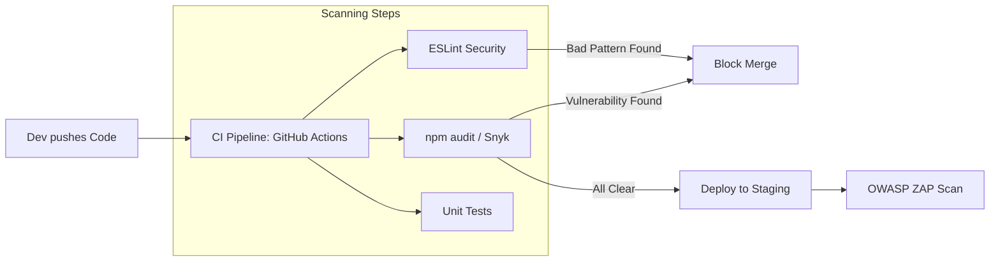

# 🔍 Security Audit and Scanning: Continuous Protection
> **Objective:** Automate vulnerability detection and maintain an audit trail | **Language:** Hinglish | **Standard:** 2026 Expert Framework

---

## 🧭 1. Beginner-Friendly Hinglish Explanation
Security Audit aur Scanning ka matlab hai "Apne ghar ki regular checking karna" ki koi lock toh nahi toot gaya.

- **The Problem:** Software humesha badalta rehta hai. Aaj aapka code safe hai, par kal kisi library (like `express`) mein koi naya bug (vulnerability) mil sakta hai.
- **The Solution:** Humein automation use karni chahiye jo har roz hamare code aur libraries ko scan kare.
- **The Tools:**
  - **Static Scanning:** Code ko bina chalaye check karna (e.g., "Aapne yahan password hardcode kiya hai!").
  - **Dynamic Scanning:** Code ko "Attack" karke dekhna (e.g., "Aapka login page SQL Injection allow kar raha hai").
- **The Audit:** Har important action (Login, Delete, Change Password) ka record rakhna taaki baad mein pata chal sake ki kya hua tha.

---

## 🧠 2. Deep Technical Explanation
### 1. SCA (Software Composition Analysis):
Scanning your `package-lock.json` against a database of known vulnerabilities (CVEs). Tools: `npm audit`, `Snyk`.

### 2. SAST (Static Application Security Testing):
Analyzing the source code for insecure patterns (e.g., use of `eval`, lack of CSRF protection). Tools: `SonarQube`, `ESLint-plugin-security`.

### 3. DAST (Dynamic Application Security Testing):
Testing the running application from the outside by simulating attacks. Tools: `OWASP ZAP`, `Burp Suite`.

### 4. Audit Logging:
Storing a tamper-proof record of security-sensitive events.
- **What to log:** Timestamp, UserID, Action, IP Address, Success/Failure.
- **What NOT to log:** Passwords, Credit Card numbers, Session Tokens.

---

## 🏗️ 3. Architecture Diagrams (The Security CI/CD)


---

## 💻 4. Production-Ready Examples (Logging & Scanning)
```typescript
// 2026 Standard: Structured Audit Logging with Winston

import winston from 'winston';

const auditLogger = winston.createLogger({
  level: 'info',
  format: winston.format.json(),
  defaultMeta: { service: 'audit-service' },
  transports: [
    new winston.transports.File({ filename: 'audit.log' }),
    // In production, send to a central log server like ELK or Datadog
  ],
});

export const logAuditEvent = (userId: string, action: string, status: 'SUCCESS' | 'FAILURE', metadata: any = {}) => {
  auditLogger.info({
    timestamp: new Date().toISOString(),
    userId,
    action,
    status,
    ip: metadata.ip,
    userAgent: metadata.userAgent,
    details: metadata.details
  });
};

// Usage in Login
if (loginSuccessful) {
  logAuditEvent(user.id, 'USER_LOGIN', 'SUCCESS', { ip: req.ip });
} else {
  logAuditEvent('unknown', 'USER_LOGIN', 'FAILURE', { ip: req.ip, details: 'Invalid Password' });
}
```

---

## 🌍 5. Real-World Use Cases
- **Compliance (SOC2/GDPR):** Mandatory audit logs for all data access.
- **Fintech:** Real-time monitoring of failed login attempts to detect "Stuffing" attacks.
- **Open Source:** Using GitHub Dependabot to automatically open PRs for security updates.

---

## ❌ 6. Failure Cases
- **Logging to the same disk:** If a hacker gets access, they can delete the logs (The "Delete Evidence" attack). **Fix: Use a remote logging service.**
- **False Positives:** Scanners reporting 100 "Low" risks that don't matter, causing developers to ignore all warnings.
- **Logging Sensitive Data:** Accidentally logging a full request body that contains a user's password.

---

## 🛠️ 7. Debugging Section
| Tool | Feature | Action |
| :--- | :--- | :--- |
| **`npm audit fix`** | Auto-update | Automatically upgrades libraries to safe versions. |
| **Snyk Test** | CLI Scan | Run `snyk test` locally to find holes before pushing. |
| **Logalyze** | Log Parsing | Search through audit logs for specific IP patterns. |

---

## ⚖️ 8. Tradeoffs
- **Scanning Time vs Deployment Speed:** Running a full DAST scan can take 30 minutes, slowing down every release. (Solution: Run DAST once a day, not on every PR).

---

## 🛡️ 9. Security Concerns
- **Log Forging:** An attacker injecting `\n` into a username to create fake log entries. **Fix: Use structured JSON logging.**

---

## 📈 10. Scaling Challenges
- **Log Volume:** At 1 million requests per second, audit logs can grow by gigabytes every hour. Use **Log Sampling** or **Aggregation**.

---

## 💸 11. Cost Considerations
- **Log Retention:** Storing logs for 1 year (Standard for many audits) can be expensive. Use "Cold Storage" like AWS S3 Glacier.

---

## ✅ 12. Best Practices
- **Automate SCA in CI/CD.**
- **Use JSON for logs.**
- **Centralize logs** in a separate, secure environment.
- **Set alerts for high-risk actions** (e.g., "10 failed logins in 1 minute").

---

## ⚠️ 13. Common Mistakes
- **Ignoring `npm audit` warnings.**
- **Not testing your logs** (Finding out the logs are empty only *after* a hack).

---

## 📝 14. Interview Questions
1. "What is the difference between SAST and DAST?"
2. "What information should be included in a secure audit log?"
3. "How do you handle 'False Positives' in security scans?"

---

## 🚀 15. Latest 2026 Production Patterns
- **IAST (Interactive Application Security Testing):** Combining SAST and DAST by monitoring the app's internal state while it's being tested.
- **Policy as Code:** Using scripts to ensure that no server can be deployed unless it has a passing security score.
- **Blockchain for Logs:** Storing audit hashes on a private blockchain to make them 100% immutable and tamper-proof.
漫
