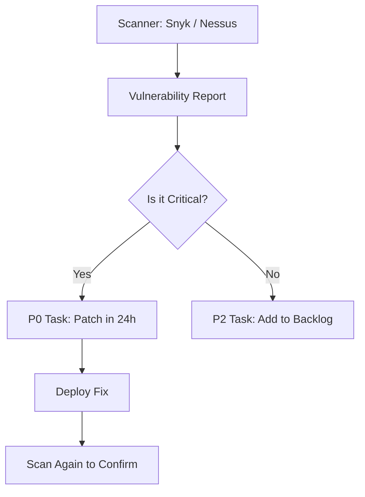

# 🛡️ Vulnerability Management: Fixing the Holes
> **Objective:** Systematically identify, prioritize, and patch security vulnerabilities | **Language:** Hinglish | **Standard:** 2026 Expert Framework

---

## 🧭 1. Beginner-Friendly Hinglish Explanation
Vulnerability Management ka matlab hai "Apne system ki kamzoriyon ko dhoondhna aur unhe theek karna".

- **The Problem:** Software purana ho jata hai. Aaj jo code safe hai, ho sakta hai kal usme koi naya hole (vulnerability) mil jaye. Agar aapne use patch nahi kiya, toh hackers uska fayda uthayenge.
- **The Solution:** Humein ek "Routine" chahiye vulnerabilities check karne ke liye aur unhe "Priority" ke hisab se theek karne ke liye.
- **The Process:** 
  1. **Identify:** Scanners use karo vulnerabilities dhoondhne ke liye.
  2. **Analyze:** Dekho ki ye kitni khatarnak hai (Severity).
  3. **Remediate:** Code update karo ya patch lagao.
- **Intuition:** Ye ek "Health Checkup" ki tarah hai. Aap wait nahi karte ki bimari ho jaye, aap regular tests karwate hain taaki shuruat mein hi sab theek ho jaye.

---

## 🧠 2. Deep Technical Explanation
### 1. CVSS (Common Vulnerability Scoring System):
A numerical score (0.0 to 10.0) that tells you how bad a vulnerability is.
- **9.0 - 10.0 (Critical):** Fix IMMEDIATELY.
- **7.0 - 8.9 (High):** Fix within 7 days.
- **4.0 - 6.9 (Medium):** Fix within 30 days.

### 2. CVE (Common Vulnerabilities and Exposures):
A unique ID given to every known security hole (e.g., `CVE-2021-44228` for Log4j).

### 3. Patching Strategy:
- **Hotfix:** Immediate temporary fix for critical issues.
- **Regular Update:** Part of the monthly release cycle.

---

## 🏗️ 3. Architecture Diagrams (The Vulnerability Lifecycle)


---

## 💻 4. Production-Ready Examples (Scanning with Trivy)
```bash
# 2026 Standard: Scanning Docker Images for Vulnerabilities

# 1. Scan your built docker image
trivy image susalabs/api:latest

# 2. Filter for only CRITICAL and HIGH issues
trivy image --severity CRITICAL,HIGH susalabs/api:latest

# 3. Scan your project directory for misconfigurations
trivy conf .

# 💡 Pro Tip: Run this in your CI/CD pipeline. 
# If a CRITICAL issue is found, FAIL the build.
```

---

## 🌍 5. Real-World Use Cases
- **Enterprise Software:** Large companies must show "Vulnerability Reports" to their clients to prove they are secure.
- **Open Source:** Maintaining a library and fixing bugs that others report on GitHub.
- **Compliance:** Passing audits like SOC2 or PCI-DSS (for payments).

---

## ❌ 6. Failure Cases
- **The Patch Gap:** A vulnerability is announced on Monday, but the company only patches it on Friday. Hackers attack on Wednesday.
- **Breaking Changes:** You updated a library to fix a security hole, but the new version broke your whole app. **Fix: Good automated tests.**
- **Ignoring Low/Mediums:** Thousands of "Low" vulnerabilities can be combined by a hacker to create one "Critical" attack.

---

## 🛠️ 7. Debugging Section
| Problem | Diagnostic | Solution |
| :--- | :--- | :--- |
| **Too many reports** | Noise | Filter out vulnerabilities that are not reachable (e.g., the vulnerable code is in a part of the library you don't even use). |
| **Patch not available** | Zero Day | If the library doesn't have an update yet, use a WAF rule to block the specific attack pattern. |

---

## ⚖️ 8. Tradeoffs
- **Immediate Patching (Maximum Security)** vs **Testing Time (Stability).**

---

## 🛡️ 9. Security Concerns
- **Zero-Day Vulnerability:** A security hole that is known to hackers but not yet known to the software developer. You have "Zero days" to fix it.

---

## 📈 10. Scaling Challenges
- **Asset Inventory:** If you have 1000 servers, just knowing "What software is running where" is a challenge. Use an **Asset Management Tool**.

---

## 💸 11. Cost Considerations
- **Scanner Subscriptions:** Tools like Snyk or Checkmarx can cost thousands of dollars per year for a team.

---

## ✅ 12. Best Practices
- **Automate Scans in CI/CD.**
- **Use CVSS to prioritize work.**
- **Keep an 'Asset Inventory'.**
- **Have a 'Bug Bounty' program** (Paying hackers to report holes safely).
- **Update your base Docker images regularly.**

---

## ⚠️ 13. Common Mistakes
- **Ignoring 'Internal' apps.**
- **Assuming the Cloud Provider (AWS) handles all security.**

---

## 📝 14. Interview Questions
1. "What is a CVE?"
2. "How do you decide which security bug to fix first?"
3. "What is the difference between a Vulnerability Scan and a Pentest?"

---

## 🚀 15. Latest 2026 Production Patterns
- **Reachability Analysis:** AI tools that check if the vulnerable code is actually "Reachable" from the internet before alerting you.
- **VEX (Vulnerability Exploitability eXchange):** A standardized way for developers to tell users: "This vulnerability exists, but our app is NOT affected by it."
- **Auto-Patching:** Systems that automatically create a Pull Request to update a library the moment a vulnerability is found.
漫
