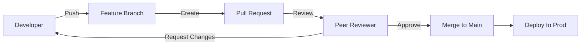

# 🔍 Code Review Best Practices: Improving the Team
> **Objective:** Ensure code quality, share knowledge, and maintain standards through effective peer reviews | **Language:** Hinglish | **Standard:** 2026 Expert Framework

---

## 🧭 1. Beginner-Friendly Hinglish Explanation
Code Review ka matlab hai "Ek dusre ka code check karna taaki galti na ho".

- **The Problem:** Jab aap akele code likhte hain, toh aap bahut saari cheezein miss kar dete hain (Bugs, security holes, ya ganda code style).
- **The Solution:** Dusra developer aapka code (Pull Request) dekhta hai aur suggestions deta hai.
- **The Goal:** Code ko "Better" banana, na ki developer ko "Neecha" dikhana.
- **Intuition:** Ye ek "Second Opinion" ki tarah hai. Jaise doctor surgery se pehle dusre doctor se puchta hai, waise hi hum production mein code daalne se pehle dusre dev se puchte hain.

---

## 🧠 2. Deep Technical Explanation
### 1. What to look for?
- **Logic:** Does it actually solve the problem? Are there edge cases?
- **Security:** Is there any potential for SQL Injection or XSS?
- **Performance:** Any nested loops or slow DB queries?
- **Maintainability:** Is the code clean and easy to understand?
- **Style:** Does it follow the team's formatting rules (Linting)?

### 2. The "Nitpick":
Small style suggestions (e.g., "Use a better variable name") are called "Nitpicks". Mark them as optional so they don't block the PR.

### 3. Reviewer vs Author:
- **Author:** Keep PRs small ($<200$ lines). Explain "Why" you made these changes.
- **Reviewer:** Be polite. Explain the reasoning behind your suggestions.

---

## 🏗️ 3. Architecture Diagrams (The PR Lifecycle)


---

## 💻 4. Production-Ready Examples (A Good Review Comment)
```markdown
# ❌ Bad Comment:
"This code is slow. Fix it." 
(Rude and doesn't explain how or why).

# ✅ Good Comment:
"I noticed a nested loop here on line 45. Since `users` can have 10,000 items, this will be O(N^2) and slow down the request. Can we use a Map to make it O(N)?"
(Polite, explains the 'Why', and suggests a 'How').
```

---

## 🌍 5. Real-World Use Cases
- **Quality Gate:** Stopping a critical bug from reaching millions of users.
- **Knowledge Sharing:** A Junior dev learning a new pattern from a Senior dev's review.
- **Consistency:** Ensuring all microservices in the company look and feel similar.

---

## ❌ 6. Failure Cases
- **Rubber-stamping:** Just clicking "Approve" without actually reading the code.
- **Bikeshedding:** Arguing for 2 hours about a variable name while ignoring a major logic bug.
- **The "Hero" Developer:** Merging code directly to `main` without any review.

---

## 🛠️ 7. Debugging Section
| Problem | Diagnostic | Solution |
| :--- | :--- | :--- |
| **Long PRs** | Speed | If a PR has 1000 lines, it will take 1 hour to review and people will miss bugs. **Rule: Maximum 250 lines per PR.** |
| **Review Fatigue** | Morale | If one person is doing all the reviews, they get tired and angry. **Rotate the reviewers.** |

---

## ⚖️ 8. Tradeoffs
- **Speed (Immediate merge)** vs **Quality (Waiting for review).** (Quality is worth the 1-2 hour wait).

---

## 🛡️ 9. Security Concerns
- **Sensitive Data:** If you see a hardcoded API key in a PR, DO NOT just ask to delete it. Ask the dev to **Rotate** the key, because it is already in the Git history!

---

## 📈 10. Scaling Challenges
- **Large Teams:** Use **Code Owners** files in GitHub to automatically assign the right person to the right PR.

---

## ✅ 11. Best Practices
- **Automate the boring stuff** (Linting/Testing) with CI so reviewers can focus on logic.
- **Be Kind.**
- **Give praise** ("Great job on this optimization!").
- **Ask questions** ("Why did you choose this approach?") instead of giving orders.
- **Review promptly** (Don't let your teammate wait for 2 days).

---

## ⚠️ 13. Common Mistakes
- **Personal attacks.**
- **Using the review to show off your own knowledge.**

---

## 📝 14. Interview Questions
1. "How do you handle a situation where you disagree with a reviewer?"
2. "What is the most important thing you look for in a code review?"
3. "How can we make code reviews faster without losing quality?"

---

## 🚀 15. Latest 2026 Production Patterns
- **AI-Powered Code Review (GitHub Copilot for PRs):** AI summarizing the PR and finding obvious bugs before a human even opens it.
- **Slack Integrations:** Instant notifications when you are mentioned in a PR or a review is finished.
- **Conventional Comments:** Using tags like `[suggestion]`, `[question]`, or `[chore]` to clearly state the intent of the comment.
漫
