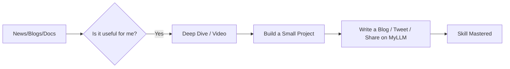

# 📚 Continuous Learning: Staying Relevant in 2026
> **Objective:** Build a sustainable system to keep up with the fast-paced world of technology | **Language:** Hinglish | **Standard:** 2026 Expert Framework

---

## 🧭 1. Beginner-Friendly Hinglish Explanation
Continuous Learning ka matlab hai "Apne aap ko humesha update rakhna".

- **The Problem:** Tech har 6 mahine mein badal jati hai. Jo aapne aaj seekha hai, wo 2 saal baad shayad purana ho jaye. Agar aapne seekhna band kar diya, toh aapki market value gir jayegi.
- **The Solution:** Humein "Learning how to learn" seekhna padega.
- **The Goal:** Ek "T-shaped" engineer banna—jise thoda thoda sab kuch pata ho (Broad) aur ek cheez mein wo expert ho (Deep).
- **Intuition:** Ye ek "Smartphone Update" ki tarah hai. Agar aap apne software ko update nahi karenge, toh naye apps (Technologies) usme nahi chalenge.

---

## 🧠 2. Deep Technical Explanation
### 1. The Half-life of Knowledge:
In software, the things you know have a "Half-life" of about 2-5 years. This means after 5 years, half of your knowledge is useless.
- **Focus on Fundamentals:** Data Structures, Networking, and Databases change very slowly. These are your "Long-term Investments".
- **Keep up with Frameworks:** React, Next.js, and Bun change fast. These are your "Short-term Tools".

### 2. The Learning Loop:
1. **Curate:** Filter the noise. Don't try to learn everything on Twitter.
2. **Consume:** Read, watch, or listen.
3. **Build:** You don't know it until you build something with it.
4. **Teach:** Explain it to someone else (The Feynman Technique).

### 3. Proof of Learning:
Don't just collect certificates. Build a **Portfolio** or contribute to **Open Source**.

---

## 🏗️ 3. Architecture Diagrams (The Learning Pipeline)


---

## 💻 4. Production-Ready Examples (Conceptual Learning Plan)
```markdown
# 📅 My 2026 Learning Roadmap

## Quarter 1: Deep Backend
- Master Redis Streams & BullMQ.
- Build a distributed rate limiter.

## Quarter 2: DevOps & Cloud
- Get AWS Solution Architect cert.
- Automate a full K8s cluster with Terraform.

## Quarter 3: AI Engineering
- Learn how to use LLMs with RAG (Retrieval Augmented Generation).
- Build an AI-powered documentation search.
```

---

## 🌍 5. Real-World Use Cases
- **Career Growth:** Moving from a Junior to a Senior role by mastering "System Design".
- **Job Security:** Being the person who knows the new technology (like Rust or AI) when the company needs it.
- **Innovation:** Bringing a new tool (like Bun) to your team that makes the app $2x$ faster.

---

## ❌ 6. Failure Cases
- **Tutorial Hell:** Watching 100 videos but never writing a single line of code. **Fix: Follow the 2:1 rule (For every 2 hours of watching, spend 1 hour coding).**
- **FOMO (Fear Of Missing Out):** Trying to learn every new framework that appears on GitHub Trends. **Fix: Focus on what you need for your current project or next job.**
- **Burnout:** Trying to learn for 5 hours every night after work. **Fix: Be consistent, not intense (30 mins every day is better than 5 hours once a week).**

---

## 🛠️ 7. Debugging Section
| Problem | Diagnostic | Solution |
| :--- | :--- | :--- |
| **"I forgot what I learned"** | Retrieval | Use Anki (Spaced Repetition) or build a small project every month. |
| **"I don't have time"** | Integration | Listen to tech podcasts (like Syntax.fm) during your commute or gym. |

---

## ⚖️ 8. Tradeoffs
- **Specialization (High pay, narrow jobs)** vs **Generalization (Good safety, medium pay).**

---

## 🛡️ 9. Security Concerns
- **Malicious Tutorials:** Be careful of tutorials that ask you to download random scripts or disable security settings. Always check the official documentation.

---

## 📈 10. Scaling Challenges
- **The Information Explosion:** There is too much to learn. **Fix: Join a community (like SusaLabs) that filters the best material for you.**

---

## ✅ 11. Best Practices
- **Read Official Documentation first.**
- **Follow experts on GitHub/Twitter.**
- **Build 'Proof of Concept' apps.**
- **Write about what you learn.**
- **Don't be afraid to say 'I don't know'.**

---

## ⚠️ 13. Common Mistakes
- **Assuming you are 'Done' learning.**
- **Learning without a goal.**

---

## 📝 14. Interview Questions
1. "How do you keep your technical skills up to date?"
2. "Tell me about a new technology you learned recently and why you chose it."
3. "What is your favorite technical resource (blog/book/podcast)?"

---

## 🚀 15. Latest 2026 Production Patterns
- **AI-Assisted Learning:** Using LLMs as a personal tutor to explain complex code or concepts in Hinglish.
- **Learning Communities:** Small, intense groups (like Masterminds) that learn a specific topic together.
- **Proof of Skill (Web3/NFTs):** Getting a digital badge for contributing to a major Open Source project like Node.js or React.
漫
