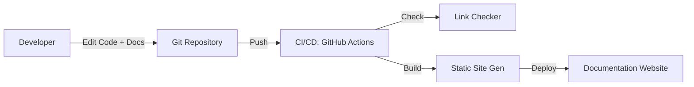

# 📜 Documentation as Code: Syncing Docs and Code
> **Objective:** Manage documentation using the same tools and workflows as source code | **Language:** Hinglish | **Standard:** 2026 Expert Framework

---

## 🧭 1. Beginner-Friendly Hinglish Explanation
Documentation as Code (DaC) ka matlab hai "Documentation ko bhi code ki tarah treat karna".

- **The Problem:** Aksar documentation kisi purane Word Doc ya Google Drive mein hoti hai. Jab code badalta hai, koi documentation update karna bhul jata hai. Result? Documentation kooda (Garbage) ban jati hai.
- **The Solution:** Documentation ko Markdown (`.md`) files mein likho aur use code ke saath hi GitHub repository mein rakho.
- **The Concept:** 
  1. **Version Control:** Docs ke liye bhi Git use karo.
  2. **Pull Requests:** Jab code badle, tabhi documentation ka bhi PR aana chahiye.
  3. **CI/CD:** Documentation ko automatically build karke website par deploy karo.
- **Intuition:** Ye ek "Mirror" ki tarah hai. Jab aap code badalte hain, mirror (Docs) ko bhi turant badalna chahiye taaki wo hamesha sach dikhaye.

---

## 🧠 2. Deep Technical Explanation
### 1. Static Site Generators (SSGs):
Tools that turn your Markdown files into a beautiful, searchable website.
- **Standard 2026:** **Docusaurus**, **Nextra**, or **Hugo**.

### 2. Integration with Code:
- **JSDoc/TSDoc:** Writing documentation directly inside the code comments. Tools then extract these comments to create an API website.
- **Swagger/OpenAPI:** Writing a YAML file that defines your API. This file is used to generate both code and documentation.

### 3. Testing Documentation:
Yes, you can test docs! Use "Link Checkers" to ensure there are no 404 broken links in your documentation.

---

## 🏗️ 3. Architecture Diagrams (The DaC Workflow)


---

## 💻 4. Production-Ready Examples (Conceptual Docusaurus Structure)
```bash
# 2026 Standard: Project Structure for DaC

my-project/
├── src/               # Source Code
├── docs/              # Markdown Documentation
│   ├── introduction.md
│   ├── setup.md
│   └── api/
│       └── authentication.md
├── package.json
└── docusaurus.config.js
```

---

## 🌍 5. Real-World Use Cases
- **Open Source Projects:** (React, Tailwind, Node.js) all use DaC.
- **Internal APIs:** Using Swagger/OpenAPI to ensure the Frontend team always knows exactly how to call the Backend.
- **Legal Compliance:** Keeping a versioned history of "Privacy Policies" or "Terms of Service" in Git.

---

## ❌ 6. Failure Cases
- **Docs and Code Out of Sync:** Merging code but forgetting to update the `.md` file. **Fix: Make doc update a mandatory part of the Code Review Checklist.**
- **Too Complex to Write:** If the documentation tool is too hard to use, developers won't write docs. **Keep it simple (Markdown).**
- **Broken Links:** Moving a file and breaking 50 links to it. **Fix: Use automated link checking.**

---

## 🛠️ 7. Debugging Section
| Tool | Purpose | Tip |
| :--- | :--- | :--- |
| **Markdown Lint** | Style | An extension for VS Code that tells you if your Markdown formatting is wrong. |
| **Vale** | Writing Style | A tool that checks if your writing is too complex or uses the wrong terminology. |

---

## ⚖️ 8. Tradeoffs
- **Developer Ownership (Docs stay fresh)** vs **Writer Quality (Developers might not be great writers).**

---

## 🛡️ 9. Security Concerns
- **Private Info:** Ensure that internal documentation (like server passwords) is kept in a **Private** repo and not accidentally published to a public documentation site.

---

## 📈 10. Scaling Challenges
- **Multiple Repos:** If you have 50 microservices, how do you see all their docs in one place? **Fix: Use 'Backstage' or 'MkDocs with Multirepo plugin'.**

---

## ✅ 11. Best Practices
- **Store docs with the code.**
- **Use Markdown.**
- **Review docs in PRs.**
- **Automate the build and deploy.**
- **Use diagrams (Mermaid).**

---

## ⚠️ 13. Common Mistakes
- **Putting images in Git** (Better to host them elsewhere or use LFS).
- **Not having a search bar** in your documentation site.

---

## 📝 14. Interview Questions
1. "What are the benefits of 'Documentation as Code'?"
2. "How do you ensure documentation doesn't become outdated?"
3. "Which tools would you use to build a documentation website for a team?"

---

## 🚀 15. Latest 2026 Production Patterns
- **AI-Powered Search (RAG):** Adding a chatbot to your documentation site that can answer questions based on your Markdown files.
- **In-code Previews:** Documentation sites that let you run code snippets in a "Playground" (like Sandpack) directly on the page.
- **Git-based CMS:** Using tools like **Decap CMS** so non-technical people can also edit Git-based docs via a nice UI.
漫
