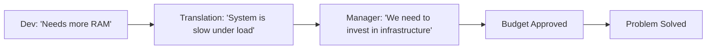

# 🗣️ Effective Communication: The Human API
> **Objective:** Bridge the gap between technical and non-technical stakeholders to build better products | **Language:** Hinglish | **Standard:** 2026 Expert Framework

---

## 🧭 1. Beginner-Friendly Hinglish Explanation
Effective Communication ka matlab hai "Sahi baat, sahi insaan ko, sahi tarike se samjhana".

- **The Problem:** Developers aksar "Binary" mein sochte hain. Managers "Value" mein sochte hain. Clients "Features" mein sochte hain. Agar aap ek manager se "SQL join optimize karne" ki baat karenge, toh wo confuse ho jayega.
- **The Solution:** Humein audience ke hisab se apni bhasha badalni padegi.
- **The Goal:** Misunderstandings kam karna aur trust build karna.
- **Intuition:** Communication ek "API" ki tarah hai. Agar aap sahi format (Language) mein request nahi bhejenge, toh aapko Error (Conflict) milega.

---

## 🧠 2. Deep Technical Explanation
### 1. Types of Communication:
- **Asynchronous:** Slack, Email, PR comments. (Best for deep work).
- **Synchronous:** Meetings, Zoom calls, pair programming. (Best for urgent/complex decisions).

### 2. High-Signal vs Low-Signal:
- **Low-Signal:** "Hey, are you free?" (Wastes time).
- **High-Signal:** "Hey, I'm stuck on the Redis timeout issue for 2 hours. Can we sync for 5 mins to debug?" (Clear and actionable).

### 3. Active Listening:
Don't just wait for your turn to speak. Truly understand what the other person is saying. Repeat it back to confirm: "So, what you're saying is that the checkout flow is too slow for mobile users, correct?"

---

## 🏗️ 3. Architecture Diagrams (The Communication Loop)


---

## 💻 4. Production-Ready Examples (A Perfect Status Update)
```markdown
# ❌ Bad Update:
"Still working on the API. Almost done."

# ✅ Good Update:
"Status: 80% Complete.
- Done: User login and JWT auth.
- Stuck: Redis connection pooling error (investigating).
- Next: Payment gateway integration.
ETA: Tomorrow EOD."
```

---

## 🌍 5. Real-World Use Cases
- **Stakeholder Management:** Explaining to a client why a feature will take 2 weeks instead of 2 days (Managing expectations).
- **Conflict Resolution:** Handling a disagreement in a code review without getting angry.
- **Mentorship:** Helping a Junior dev without making them feel stupid.

---

## ❌ 6. Failure Cases
- **The "I thought you meant..." syndrome:** Working for 3 days on the wrong feature because of a vague Slack message.
- **Ghosting:** Not replying to messages when you are stuck or behind schedule.
- **Over-promising:** Saying "Yes" to everything and then burning out or failing.

---

## 🛠️ 7. Debugging Section
| Problem | Diagnostic | Solution |
| :--- | :--- | :--- |
| **Silent Meetings** | Psychological Safety | If nobody is speaking, people are afraid to make mistakes. Encourage "Stupid questions". |
| **Infinite Slack Threads** | Format | If a Slack thread has > 10 messages, STOP TYPING. Jump on a 5-minute call. |

---

## ⚖️ 8. Tradeoffs
- **Over-communication (Distracting)** vs **Under-communication (Dangerous).** Aim for "Just-in-time" communication.

---

## 🛡️ 9. Security Concerns
- **Social Engineering:** Be careful what you share with strangers or even over Slack. Hackers often use "Communication" to trick devs into giving away passwords.

---

## 📈 10. Scaling Challenges
- **Remote Teams:** Communicating across time zones requires excellent **Written Communication** skills.

---

## ✅ 11. Best Practices
- **Be Concise.**
- **Be Proactive** (Tell people about a delay BEFORE the deadline).
- **Use Visuals** (Screenshots/Diagrams).
- **Assume Good Intentions.**
- **Learn to say "No" politely.**

---

## ⚠️ 13. Common Mistakes
- **Using too much technical jargon** with non-tech people.
- **Assuming everyone understands your context.**

---

## 📝 14. Interview Questions
1. "Tell me about a time you had to explain a complex technical issue to a non-technical manager."
2. "How do you handle a conflict with a teammate?"
3. "What is your approach to giving and receiving feedback?"

---

## 🚀 15. Latest 2026 Production Patterns
- **Async-First Culture:** Companies like GitLab/Remote that avoid all meetings and do 99% of work through written docs and Git.
- **Video Snippets (Loom):** Recording a 2-minute video instead of writing a 10-paragraph email to explain a bug or feature.
- **AI-summarized Meetings:** Using tools like **Otter.ai** or **Fireflies** to automatically create notes and action items from Zoom calls.
漫
