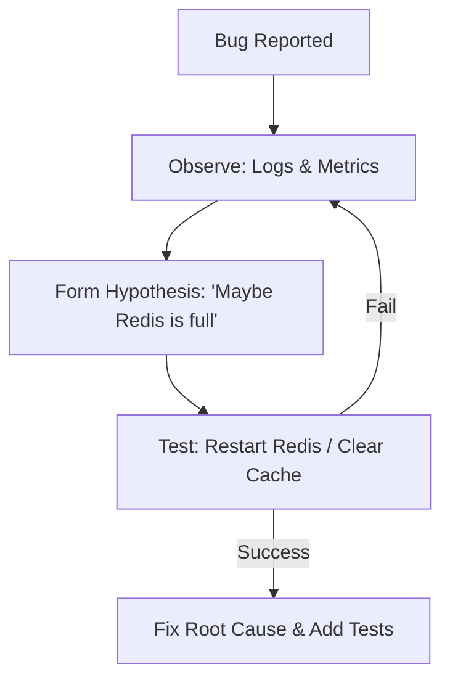

# 🧩 Problem Solving Strategies: The Engineer's Mindset
> **Objective:** Systematically tackle complex technical challenges and bugs | **Language:** Hinglish | **Standard:** 2026 Expert Framework

---

## 🧭 1. Beginner-Friendly Hinglish Explanation
Problem Solving ka matlab hai "Ulajh kar nahi, balki tod kar solution dhoondhna".

- **The Problem:** Jab ek bada bug aata hai ya koi naya complex feature banana hota hai, toh hum ghabra jate hain. Hum bina soche-samjhe code badalne lagte hain aur situation aur kharab ho jati hai.
- **The Solution:** Humein ek "Method" chahiye.
- **The Core Strategy:** **Divide and Conquer**. Ek badi problem ko 10 choti problems mein todo. Choti problem ko solve karna aasaan hai.
- **Intuition:** Ye ek "Detective" ki tarah hai. Aap direct chor ko nahi pakadte, aap saboot (logs) ikhatta karte hain aur ek-ek karke suspects (causes) ko bahar nikaalte hain.

---

## 🧠 2. Deep Technical Explanation
### 1. First Principles Thinking:
Don't assume anything. Break the problem down to the most basic truths. If the API is failing, is the server even on? Is the internet working? Is the code even running?

### 2. The 5 Whys:
Keep asking "Why" until you find the real cause.
- **Problem:** Database is slow.
- 1. **Why?** Too many connections.
- 2. **Why?** The API isn't closing them.
- 3. **Why?** The `finally` block is missing in the code.
- 4. **Why?** The developer didn't know about connection pooling.
- 5. **Why?** (Root Cause): Lack of training on DB best practices.

### 3. Rubber Duck Debugging:
Explain your problem to someone else (or a rubber duck). Often, while explaining, your brain finds the answer.

---

## 🏗️ 3. Architecture Diagrams (The Debugging Loop)


---

## 💻 4. Production-Ready Examples (Conceptual Debugging Steps)
```markdown
# 🛠️ Problem: API returning 500 on Login

1. **Reproduce:** Can I make it fail on my local machine with the same input?
2. **Isolate:** Does it fail for ALL users or just one?
3. **Trace:** Follow the request through the logs using the `correlationId`.
4. **Binary Search:** Comment out half the code. Does it still fail? 
   - If yes, the bug is in the remaining half.
   - If no, the bug is in the commented half.
```

---

## 🌍 5. Real-World Use Cases
- **Legacy Code:** Fixing a bug in a 5-year-old system you didn't write.
- **System Design:** Figuring out how to handle 1 million users without a massive budget.
- **Interview Prep:** Solving "LeetCode" style problems by recognizing patterns (Dynamic Programming, Sliding Window).

---

## ❌ 6. Failure Cases
- **Guessing:** Changing code randomly hoping it will work. (This is 'Voodoo Coding').
- **The "XY Problem":** Asking for help with a solution (Y) instead of explaining the real problem (X).
- **Confirmation Bias:** Only looking for evidence that supports your theory and ignoring everything else.

---

## 🛠️ 7. Debugging Section
| Method | Purpose | Tip |
| :--- | :--- | :--- |
| **Binary Search (Debugging)** | Speed | Commenting/Removing parts of the system until the bug disappears to find the exact location. |
| **Logging** | Visibility | Adding `console.log` or structured logs at every step to see where the data changes. |

---

## ⚖️ 8. Tradeoffs
- **Quick Fix (Hotpatch)** vs **Correct Fix (Refactor).** Always hotpatch if production is down, but follow up with a correct fix.

---

## 🛡️ 9. Security Concerns
- **Problem Solving vs Security:** Sometimes the "Easy" solution is the most insecure. E.g., "Just disable SSL to make it work". NEVER do this.

---

## 📈 10. Scaling Challenges
- **Complexity:** As systems grow, problems become "Distributed". You need **Observability** (Logs, Metrics, Traces) to solve them.

---

## ✅ 11. Best Practices
- **Stay Calm.**
- **Gather Data first.**
- **Don't make assumptions.**
- **Document the solution** so others don't face the same problem.
- **Sleep on it.** (Your brain solves problems better after a break).

---

## ⚠️ 13. Common Mistakes
- **Fixing the Symptom, not the Cause** (e.g., Restarting the server instead of fixing the memory leak).
- **Not writing a test** to prevent the bug from coming back.

---

## 📝 14. Interview Questions
1. "Tell me about the hardest bug you ever solved."
2. "How do you approach a task when you have no idea where to start?"
3. "What is 'First Principles' thinking?"

---

## 🚀 15. Latest 2026 Production Patterns
- **AI Debugging (Copilot/Claude):** Pasting your logs and code into an AI to get a list of potential causes in seconds.
- **Chaos Engineering:** Purposefully breaking things in a controlled way to learn how to solve them before they happen for real.
- **Observability Driven Development (ODD):** Writing your logs and metrics BEFORE you even write the business logic.
漫
