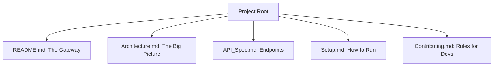

# ✍️ Technical Writing: The Art of Explanation
> **Objective:** Communicate complex technical ideas clearly to different audiences | **Language:** Hinglish | **Standard:** 2026 Expert Framework

---

## 🧭 1. Beginner-Friendly Hinglish Explanation
Technical Writing ka matlab hai "Mushkil cheezon ko aasaan bhasha mein samjhana".

- **The Problem:** Ek engineer bahut smart ho sakta hai, par agar wo apna kaam dusron ko samjha nahi sakta, toh uske kaam ki value kam ho jati hai. "Code doesn't speak for itself".
- **The Solution:** Humein dhang se Documentation, READMEs, aur Design Docs likhne chahiye.
- **The Goal:** Padhne wala insaan (chahe wo Junior ho ya Manager) baat ko turant samajh jaye bina confuse huye.
- **Intuition:** Ye ek "Manual" likhne jaisa hai. Agar aapne naya camera khareeda hai aur manual bahut ghalat likhi hai, toh aap camera use hi nahi kar payenge. Documentation aapke code ka manual hai.

---

## 🧠 2. Deep Technical Explanation
### 1. Know your Audience:
- **Developers:** Want code snippets, API specs, and error codes.
- **Product Managers:** Want features, status, and impact.
- **Users:** Want "How to" guides and screenshots.

### 2. The inverted Pyramid:
Put the most important information (The "What" and "Why") at the top. The details (The "How") should follow.

### 3. Consistency:
Use the same terms everywhere. Don't call it a "User" in one place and an "Account" in another.

---

## 🏗️ 3. Architecture Diagrams (The Documentation Hierarchy)


---

## 💻 4. Production-Ready Examples (A Perfect README Structure)
```markdown
# 🚀 Project Name: The One-Liner Description

## 📝 Overview
What problem does this solve? Why does it exist?

## ✨ Features
- Feature 1
- Feature 2

## 🛠️ Tech Stack
- Node.js, TypeScript, PostgreSQL

## 🚦 Getting Started
1. `npm install`
2. `npm run dev`

## 📘 API Reference
`GET /users` - Returns all users.
```

---

## 🌍 5. Real-World Use Cases
- **Open Source:** A good README is the difference between 0 and 10,000 GitHub stars.
- **Internal Knowledge:** Helping a new team member get productive in 1 day instead of 1 week.
- **Promotion:** Showing your manager exactly what you built and its impact through a clear Design Doc.

---

## ❌ 6. Failure Cases
- **The "Wall of Text":** Huge paragraphs with no headings or bullet points. Nobody will read it.
- **Outdated Docs:** Code changed 6 months ago, but the docs still show the old way. **Fix: Document as Code.**
- **Jargon Overload:** Using too many abbreviations without explaining them.

---

## 🛠️ 7. Debugging Section
| Problem | Diagnostic | Solution |
| :--- | :--- | :--- |
| **People still ask questions** | Gaps | If 5 people ask the same question, your documentation is missing that answer. Add it! |
| **"I don't understand"** | Complexity | Use more analogies and Mermaid diagrams. |

---

## ⚖️ 8. Tradeoffs
- **Detailed Docs (Helpful)** vs **Maintenance (Time-consuming).**

---

## 🛡️ 9. Security Concerns
- **Sensitive Info in Docs:** Never put real API keys, staging URLs, or internal server IPs in public documentation.

---

## 📈 10. Scaling Challenges
- **Massive Docs:** When a project has 500 pages of docs, finding the right page is hard. **Fix: Use Search (Algolia/Docusaurus).**

---

## ✅ 11. Best Practices
- **Use Clear Headings.**
- **Use Bullet Points.**
- **Include Code Snippets.**
- **Add Diagrams (Mermaid/Excalidraw).**
- **Keep it Updated.**
- **Use 'Hinglish' intuition for complex topics.**

---

## ⚠️ 13. Common Mistakes
- **Assuming the reader knows everything.**
- **Not proofreading.**

---

## 📝 14. Interview Questions
1. "How do you document a new API feature?"
2. "What makes a README 'Good'?"
3. "How do you handle documentation for a large microservices system?"

---

## 🚀 15. Latest 2026 Production Patterns
- **Documentation as Code:** Keeping `.md` files in the same Git repo as the code, so they are reviewed together in Pull Requests.
- **AI-generated Drafts:** Using LLMs to write the first draft of your documentation based on your code and comments.
- **Interactive Demos:** Using tools like **Storybook** or **Swagger** where users can "Try" the code directly inside the documentation.
漫
