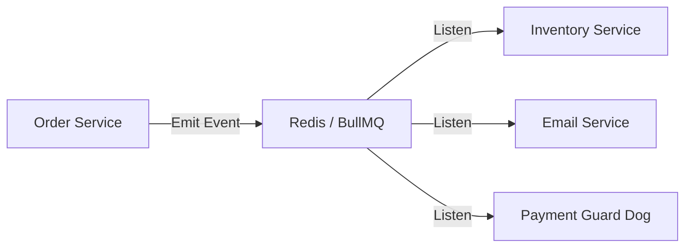

# 🛒 Project 2: High-Performance E-Commerce Backend
> **Objective:** Design a resilient backend for a massive marketplace like Amazon | **Type:** Hands-on Project | **Standard:** 2026 Expert Framework

---

## 🧭 1. Project Vision
Is project mein hum focus karenge **Consistency**, **Concurrency**, aur **Complex State Management** par. Aap seekhenge ki kaise Flash Sale ke waqt "Overselling" se bacha jata hai aur kaise complex Order workflows ko manage karte hain.

---

## 🛠️ 2. Tech Stack
- **Runtime:** Node.js (v20+)
- **Language:** TypeScript
- **Framework:** Express.js
- **Database:** PostgreSQL (for Orders/Payments) + MongoDB (for Product Catalog)
- **Queues:** BullMQ with Redis (for Background processing)
- **Search:** ElasticSearch (for product search)
- **Payment:** Stripe API (Stripe Elements)

---

## 🏗️ 3. Core Features & Requirements
### Phase 1: Product & Inventory
- Complex product schema (Variants, Colors, Sizes) in MongoDB.
- Real-time inventory tracking with Redis-based locking.

### Phase 2: Cart & Checkout
- Persistent cart (even for logged-out users via Redis).
- Checkout flow with atomic stock decrement.

### Phase 3: Orders & Payments
- Order lifecycle: `PENDING` -> `PAID` -> `SHIPPED` -> `DELIVERED`.
- Stripe Webhook integration for payment confirmation.

### Phase 4: Background Jobs
- Automatic order cancellation if payment is not received in 15 mins.
- Generating PDF invoices and emailing them to users.

---

## 📐 4. Architecture Pattern (Event-Driven)

---

## 💻 5. Implementation Roadmap
### Step 1: Multi-DB Setup
Setup Docker containers for Postgres, Mongo, and Redis.

### Step 2: Search Optimization
Implement "Search as you type" using ElasticSearch index. Ensure the index updates whenever a product is added/updated in MongoDB.

### Step 3: Flash Sale Test
Write a stress test to simulate 500 users trying to buy the same item with only 5 units in stock.

---

## ❌ 6. Failure Analysis (Common Pitfalls)
- **Race Condition:** Two users buying the last item at the same millisecond. **Fix: Use `SELECT FOR UPDATE` in SQL or Redis `SETNX`.**
- **Incomplete Checkout:** Payment is successful, but the order status didn't update. **Fix: Use Idempotent Webhooks.**
- **Heavy Image Processing:** Blocking the main thread while resizing product photos. **Fix: Use a worker process.**

---

## ✅ 7. Definition of Done
- Zero items oversold during stress tests.
- Database is properly indexed for fast queries.
- Order history is auditable.
- Swagger documentation for all 20+ endpoints.

---

## 📝 8. Interview Talking Points
- "How did you handle the dual-database consistency between Mongo and ElasticSearch?"
- "Explain your strategy for handling failed payments."
- "How did you optimize the database for searching millions of products?"
漫
