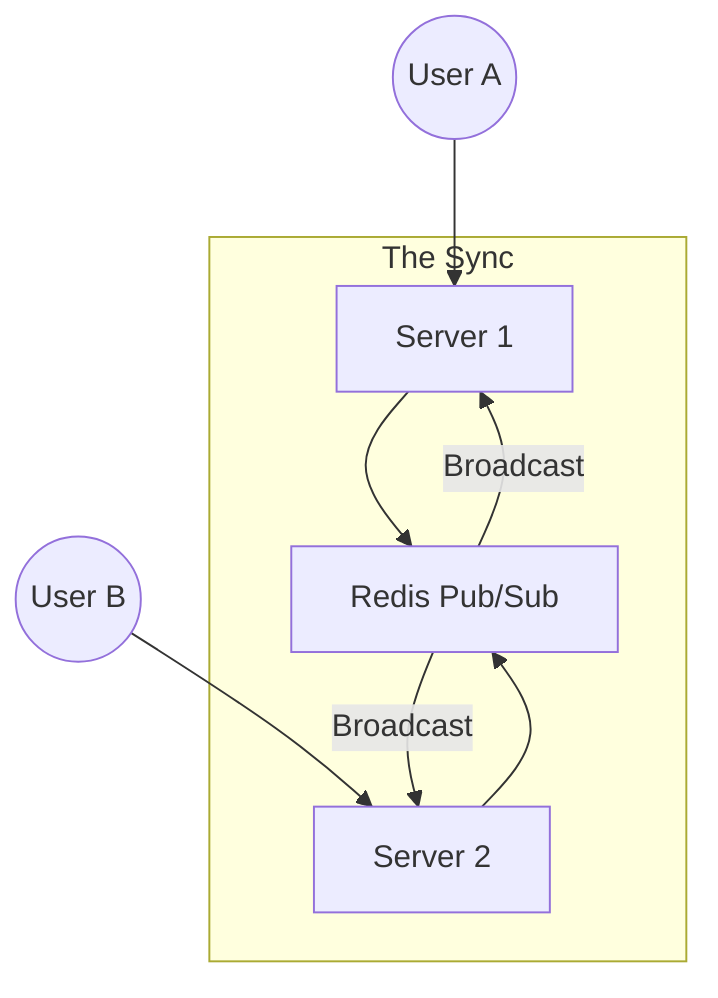

# 💬 Project 3: Real-Time Enterprise Chat System
> **Objective:** Build a scalable, real-time communication platform like Slack or Discord | **Type:** Hands-on Project | **Standard:** 2026 Expert Framework

---

## 🧭 1. Project Vision
Is project mein hum focus karenge **Low Latency**, **Scaling WebSockets**, aur **Message Persistence** par. Aap seekhenge ki kaise hazaron log ek saath ek hi channel mein bina lag ke baat kar sakte hain.

---

## 🛠️ 2. Tech Stack
- **Runtime:** Node.js (v20+)
- **Real-time:** Socket.io / WebSockets
- **Database:** MongoDB (for Message History) + Redis (for Pub/Sub and Presence)
- **State:** Redis (Tracking who is Online/Offline)
- **Deployment:** Docker + Nginx (with sticky sessions)

---

## 🏗️ 3. Core Features & Requirements
### Phase 1: Real-time Messaging
- One-to-one private chat.
- Group channels with permissions.
- Typing indicators ("Sameer is typing...").

### Phase 2: User Presence
- Online/Offline status tracking (using Redis Expire).
- "Last seen at..." functionality.

### Phase 3: Scaling (The Hard Part)
- Running 5 backend servers and syncing messages between them using **Redis Pub/Sub**.
- Handling "Reconnection" logic gracefully.

### Phase 4: Media & Search
- Drag & Drop file sharing (S3 integration).
- Full-text search for message history.

---

## 📐 4. Scaling Pattern (Horizontal WebSocket Scaling)

---

## 💻 5. Implementation Roadmap
### Step 1: Basic Socket.io Setup
Setup a basic server that accepts connections and broadcasts a "Hello World" message.

### Step 2: Implement Redis Adapter
Use the `@socket.io/redis-adapter` so that if User A is on Server 1 and User B is on Server 2, they can still talk to each other.

### Step 3: Message Persistence
Write messages to MongoDB asynchronously (don't make the user wait for the DB save before showing the message on screen).

---

## ❌ 6. Failure Analysis (Common Pitfalls)
- **Memory Leaks:** Not cleaning up event listeners when a user disconnects. **Fix: Use `socket.off()` or `.removeAllListeners()`.**
- **Load Balancing:** Nginx disconnecting users because of "Timeout". **Fix: Increase proxy timeout and enable keep-alive.**
- **Out of Order Messages:** Messages appearing in the wrong order during a network glitch. **Fix: Use Client-side sequencing or timestamps.**

---

## ✅ 7. Definition of Done
- Real-time delivery in < 100ms.
- 10,000 concurrent connections supported in load tests.
- Offline messages are saved and delivered when the user reconnects.
- Clear separation between 'Transport' (WebSockets) and 'Storage' (MongoDB).

---

## 📝 8. Interview Talking Points
- "How do you handle a situation where the WebSocket server crashes but users are still typing?"
- "Explain why you used Redis for 'Presence' instead of a database."
- "How did you scale the system to handle 10 servers?"
漫
