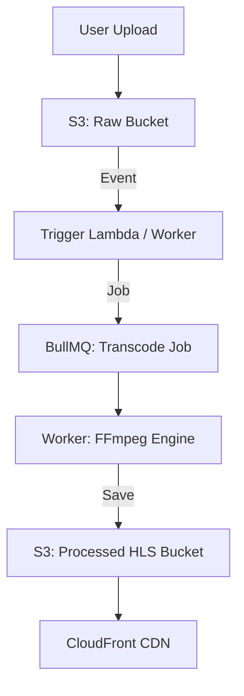

# 🎬 Project 4: Scalable Video Streaming Service
> **Objective:** Build a platform like Netflix or YouTube for high-quality video delivery | **Type:** Hands-on Project | **Standard:** 2026 Expert Framework

---

## 🧭 1. Project Vision
Is project mein hum focus karenge **Large File Handling**, **Encoding**, aur **Content Delivery** par. Aap seekhenge ki kaise GBs ki videos ko process kiya jata hai aur kaise unhe low-latency ke saath duniya bhar mein stream karte hain.

---

## 🛠️ 2. Tech Stack
- **Runtime:** Node.js (v20+)
- **Processing:** FFmpeg (for video transcoding)
- **Storage:** AWS S3 (for raw and processed files)
- **CDN:** AWS CloudFront (for global delivery)
- **Database:** PostgreSQL (for metadata) + ElasticSearch (for search)
- **Workers:** BullMQ (for handling long-running transcoding jobs)

---

## 🏗️ 3. Core Features & Requirements
### Phase 1: Upload & Transcoding
- Resumable file uploads (handling 1GB+ files without timeouts).
- Automatic transcoding: `1080p` -> `720p`, `480p`, `360p`.
- Generating video thumbnails (screenshots).

### Phase 2: Adaptive Streaming
- Implementing **HLS (HTTP Live Streaming)**.
- Creating a `.m3u8` playlist for different quality levels.

### Phase 3: Global Delivery
- Setting up CloudFront with S3.
- Signed URLs for private/premium content.

### Phase 4: Discovery
- Video recommendations based on tags.
- Fast search across thousands of titles.

---

## 📐 4. Transcoding Pipeline

---

## 💻 5. Implementation Roadmap
### Step 1: Multipart Upload
Implement S3 Multipart upload so that if a user's internet disconnects at 90%, they can resume from there.

### Step 2: FFmpeg Integration
Use the `fluent-ffmpeg` library in Node.js to convert a `.mp4` file into HLS segments (`.ts` files).

### Step 3: HLS Player
Integrate `Hls.js` in the frontend to play the generated stream and automatically switch quality based on internet speed.

---

## ❌ 6. Failure Analysis (Common Pitfalls)
- **Disk Full:** The worker server running out of space while processing 10 videos at once. **Fix: Use ephemeral storage and clean up after every job.**
- **CPU Bottleneck:** Transcoding is 100% CPU intensive. **Fix: Use separate 'Auto-scaling' worker pools.**
- **Cost Explosion:** S3 egress fees. **Fix: Always use a CDN (CloudFront) as it's cheaper and faster.**

---

## ✅ 7. Definition of Done
- Videos are playable on all devices (mobile/desktop).
- Quality switches automatically (Auto-quality).
- Uploads are stable and resumable.
- Infrastructure is fully automated with Terraform.

---

## 📝 8. Interview Talking Points
- "What is HLS and why is it better than just playing an MP4 file?"
- "How do you protect your videos from being downloaded for free?"
- "How do you scale the transcoding workers when 1000 people upload videos at once?"
漫
