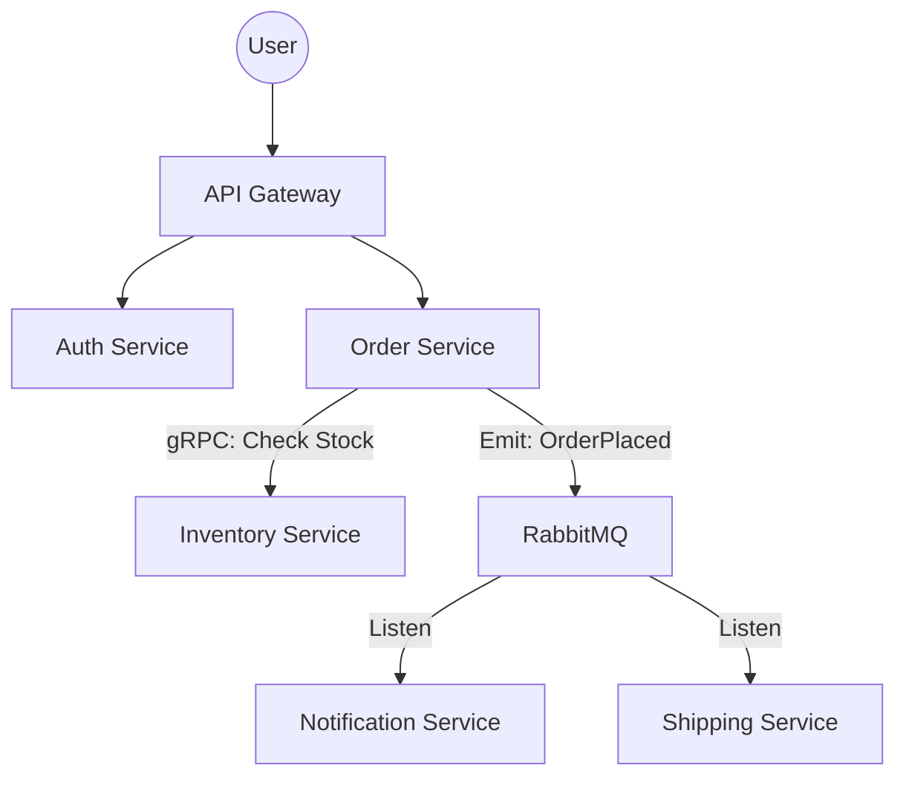

# 🕸️ Project 5: Enterprise Microservices Orchestration
> **Objective:** Build a distributed system with service discovery, inter-service communication, and resilience | **Type:** Hands-on Project | **Standard:** 2026 Expert Framework

---

## 🧭 1. Project Vision
Is project mein hum focus karenge **Architectural Complexity** par. Aap seekhenge ki kaise 5+ independent services aapas mein baat karti hain, kaise data consistency banaye rakhte hain (Saga), aur kaise poore system ko Kubernetes par deploy karte hain.

---

## 🛠️ 2. Tech Stack
- **Frameworks:** Node.js (Express), Go (for high-perf services)
- **Communication:** gRPC (Internal) + REST (External)
- **Broker:** RabbitMQ / Kafka
- **Orchestration:** Kubernetes (K8s)
- **Observability:** Prometheus, Grafana, and Jaeger (Tracing)
- **Gateway:** Kong or Nginx Ingress

---

## 🏗️ 3. Core Features & Requirements
### Phase 1: Service Architecture
- **Auth Service:** Centralized JWT issuer.
- **Inventory Service:** Managing product stock.
- **Order Service:** Orchestrating the purchase flow.
- **Notification Service:** Asynchronously sending emails.

### Phase 2: Inter-service Communication
- Use **gRPC** for high-speed synchronous calls (e.g., Order calling Inventory to check stock).
- Use **RabbitMQ** for asynchronous events (e.g., Order Created -> Notification sent).

### Phase 3: Resilience & Patterns
- Implementing a **Circuit Breaker** (using Opossum).
- Implementing the **Saga Pattern** to handle rollbacks if an order fails halfway.

### Phase 4: Kubernetes Deployment
- Writing Helm charts for every service.
- Setting up a Load Balancer and Ingress.

---

## 📐 4. Distributed Architecture (The Mesh)

---

## 💻 5. Implementation Roadmap
### Step 1: Mono-repo Setup
Setup a mono-repo using **Turborepo** or **Nx** to manage multiple services in one place.

### Step 2: Define Protobufs
Write the `.proto` files for gRPC communication between services.

### Step 3: Kubernetes Local
Use **Minikube** or **Kind** to deploy the whole system on your local machine with 5 different pods and a local RabbitMQ.

---

## ❌ 6. Failure Analysis (Common Pitfalls)
- **Network Latency:** Internal gRPC calls taking too long. **Fix: Use Service Mesh (Istio) or better caching.**
- **Database Consistency:** Service A updated its DB, but Service B failed. **Fix: Use Saga Pattern (Compensating transactions).**
- **Distributed Debugging:** Not knowing where a request failed. **Fix: Use Distributed Tracing (Jaeger).**

---

## ✅ 7. Definition of Done
- System survives the 'Chaos Test' (deleting one pod doesn't break the whole flow).
- All services have health checks.
- Centralized logging and metrics dashboard is operational.
- Zero-downtime deployment achieved via Kubernetes Rolling Updates.

---

## 📝 8. Interview Talking Points
- "Why did you use gRPC instead of REST for internal communication?"
- "How did you handle a distributed transaction across 3 services?"
- "What was the biggest challenge in managing 5 different Docker images and deployments?"
漫
