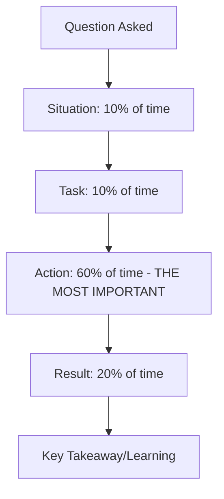

# 🤝 Behavioral Interview Tips: The Culture Fit
> **Objective:** Master the non-technical part of the interview to prove you are a great teammate | **Language:** Hinglish | **Standard:** 2026 Expert Framework

---

## 🧭 1. Beginner-Friendly Hinglish Explanation
Behavioral Interview ka matlab hai "Ye check karna ki aap ke saath kaam karna kaisa hai".

- **The Problem:** Ek engineer bahut smart ho sakta hai, par agar wo gussail hai, dusron ki baat nahi sunta, ya pressure mein ro deta hai, toh koi use hire nahi karega. "No Asshole Rule" is real.
- **The Solution:** Humein apni past stories ko "STAR" format mein sunana chahiye.
- **The Goal:** Ye dikhana ki aap **Adaptable**, **Humble**, aur **Problem-Solver** hain.
- **Intuition:** Ye ek "First Date" ki tarah hai. Recruiter ye dekh raha hai ki kya wo aapke saath roz 8 ghante bitana chahta hai ya nahi.

---

## 🧠 2. Deep Technical Explanation
### 1. The STAR Method (Situation, Task, Action, Result):
- **Situation:** Set the scene. "Last year, our server crashed during a sale."
- **Task:** What was your job? "I had to find the bug and restore the DB."
- **Action:** What did YOU do? "I analyzed the logs, found a memory leak, and deployed a hotfix."
- **Result:** What was the outcome? "Site was back in 15 mins and we saved ₹10 lakhs."

### 2. Common Behavioral Questions:
- "Tell me about a conflict with a coworker." (Focus on how you solved it, not who was wrong).
- "Tell me about a time you failed." (Focus on what you learned).
- "What is your biggest weakness?" (Focus on a real weakness and how you are fixing it).

### 3. The "Conflict" Answer:
Never blame others. Use "I" statements. "I felt the communication was unclear, so I invited the team to a 5-minute sync to clarify the goals."

---

## 🏗️ 3. Architecture Diagrams (The Perfect Behavioral Answer)


---

## 💻 4. Production-Ready Examples (The 'Failure' Story)
```markdown
# ❌ Bad Answer:
"I never really failed, I'm a perfectionist." 
(Recruiter will think you are lying or arrogant).

# ✅ Great Answer (STAR):
- **Situation:** In my first internship, I accidentally deleted a staging database.
- **Task:** I had to restore the data before the QA team started testing.
- **Action:** I immediately informed my manager (honesty), found the latest backup, and restored it. I then wrote a script to prevent accidental deletions in the future.
- **Result:** Data was back in 30 mins. 
- **Learning:** I learned the importance of 'Safety Guards' and that admitting mistakes early saves everyone's time.
```

---

## 🌍 5. Real-World Use Cases
- **Senior Roles:** Where "Leadership" and "Conflict Management" are more important than coding.
- **Remote Work:** Where "Clear Communication" and "Ownership" are critical.
- **Startup Culture:** Where "Fast Learning" and "Wearing many hats" are valued.

---

## ❌ 6. Failure Cases
- **Badmouthing past bosses:** If you talk bad about your old boss, the interviewer thinks you will talk bad about them too.
- **Lying:** If the interviewer asks a follow-up question, you will get caught.
- **Being Vague:** "I helped the team a lot." (Doesn't mean anything). **Be specific.**

---

## 🛠️ 7. Debugging Section
| Problem | Diagnostic | Solution |
| :--- | :--- | :--- |
| **Talking too much** | Bored Interviewer | Keep every answer under 2-3 minutes. If they want more, they will ask. |
| **Blanking out** | No Stories | Prepare 5 "Core Stories" before the interview (Conflict, Failure, Success, Leadership, Learning). |

---

## ⚖️ 8. Tradeoffs
- **Confidence (Good)** vs **Arrogance (Bad).**
- **Honesty (Good)** vs **Over-sharing (Bad).**

---

## 🛡️ 9. Security Concerns
- **NDAs:** Never share secret company data (e.g., "I worked on Project X which had a secret algorithm for Google") during an interview.

---

## ✅ 10. Best Practices
- **Prepare 5 core stories.**
- **Use the STAR method.**
- **Be positive.**
- **Research the company's "Values".**
- **Ask great questions at the end** ("What does a typical day for a dev look like here?").

---

## ⚠️ 13. Common Mistakes
- **Interrupting the interviewer.**
- **Not having any questions for them.**

---

## 📝 14. Interview Questions
1. "Why do you want to work here?"
2. "How do you handle a situation where you are behind schedule?"
3. "Give me an example of when you went above and beyond for a project."

---

## 🚀 15. Latest 2026 Production Patterns
- **Culture Add vs Culture Fit:** Companies now look for people who bring a "New perspective" (Diversity) rather than just "Fitting in".
- **Reverse Interviews:** In 2026, top devs "Interview the company" as much as they are being interviewed. Ask about their tech debt and on-call rotation!
漫
