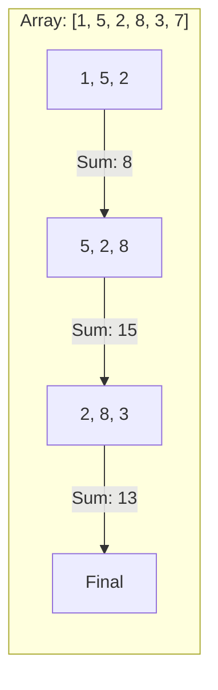

# 🧠 Coding Challenge Patterns: Solving Backend Tasks
> **Objective:** Recognize and solve the most common patterns in backend coding interviews | **Language:** Hinglish | **Standard:** 2026 Expert Framework

---

## 🧭 1. Beginner-Friendly Hinglish Explanation
Coding Challenge Patterns ka matlab hai "Problem dhoondhne ke shortcuts".

- **The Problem:** Interview mein jab aapko code likhne ko kaha jata hai, toh aap confuse ho jate hain ki shuru kahan se karein. Har question alag lagta hai.
- **The Solution:** Actually, 90% questions sirf 5-10 "Patterns" par based hote hain. Agar aap pattern pehchan gaye, toh solution apne aap dimag mein aa jayega.
- **The Concept:** 
  1. **Sliding Window:** Array/String mein 'k' length ka chunk dhoondhna.
  2. **Two Pointers:** Array ke dono ends se center tak aana.
  3. **Hash Maps:** Fast lookup (O(1)) ke liye data store karna.
- **Intuition:** Ye "Math Formulas" ki tarah hain. Agar aapko formula pata hai, toh aap question (Problem) solve kar sakte hain chahe values (Data) kuch bhi hon.

---

## 🧠 2. Deep Technical Explanation
### 1. The Hash Map Pattern (The Backend King):
In backend interviews, **Hash Maps** are used everywhere.
- **Problem:** "Find the first non-repeating character in a string" or "Group similar orders".
- **Logic:** Store counts or objects in a Map for instant retrieval.

### 2. The Sliding Window:
Used when you need to find a subarray or substring that meets a condition.
- **Problem:** "Maximum sum of 3 consecutive elements".
- **Logic:** Instead of re-calculating everything, subtract the element leaving the window and add the one entering it.

### 3. The BFS/DFS (Graph/Tree):
Used for hierarchical data (e.g., Folder structures, Friend suggestions).
- **BFS (Breadth First Search):** Finding the "Shortest Path".
- **DFS (Depth First Search):** Finding "All possible paths".

---

## 🏗️ 3. Architecture Diagrams (Sliding Window Visual)


---

## 💻 4. Production-Ready Examples (Two Sum Pattern)
```typescript
// 2026 Standard: Optimal 'Two Sum' using Hash Map (O(N))

function twoSum(nums: number[], target: number): number[] {
  const map = new Map<number, number>();

  for (let i = 0; i < nums.length; i++) {
    const complement = target - nums[i];
    
    if (map.has(complement)) {
      return [map.get(complement)!, i];
    }
    
    map.set(nums[i], i);
  }

  return [];
}

// 💡 Why is this better? 
// A nested loop (Brute force) is O(N^2), but a Map makes it O(N).
```

---

## 🌍 5. Real-World Use Cases
- **Search Suggester:** Using a **Trie** (Tree pattern) to find words that start with "App...".
- **Rate Limiting:** Using the **Sliding Window Log** algorithm to track user requests.
- **File System:** Using **Recursion (DFS)** to list all files in a deep directory structure.

---

## ❌ 6. Failure Cases
- **Infinite Loops:** Forgetting to increment your pointers in a `while` loop.
- **Edge Cases:** Your code works for `[1, 2, 3]` but crashes for `[]` (Empty) or `[1]` (Single element). **Fix: Always check for null/empty at the start.**
- **Space Complexity:** Solving the problem but using so much RAM that the server crashes.

---

## 🛠️ 7. Debugging Section
| Pattern | Big O (Time) | Big O (Space) |
| :--- | :--- | :--- |
| **Hash Map** | O(N) | O(N) |
| **Two Pointers** | O(N) | O(1) |
| **Sliding Window** | O(N) | O(1) |

---

## ⚖️ 8. Tradeoffs
- **Time vs Space:** You can often make code faster (Time) by using more memory (Space, like a Cache/Map).

---

## 🛡️ 9. Security Concerns
- **ReDoS (Regular Expression Denial of Service):** Writing a complex regex pattern that takes 100 years to run if the input is malicious. **Fix: Avoid 'Evil' regex patterns.**

---

## ✅ 10. Best Practices
- **Read the problem twice.**
- **Write the Brute Force logic first** (at least in your head).
- **Optimize using a Map or Pointer.**
- **Test with edge cases.**
- **Explain your Big O complexity.**

---

## ⚠️ 13. Common Mistakes
- **Over-complicating** the solution.
- **Not talking while coding.** (The interviewer needs to hear your logic).

---

## 📝 14. Interview Questions
1. "How do you find a cycle in a linked list?" (Pattern: Fast/Slow Pointers).
2. "How do you find the k-th largest element in an array?" (Pattern: Min-Heap).
3. "Reverse a string without using extra space." (Pattern: Two Pointers).

---

## 🚀 15. Latest 2026 Production Patterns
- **Bloom Filters:** Using hashing to check if an item exists in a set (like a username) with almost $100\%$ accuracy and zero memory usage.
- **HyperLogLog:** Using complex math to count unique users (DAU) across millions of events with tiny memory usage.
- **AI Code Review:** Using AI to find the "Big O" of your code automatically during the interview.
漫
