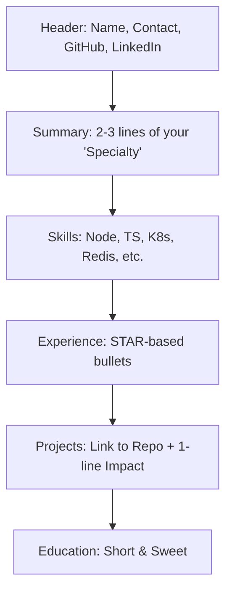

# 📄 Resume & Portfolio Guide: Getting Noticed
> **Objective:** Build a high-impact profile that gets you interviews at top-tier tech companies | **Language:** Hinglish | **Standard:** 2026 Expert Framework

---

## 🧭 1. Beginner-Friendly Hinglish Explanation
Resume & Portfolio ka matlab hai "Apni marketing karna".

- **The Problem:** Ek recruiter ke paas sirf 6 seconds hote hain aapka resume dekhne ke liye. Agar aapne generic resume banaya ("I know Java, HTML, CSS"), toh wo select nahi hoga.
- **The Solution:** Humein ek "Action-oriented" resume aur ek "Proof-based" portfolio chahiye.
- **The Goal:** Ye dikhana ki aap sirf code nahi likhte, aap "Problems solve karte hain".
- **Intuition:** Resume ek "Trailer" ki tarah hai. Use dekhkar recruiter ko film (Aapka Interview) dekhne ka mann hona chahiye. Portfolio wo film hai jo sabit karti hai ki aapne sach mein kaam kiya hai.

---

## 🧠 2. Deep Technical Explanation
### 1. The STAR Method (For Resume Bullets):
Don't say: "Built an API".
Say: "Optimized a Node.js API (Situation/Task) which reduced latency by $40\%$ (Action) and improved user retention by $15\%$ (Result)."

### 2. Keywords for ATS (Applicant Tracking Systems):
Many companies use AI to filter resumes. Ensure you have keywords like:
- `Node.js`, `TypeScript`, `PostgreSQL`, `Docker`, `Kubernetes`, `Redis`, `CI/CD`.

### 3. The Backend Portfolio:
A backend dev's portfolio is different. We don't have pretty designs. We have:
- **GitHub Repos:** Clean code, meaningful commits, great READMEs.
- **Architecture Diagrams:** Explaining HOW you designed the system.
- **Performance Reports:** Proof that your code handles $10k+$ requests/sec.

---

## 🏗️ 3. Architecture Diagrams (The High-Impact Resume Structure)


---

## 💻 4. Production-Ready Examples (The Perfect Project Description)
```markdown
# ❌ Bad:
"Made a Chat App using WebSockets and Node.js."

# ✅ Great:
"Scalable Real-time Chat Engine (Node.js & Socket.io)
- Orchestrated multiple WebSocket servers using Redis Pub/Sub for horizontal scaling.
- Reduced message delivery latency to < 100ms for 5,000 concurrent users.
- Implemented cursor-based pagination for chat history, reducing DB load by 30%."
```

---

## 🌍 5. Real-World Use Cases
- **Junior Devs:** Focus on "Personal Projects" and "Open Source Contributions".
- **Senior Devs:** Focus on "System Scalability", "Team Mentorship", and "Business Impact".
- **Freelancers:** Focus on "Client Results" and "Full-stack delivery".

---

## ❌ 6. Failure Cases
- **The "Wall of Text":** 3-page long resumes. **Fix: Keep it to 1 page.**
- **Generic Skills:** Listing "Microsoft Word" or "Team Player". (Waste of space).
- **Broken Links:** Linking to a GitHub repo that doesn't exist or is empty.

---

## 🛠️ 7. Debugging Section
| Section | Tip |
| :--- | :--- | :--- |
| **Experience** | Use bold for tech names (e.g., **Redis**) to make them pop during the 6-second scan. |
| **Education** | If you have > 2 years of experience, put Education at the bottom. |

---

## ⚖️ 8. Tradeoffs
- **Modern Design (Can be messy for AI scanners)** vs **Standard Template (Safe and clean).** Always use a clean, single-column template for ATS compatibility.

---

## 🛡️ 9. Security Concerns
- **Personal Info:** Never put your full home address or Aadhaar/PAN number on your resume. Email and Phone are enough.

---

## ✅ 10. Best Practices
- **Use a Single Column layout.**
- **Save as PDF.**
- **Quantify your achievements** (Use numbers: $50\%, ₹10k, 500ms$).
- **Include links to live demos/repos.**
- **Tailor your resume** for every job description.

---

## ⚠️ 13. Common Mistakes
- **Typos/Spelling mistakes.** (A backend dev must be detail-oriented!).
- **Using a photo.** (Not needed in 2026 tech resumes).

---

## 📝 14. Interview Questions
1. "Walk me through the most complex part of this project on your resume."
2. "Why did you choose Redis for this specific task?"
3. "How did you measure the '40% performance improvement' you mentioned?"

---

## 🚀 15. Latest 2026 Production Patterns
- **Interactive Resume (vCard):** A QR code on your resume that opens an interactive terminal-based portfolio of your work.
- **Proof of Work (On-chain):** Linking to your verified Open Source contributions (like on **OpenSauced**).
- **Video Introduction:** A 30-second video of you explaining your passion for backend engineering.
漫
