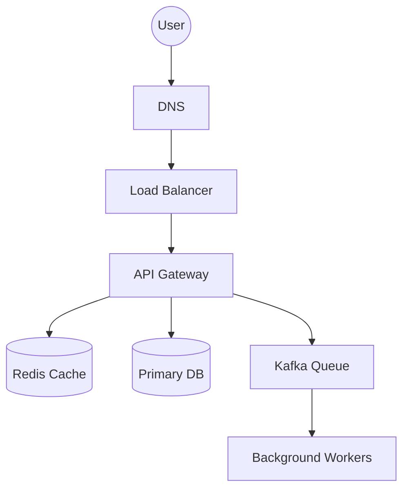

# 📐 System Design Interview Framework: The 4-Step Method
> **Objective:** Master the structured approach to solving any system design problem in an interview | **Language:** Hinglish | **Standard:** 2026 Expert Framework

---

## 🧭 1. Beginner-Friendly Hinglish Explanation
System Design Interview ka matlab hai "45 minute mein ek billion-user app ka naksha banana".

- **The Problem:** Jab interview mein pucha jata hai "Design YouTube", toh hum panic karke direct "Database" ya "Load Balancer" par kood jate hain. Ye galat hai.
- **The Solution:** Humein ek strict "Framework" chahiye. Humein step-by-step jana hai: Requirement -> Estimation -> Architecture -> Deep Dive.
- **The Goal:** Ye dikhana ki aap ek "Architect" ki tarah soch sakte hain jo complexity aur tradeoffs ko samajhta hai.
- **Intuition:** Ye ek "Ghar banane" jaisa hai. Aap direct eentein (bricks) nahi uthate, pehle aap puchte hain "Kitne log rahenge?" (Requirements), "Kitna budget hai?" (Constraints), aur phir naksha banate hain.

---

## 🧠 2. Deep Technical Explanation (The 4-Step Framework)
### Step 1: Clarify Requirements (5-10 mins)
Never start without asking questions!
- **Functional:** What should the app do? (e.g., "User can upload videos").
- **Non-Functional:** Scale, Latency, Availability. (e.g., "10M DAU, <200ms latency").

### Step 2: Back-of-the-envelope Estimation (5 mins)
Do the math!
- **Storage:** "10M users x 1MB data = 10TB total storage".
- **Bandwidth:** "1M requests/sec x 1KB/req = 1GB/sec bandwidth".
- **This shows you understand the scale.**

### Step 3: High-Level Design (10-15 mins)
Draw the big blocks!
- Load Balancer -> API Servers -> Cache -> Database.
- Explain the data flow.

### Step 4: Deep Dive (15-20 mins)
Solve the hard parts!
- "How do we handle a celebrity follower with 100M fans?"
- "How do we ensure the database doesn't crash during a spike?"
- **This is where you show your 2026 expert knowledge (Saga, CQRS, Sharding).**

---

## 🏗️ 3. Architecture Diagrams (The Universal Skeleton)


---

## 💻 4. Production-Ready Examples (Conceptual Scalability Analysis)
```markdown
# 💬 Interview Question: Design a Rate Limiter

1. **Clarify:** Is it per User or per IP? (User). What's the limit? (100 req/min).
2. **Estimation:** 1B users x 8 bytes (ID+Count) = 8GB Redis memory. (Easy!).
3. **High-Level:** 
   - User -> API Gateway -> Redis.
   - Use `INCR` and `EXPIRE` in Redis.
4. **Deep Dive:** 
   - "How to handle a distributed Redis cluster?" -> Use **Redis Cell** or **Token Bucket** algorithm.
   - "How to handle clock drift?" -> Use a centralized timestamp.
```

---

## 🌍 5. Real-World Use Cases
- **Junior Interviews:** Focusing on SQL vs NoSQL and basic caching.
- **Senior Interviews:** Focusing on Distributed Transactions, Sharding, and Consistency.
- **Architect Interviews:** Focusing on Cost, Security, and Organizational impact.

---

## ❌ 6. Failure Cases
- **Not asking questions:** Assuming you know exactly what the interviewer wants.
- **Going too deep too fast:** Spending 20 minutes on "Database Indexing" and never finishing the rest of the system.
- **Ignoring Tradeoffs:** Saying "This is the best way" instead of "This is good for X, but bad for Y".

---

## 🛠️ 7. Debugging Section
| Problem | Diagnostic | Solution |
| :--- | :--- | :--- |
| **Silent Interviewer** | Lost connection | If the interviewer isn't talking, you might be going too deep. STOP and ask: "Should I dive deeper into the DB or move to the Feed logic?" |
| **Wrong Math** | Panic | Don't worry about being 100% exact. "Around 10TB" is better than a wrong exact number. |

---

## ⚖️ 8. Tradeoffs
- **SQL (Consistency)** vs **NoSQL (Scalability).**
- **Load Balancer (Software)** vs **Cloud Gateway (Managed).**

---

## 🛡️ 9. Security Concerns
- **Mention Security!** In every design, say: "And here I will add a WAF and use HTTPS with JWT auth to protect the user data."

---

## ✅ 10. Best Practices
- **Think Out Loud.** (The interviewer wants to hear your brain working).
- **Start Simple, then Scale.**
- **Use the right terminology** (Sharding, Replication, Latency, Throughput).
- **Draw clearly.**
- **Stay Calm.**

---

## ⚠️ 13. Common Mistakes
- **Designing for 1 billion users** when the interviewer asked for 1,000.
- **Forgeting to handle failures** (What if the DB dies?).

---

## 📝 14. Interview Questions
1. "How do you handle the 'Celebrity' problem in a social media app?"
2. "Explain the CAP theorem and how it affects your choice of database."
3. "How would you design a system that is 99.999% available?"

---

## 🚀 15. Latest 2026 Production Patterns
- **Serverless Evolution:** Discussing how you'd use AWS Lambda to handle spikes without pre-provisioning servers.
- **Edge Data:** Discussing moving data to the CDN level for ultra-fast local access.
- **AI-driven Scaling:** How predictive analytics can help scale the system before the traffic even hits.
漫
