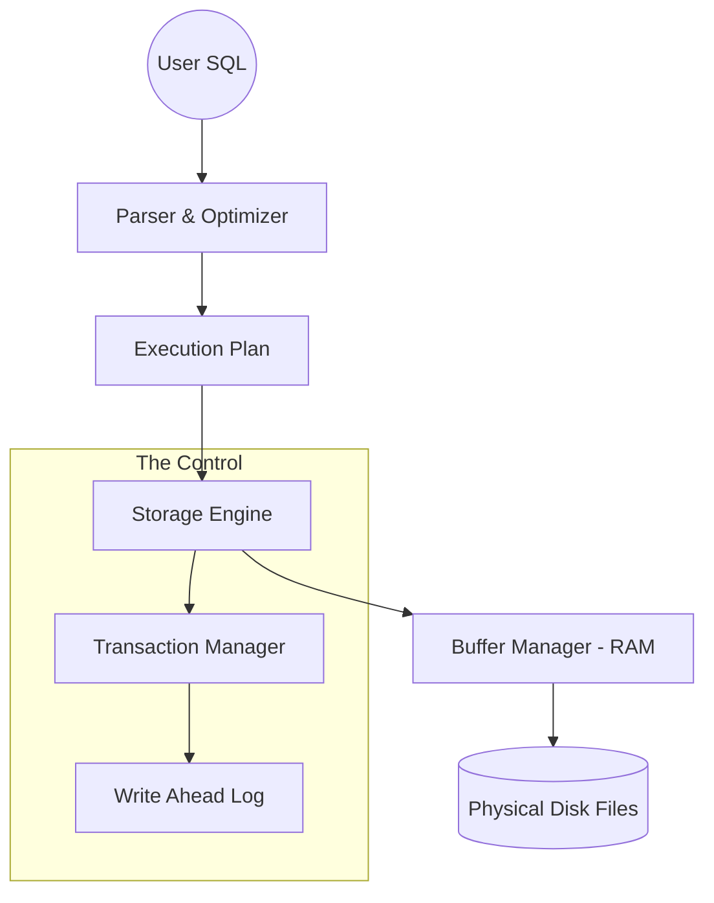

# 🏗️ Database Architecture: Under the Hood
> **Objective:** Understand the internal components that make a database functional, fast, and reliable | **Language:** Hinglish | **Standard:** 2026 Expert Framework

---

## 🧭 1. Beginner-Friendly Hinglish Explanation
Database Architecture ka matlab hai "Database ke andar ke purze (Components)".

- **The Problem:** Jab aap `SELECT * FROM users` likhte hain, toh kya hota hai? Ye magic nahi hai. Piche ek bada engine kaam kar raha hota hai.
- **The Solution:** Humein components ko alag-alag kaam dena padta hai.
- **The Core Components:** 
  1. **Query Processor:** Aapke SQL ko samajhne wala (Parser) aur optimize karne wala (Optimizer).
  2. **Storage Engine:** Disk par data kaise likha jayega aur kaise padha jayega.
  3. **Transaction Manager:** ACID ensure karne wala.
  4. **Buffer Manager:** RAM aur Disk ke beech data balance karne wala.
- **Intuition:** Ye ek "Restaurant" ki tarah hai. **Query Processor** (Waiter) order leta hai, **Optimizer** (Chef) decide karta hai kaise fast banana hai, aur **Storage Engine** (Kitchen) khana banakar plate mein deta hai.

---

## 🧠 2. Deep Technical Explanation
### 1. The Query Processor:
- **Parser:** Checks SQL syntax.
- **Binder:** Checks if tables/columns exist.
- **Optimizer:** The brain! It chooses the "Fastest Path" (e.g., Use Index vs Full Scan).

### 2. The Storage Manager (Engine):
The component that manages the actual file on the disk.
- **Data Files:** Where the actual rows live.
- **Index Files:** Where the shortcuts live.
- **Log Files (WAL):** Where changes are recorded for safety.

### 3. Buffer Manager (Cache):
Reading from RAM is $100,000x$ faster than Disk. The Buffer Manager keeps "Hot Data" (frequently used pages) in the RAM (Buffer Pool).

### 4. Transaction & Recovery Manager:
Ensures that if the server crashes halfway through a transfer, the money isn't lost. It uses the **WAL (Write-Ahead Log)** to replay or rollback actions.

---

## 🏗️ 3. Architecture Diagrams (The Internal Flow)


---

## 💻 4. Query Execution Examples (Internal Steps)
```sql
-- Query:
SELECT name FROM users WHERE id = 5;

-- Internal Steps:
-- 1. Parser: Is 'SELECT' spelled correctly? Yes.
-- 2. Optimizer: I have an index on 'id'. I will jump to page #42.
-- 3. Buffer Manager: Is page #42 in RAM? 
--    - If Yes: Return 'name' immediately (Cache Hit).
--    - If No: Read page #42 from Disk, put it in RAM, then return (Cache Miss).
```

---

## 🌍 5. Real-World Production Examples
- **PostgreSQL:** Uses a process-based architecture where every connection gets a separate process.
- **MySQL (InnoDB):** Uses a thread-based architecture and is famous for its efficient Buffer Pool.

---

## ❌ 6. Failure Cases
- **Buffer Bloat:** RAM is full of useless data. **Fix: Better 'Cache Eviction' policies.**
- **Log Overflow:** The WAL file grew too large and crashed the disk. **Fix: Frequent 'Checkpoints'.**
- **Query Timeout:** The Optimizer chose a "Bad Plan" and is scanning 1 billion rows.

---

## 🛠️ 7. Debugging Guide
| Component | Metric to Watch | Tip |
| :--- | :--- | :--- |
| **Buffer Manager** | Cache Hit Ratio | Should be > 95%. If low, you need more RAM. |
| **Optimizer** | Query Time | Use `EXPLAIN ANALYZE` to see if it's using the right index. |

---

## ⚖️ 8. Tradeoffs
- **Process-based (Safe/Isolated)** vs **Thread-based (Fast/Lightweight).**

---

## 🛡️ 9. Security Concerns
- **Component Access:** If a hacker gains access to the 'Physical Files' on disk, they can bypass all DBMS security. **Fix: Use 'Transparent Data Encryption' (TDE).**

---

## 📈 10. Scaling Challenges
- **The "N-Core" Problem:** Scaling the Transaction Manager to handle thousands of CPU cores without lock contention.

---

## ✅ 11. Best Practices
- **Tune your Buffer Pool size (usually 60-80% of RAM).**
- **Keep your WAL on a separate fast disk (SSD).**
- **Use 'Prepared Statements' to help the Parser.**

---

## ⚠️ 13. Common Mistakes
- **Assuming the DB reads from Disk for every query.** (It should read from RAM most of the time).
- **Ignoring the Optimizer's warnings.**

---

## 📝 14. Interview Questions
1. "Explain the role of the Buffer Manager."
2. "What happens between a SQL query being sent and data being returned?"
3. "What is Write-Ahead Logging (WAL) and why is it important?"

---

## 🚀 15. Latest 2026 Production Database Patterns
- **Disaggregated Storage:** Separating Compute (Query Processor) from Storage (Disk). Examples: **AWS Aurora**, **Snowflake**. You can scale them independently!
- **NVMe Optimized Engines:** New storage engines designed specifically for ultra-fast NVMe drives, bypassing old "Page-based" bottlenecks.
漫
