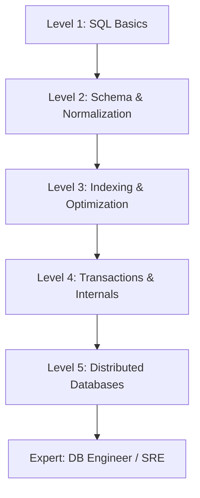

# 🗺️ Database Roadmap 2026: From CRUD to DB Engineer
> **Objective:** A step-by-step path to master database engineering and get job-ready for top tech roles | **Language:** Hinglish | **Standard:** 2026 Expert Framework

---

## 🧭 1. Beginner-Friendly Hinglish Explanation
Database Roadmap ka matlab hai "Data ka master banne ka nakshe (Map)".

- **Level 1 (The User):** Pehle seekho SQL kaise likhte hain (`SELECT`, `INSERT`). Tables kaise banti hain.
- **Level 2 (The Developer):** Ab seekho Schema Design, Joins, aur Joins ko optimize karna (Indexing). Transactions aur ACID properties samajhna.
- **Level 3 (The Engineer):** Ab "Internals" mein ghuso. Database disk par kaise save karta hai? B-Trees kya hain? Lock kaise kaam karta hai?
- **Level 4 (The Architect):** Ab "Distributed Systems" par jao. Sharding, Replication, CAP Theorem, aur Scaling.
- **Intuition:** Pehle aap sirf "Gadi chalana" (SQL) seekhte hain. Phir "Gadi theek karna" (Indexing/Optimization). Aur ant mein aap "Nayi Gadi design karna" (DB Engineering) seekhte hain.

---

## 🧠 2. Deep Technical Explanation (The Stages)
### Phase 1: Relational Mastery (SQL)
- **Topics:** Basic DDL/DML, Joins, Aggregations, Window Functions.
- **Goal:** Be able to write complex reports and data migrations.

### Phase 2: Schema Design & Modeling
- **Topics:** Normalization (1NF-3NF), ER Diagrams, One-to-Many vs Many-to-Many.
- **Goal:** Design a database for an E-commerce or Social Media app.

### Phase 3: Performance & Optimization
- **Topics:** Indexing (B-Tree vs Hash), Execution Plans (EXPLAIN), Query Tuning.
- **Goal:** Fix a query that is taking 10 seconds and make it take 10ms.

### Phase 4: Transactions & Internals
- **Topics:** Isolation Levels (Read Committed vs Serializable), MVCC, WAL (Write-Ahead Log).
- **Goal:** Understand how databases handle concurrency and crashes.

### Phase 5: Distributed Systems (Modern DB)
- **Topics:** Sharding, Read Replicas, Consistency Models (Eventual vs Strong), CAP Theorem.
- **Goal:** Scale a database to handle 1 million requests per second.

---

## 🏗️ 3. Roadmap Diagrams (The Journey)


---

## 💻 4. Industry Expectations (What to put on Resume)
```markdown
- **Junior:** "Proficient in SQL, Joins, and basic Database Normalization."
- **Mid-Level:** "Expert in Query Optimization, Indexing strategies, and ACID properties."
- **Senior:** "Deep understanding of Distributed Databases, Sharding, and Multi-region replication."
```

---

## 🌍 5. Real-World Production Examples
- **Stripe:** Needs engineers who understand "Distributed Transactions" perfectly (Money cannot be lost).
- **Netflix:** Needs engineers who understand "NoSQL Scaling" ( billions of stream events).

---

## ❌ 6. Failure Cases
- **Skipping Level 1-2:** Trying to learn Sharding before knowing how a simple Index works.
- **Tutorial Hell:** Watching videos but never building a project with 1 million rows of fake data.

---

## 🛠️ 7. Debugging Guide (Skill Check)
| Problem | Missing Skill | Fix |
| :--- | :--- | :--- |
| **Site is slow** | Optimization | Learn 'Execution Plans' and 'Indexes'. |
| **Data is wrong** | Modeling | Learn 'Normalization' and 'Foreign Keys'. |

---

## ⚖️ 8. Tradeoffs
- **Breadth (Learning many DBs)** vs **Depth (Mastering one DB like Postgres).** **Rule: Go Deep in Postgres first.**

---

## 🛡️ 9. Security Concerns
- **Security-First Learning:** Learn how to protect against SQL Injection from day one.

---

## 📈 10. Scaling Challenges
- **The "Data Gravity" Challenge:** Moving large amounts of data is the hardest part of the job.

---

## ✅ 11. Best Practices
- **Build projects with REALISTIC data volume.**
- **Read the official documentation of PostgreSQL.**
- **Understand 'Why' before 'How'.**

---

## ⚠️ 13. Common Mistakes
- **Ignoring Database Internals.**
- **Thinking MongoDB solves all scaling problems.**

---

## 📝 14. Interview Questions
1. "Explain the ACID properties with an example."
2. "What is the difference between a Clustered and Non-clustered index?"
3. "How does a database handle two users updating the same row at once?"

---

## 🚀 15. Latest 2026 Production Database Patterns
- **AI-Managed Databases:** Databases that automatically create indexes for you using ML.
- **Serverless SQL:** Using databases like **PlanetScale** or **Neon** that scale to zero.
漫
