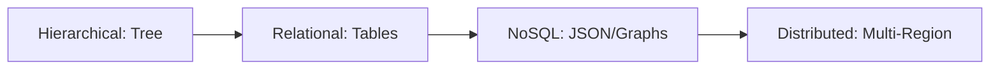

# 📜 History of Databases: From Paper to the Cloud
> **Objective:** Understand how data storage evolved to appreciate modern database design | **Language:** Hinglish | **Standard:** 2026 Expert Framework

---

## 🧭 1. Beginner-Friendly Hinglish Explanation
Databases ki history ka matlab hai "Data store karne ke tareekon ka safar".

- **The Start (1960s):** Sabse pehle "Hierarchical" aur "Network" DBs the. Ye "Tree" ki tarah the—ek parent, bahut saare children. Bahut mushkil the handle karna.
- **The Revolution (1970s):** Edgar F. Codd ne "Relational Model" (Tables) diya. SQL ka janam hua. Sab kuch Tables, Rows aur Columns mein fit ho gaya.
- **The Modern Era (2000s):** Jab Internet boom hua (Facebook/Google), toh Relational DBs slow padne lage. Tab aaya "NoSQL" (MongoDB, Cassandra) jo unstructured data handle kar sake.
- **The Present (2020s+):** Ab hum use karte hain "Distributed Databases" aur "NewSQL" jo SQL ki safety aur NoSQL ki speed dono dete hain.
- **Intuition:** Pehle hum "Register" mein data likhte the (Paper), phir humne "Computer Folder" banaye (File System), phir "Excel" jaisa table banaya (RDBMS), aur ab hum "AI-powered Cloud" mein data store karte hain.

---

## 🧠 2. Deep Technical Explanation
### 1. Hierarchical & Network Era (1960s-70s):
- **Hierarchical:** Data as a tree (One-to-many). If you want to change the parent, you have to rewrite the whole path. (IBM IMS).
- **Network:** Many-to-many relationships allowed, but extremely complex queries. (IDMS).

### 2. The Relational Era (1970s-Present):
- **Codd's 12 Rules:** The foundation of RDBMS.
- **SQL (Structured Query Language):** Became the universal language for data.
- **Leaders:** Oracle, MySQL, PostgreSQL.

### 3. The NoSQL Boom (2005-2015):
- **Reason:** Big Data and Real-time web.
- **Types:** Key-Value (Redis), Document (Mongo), Columnar (Cassandra), Graph (Neo4j).
- **Focus:** Horizontal scaling and flexibility.

### 4. Distributed & NewSQL (2015-Present):
- **Distributed:** Data split across multiple machines globally (Google Spanner).
- **NewSQL:** ACID transactions at NoSQL scale (CockroachDB).

---

## 🏗️ 3. Evolution Diagrams (The Architecture Shift)


---

## 💻 4. Query Evolution (Old vs New)
```sql
-- Relational (The Standard)
SELECT * FROM orders JOIN users ON orders.user_id = users.id;

-- NoSQL (The Flexible)
-- { "order_id": 1, "user": { "name": "Sameer", "id": 123 } }
db.orders.find({ "user.name": "Sameer" });
```

---

## 🌍 5. Real-World Production Examples
- **Banking:** Still relies on 1970s Mainframe DBs (Relational) for accuracy.
- **Uber:** Switched from Postgres to a custom distributed DB (Schemaless) to handle millions of rides.

---

## ❌ 6. Failure Cases
- **Hierarchical Failure:** Hard to add new categories without breaking the old structure.
- **Early NoSQL Failure:** Losing data during a crash because they traded "Consistency" for "Speed".

---

## 🛠️ 7. Debugging Guide
| Era | Typical Issue | Fix |
| :--- | :--- | :--- |
| **Relational** | Deadlocks | Better transaction management. |
| **NoSQL** | Data Inconsistency | Implement 'Schema Validation' in the application layer. |

---

## ⚖️ 8. Tradeoffs
- **Relational (Safe/Slow)** vs **NoSQL (Fast/Flexible).**

---

## 🛡️ 9. Security Concerns
- **Evolution of Attacks:** From simple physical theft of tapes to advanced SQL Injection and Ransomware.

---

## 📈 10. Scaling Challenges
- **The "Vertical" Limit:** You can only buy a server so big. Eventually, you have to go "Distributed".

---

## ⚡ 11. Performance Optimization
- **Modern Shift:** Moving from HDD-optimized DBs to RAM and SSD-optimized DBs.

---

## ✅ 12. Best Practices
- **Study the past to avoid repeating mistakes.**
- **Don't use NoSQL just because it's trendy.**
- **Always prioritize data integrity.**

---

## ⚠️ 13. Common Mistakes
- **Thinking SQL is "Dead".** (It's stronger than ever).
- **Using a hammer for everything.** (Choosing the wrong DB type for the job).

---

## 📝 14. Interview Questions
1. "Why did NoSQL emerge if SQL was already working?"
2. "What is the difference between Hierarchical and Relational models?"
3. "What are Codd's Rules?"

---

## 🚀 15. Latest 2026 Production Database Patterns
- **Multi-Model Databases:** Databases that can do SQL, JSON, and Graph all in one (e.g., ArangoDB or modern Postgres).
- **Edge Computing:** Storing small amounts of data at the "Edge" (near the user) for zero-latency.
漫
