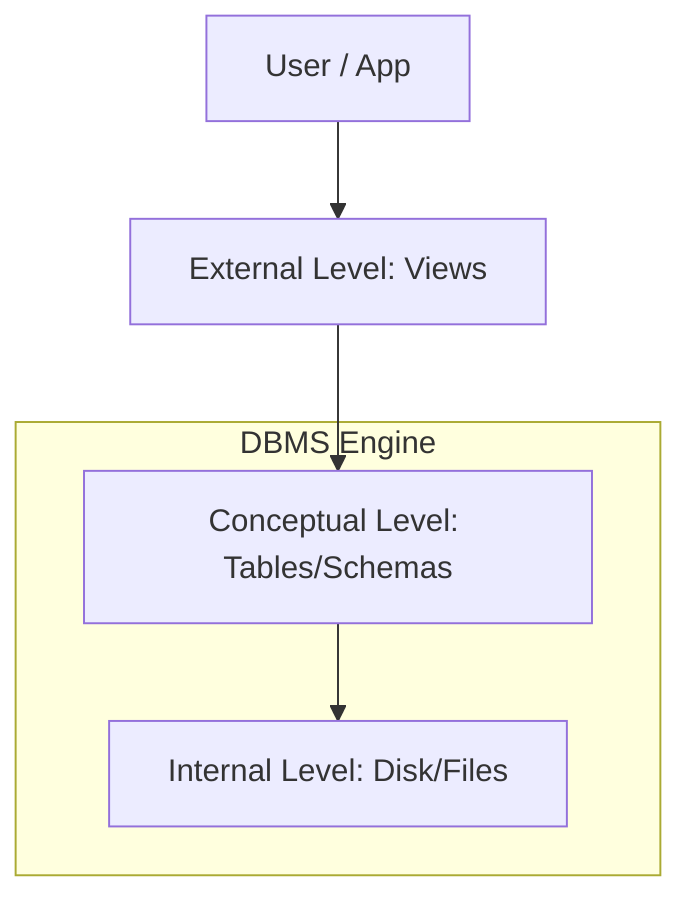

# 🗄️ What is DBMS? (Database Management System)
> **Objective:** Understand the core purpose of a DBMS and why we use it instead of simple files | **Language:** Hinglish | **Standard:** 2026 Expert Framework

---

## 🧭 1. Beginner-Friendly Hinglish Explanation
DBMS ka matlab hai "Data ko manage karne wala system".

- **The Problem:** Socho aapke paas 10 lakh users ka data ek Excel sheet ya Notepad file mein hai. Agar aapko ek user dhoondhna hai, toh file slow ho jayegi. Agar do log ek saath update karenge, toh data crash ho jayega.
- **The Solution:** Humein ek "Manager" chahiye jo data ko safely store kare, fast dhoondhe (search), aur sabko permissions ke hisab se access de.
- **The Core Difference:** 
  - **File System:** Manual entry, no security, slow search, data redundancy (repeat hona).
  - **DBMS:** Automatic, highly secure, ultra-fast search, no repeat data.
- **Intuition:** File System ek "Kabadkhana" (Store room) ki tarah hai jahan saman pheka hua hai. DBMS ek "Modern Library" ki tarah hai jahan har book ka ek fixed address hai aur ek librarian (DBMS engine) hai jo turant book nikal kar de deta hai.

---

## 🧠 2. Deep Technical Explanation
### 1. Definition:
A DBMS is a software suite designed to define, manipulate, retrieve, and manage data in a database. It sits between the user and the raw data.

### 2. Key Features (The Must-Haves):
- **Data Abstraction:** You don't need to know *how* data is stored on the disk (bits/bytes). You just use SQL.
- **Concurrency Control:** Multiple users can read/write at the same time without breaking anything.
- **Data Integrity:** Ensuring data follows rules (e.g., Age cannot be negative).
- **Security:** Only authorized users can see sensitive data.

### 3. DBMS vs File System:
| Feature | File System | DBMS |
| :--- | :--- | :--- |
| **Data Redundancy** | High (Same data in multiple files) | Low (Normalized data) |
| **Access** | Sequential (Slow) | Random/Indexed (Fast) |
| **Backup** | Manual | Automated & Incremental |
| **Transactions** | No ACID properties | Full ACID support |

---

## 🏗️ 3. Database Diagrams (The 3-Layer Architecture)


---

## 💻 4. Query Execution Examples (How it works internally)
```sql
-- What you write (External Level)
SELECT name FROM users WHERE id = 101;

-- What DBMS does (Internal Level)
-- 1. Check if user has permission.
-- 2. Check if table 'users' exists.
-- 3. Use an 'Index' to jump to row 101 on the disk.
-- 4. Return only the 'name' column to save bandwidth.
```

---

## 🌍 5. Real-World Production Examples
- **Banking:** Every time you withdraw money, a DBMS ensures the transaction is recorded and your balance is updated across all ATMs instantly.
- **Amazon:** Keeping track of millions of products, their stock levels, and user reviews.

---

## ❌ 6. Failure Cases
- **Data Corruption:** If the power goes out while writing to a file, the file is corrupted. **Fix: DBMS uses 'Write-Ahead Logging' (WAL).**
- **Concurrency Conflict:** Two users booking the last ticket at the same time. **Fix: DBMS uses 'Locks'.**

---

## 🛠️ 7. Debugging Guide
| Problem | Diagnostic | Solution |
| :--- | :--- | :--- |
| **Slow Query** | Explain Plan | Check if the DBMS is doing a 'Full Table Scan' instead of using an 'Index'. |
| **Connection Refused** | Process Status | Check if the DBMS service (Postgres/MySQL) is actually running. |

---

## ⚖️ 8. Tradeoffs
- **Performance (Raw Files are faster for small data)** vs **Reliability (DBMS is safer for large data).**

---

## 🛡️ 9. Security Concerns
- **SQL Injection:** Attackers passing malicious SQL through input forms.
- **Access Control:** Giving "Root" access to a Junior developer.

---

## 📈 10. Scaling Challenges
- **Large Data:** When a single database server can't handle the traffic (needs Sharding).

---

## ⚡ 11. Performance Optimization
- **Indexing:** Creating a shortcut for the data.
- **Normalization:** Reducing data repeat to save space.

---

## ✅ 12. Best Practices
- **Always use a DBMS for production data.**
- **Choose the right type (Relational vs NoSQL) based on the use case.**
- **Regular Backups are mandatory.**

---

## ⚠️ 13. Common Mistakes
- **Treating a Database like a Spreadsheet.**
- **Not defining a Schema (in SQL databases).**

---

## 📝 14. Interview Questions
1. "Difference between a File System and a DBMS?"
2. "What are the advantages of using a DBMS?"
3. "Explain the 3-schema architecture."

---

## 🚀 15. Latest 2026 Production Database Patterns
- **Cloud-Native Databases:** AWS Aurora or Google Spanner that handle scaling and backups automatically.
- **Serverless Databases:** Databases that "Sleep" when not in use and wake up instantly when a request comes.
漫
