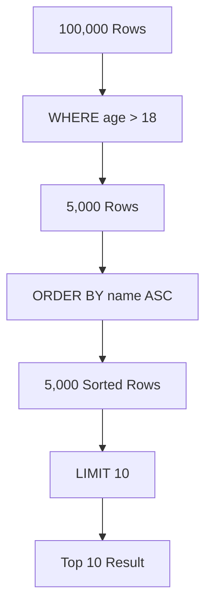

# 🔍 Filtering and Sorting: Finding the Needle
> **Objective:** Master how to extract specific data and organize it using WHERE, ORDER BY, and LIMIT | **Language:** Hinglish | **Standard:** 2026 Expert Framework

---

## 🧭 1. Beginner-Friendly Hinglish Explanation
Filtering aur Sorting ka matlab hai "Data ko chhaan-na (Filter) aur sahi order mein lagana (Sort)".

- **Filtering (`WHERE`):** Jab aapko saara data nahi chahiye, sirf wahi chahiye jo kisi rule (Condition) ko follow kare. (e.g., "Sirf 18 saal se bade users dikhao").
- **Sorting (`ORDER BY`):** Data ko kisi sequence mein lagana. (e.g., "Saste se Mehenga" ya "Naye se Purana").
- **Limiting (`LIMIT`):** Result ka count fix karna. (e.g., "Sirf top 5 results dikhao").
- **Intuition:** Ye ek "Online Shopping Filter" ki tarah hai. Aap "Brand" select karte hain (Filter), "Price: Low to High" karte hain (Sort), aur pehle 20 items dekhte hain (Limit).

---

## 🧠 2. Deep Technical Explanation
### 1. The `WHERE` Clause:
Used to filter rows based on operators:
- **Comparison:** `=`, `<>`, `>`, `<`, `>=`, `<=`.
- **Logical:** `AND`, `OR`, `NOT`, `IN`, `BETWEEN`.
- **Pattern Matching:** `LIKE` (using `%` for wildcard).

### 2. The `ORDER BY` Clause:
- **ASC (Ascending):** Default (0-9, A-Z).
- **DESC (Descending):** Reverse (9-0, Z-A).
- **Multiple Columns:** `ORDER BY city ASC, age DESC;` (Sort by city first, then by age within each city).

### 3. The `LIMIT` and `OFFSET`:
- **LIMIT:** How many rows to return.
- **OFFSET:** How many rows to skip (Used for Pagination).

---

## 🏗️ 3. Database Diagrams (The Filtering Pipe)


---

## 💻 4. Query Execution Examples
```sql
-- 1. Complex Filtering
SELECT * FROM products 
WHERE category = 'Electronics' 
  AND price BETWEEN 500 AND 2000 
  AND stock > 0;

-- 2. Pattern Matching (Find all emails ending with @gmail.com)
SELECT email FROM users 
WHERE email LIKE '%@gmail.com';

-- 3. Sorting and Pagination
SELECT * FROM posts 
WHERE status = 'published' 
ORDER BY created_at DESC 
LIMIT 20 OFFSET 0; -- First Page
```

---

## 🌍 5. Real-World Production Examples
- **Search Bar:** Uses `LIKE` or `Full-Text Search`.
- **Leaderboard:** `ORDER BY score DESC LIMIT 10`.
- **Price Filter:** `WHERE price < 1000`.

---

## ❌ 6. Failure Cases
- **Case Sensitivity:** In some DBs (like Postgres), `LIKE` is case-sensitive. **Fix: Use `ILIKE`.**
- **Null Comparison:** `WHERE name = NULL` doesn't work. **Fix: Use `WHERE name IS NULL`.**
- **Performance:** Running `LIKE '%pattern%'` (leading wildcard) ignores indexes and is very slow.

---

## 🛠️ 7. Debugging Guide
| Problem | Reason | Solution |
| :--- | :--- | :--- |
| **Empty Result** | Conflicting ANDs | Check if your conditions are impossible (e.g., `age > 50 AND age < 10`). |
| **Slow Pagination** | Large OFFSET | `OFFSET 1,000,000` is slow because the DB still has to read all those rows. **Fix: Use 'Cursor-based pagination'.** |

---

## ⚖️ 8. Tradeoffs
- **Filtering on Database (Fast)** vs **Filtering on Application code (Slow/Easy).** Always filter in the DB!

---

## 🛡️ 9. Security Concerns
- **Sensitive Data in Order By:** Attackers can sometimes use "Blind SQL Injection" by checking how the sorting changes to guess the database name.

---

## 📈 10. Scaling Challenges
- **Large Sorts:** Sorting 10 million rows in RAM is expensive. **Fix: Use an 'Index' on the column you are sorting by.**

---

## ✅ 11. Best Practices
- **Filter as much as possible to reduce row count.**
- **Use `IN` instead of many `OR`s.**
- **Always have an Index for columns used in `ORDER BY`.**

---

## ⚠️ 13. Common Mistakes
- **Putting `WHERE` after `ORDER BY`.** (Sequence matters!).
- **Using `NOT IN` with NULL values.** (It might return an empty set unexpectedly).

---

## 📝 14. Interview Questions
1. "Difference between LIKE and ILIKE?"
2. "How does OFFSET affect performance on large datasets?"
3. "Explain how to sort by multiple columns."

---

## 🚀 15. Latest 2026 Production Database Patterns
- **Computed Columns:** Storing a lowercase version of a name in a separate column just for faster case-insensitive searching.
- **Top-N Optimization:** Modern DB engines use "Heap Sort" for small LIMITs, which is $10x$ faster than sorting the whole table.
漫
