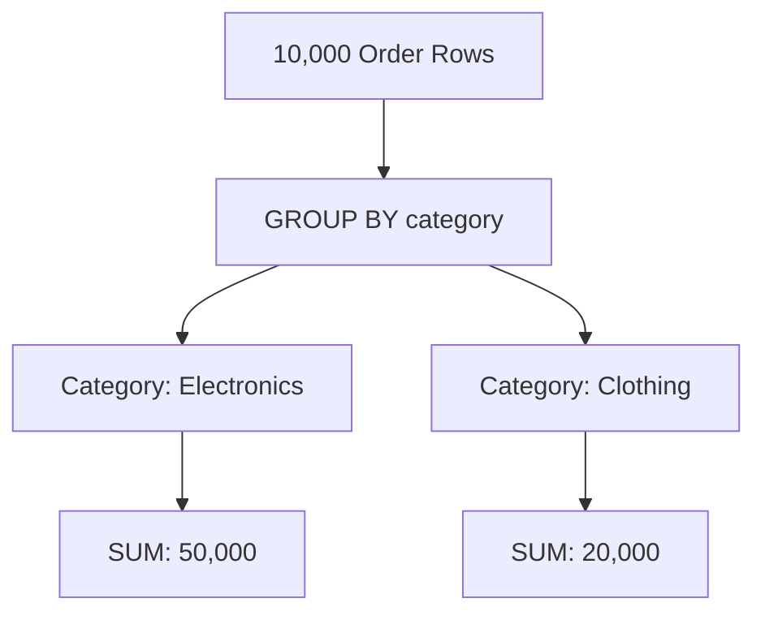

# 📊 Grouping and Aggregation: Summarizing Data
> **Objective:** Master how to calculate totals, averages, and counts using GROUP BY and Aggregate Functions | **Language:** Hinglish | **Standard:** 2026 Expert Framework

---

## 🧭 1. Beginner-Friendly Hinglish Explanation
Grouping aur Aggregation ka matlab hai "Data ka nichod (Summary) nikalna".

- **The Problem:** Aapke paas 1 lakh orders ki list hai. Aapko ye nahi dekhna ki kisne kya khareeda, aapko ye dekhna hai ki "Total kitni kamayi (Sales) hui?" ya "Har city mein kitne users hain?".
- **The Functions (Tools):** 
  1. **SUM:** Sabka total (Total money).
  2. **COUNT:** Kitne items hain (Total users).
  3. **AVG:** Average nikalna (Average rating).
  4. **MAX/MIN:** Sabse bada ya chota value.
- **The Logic (`GROUP BY`):** Data ko categories mein todna. (e.g., "Category-wise total sales").
- **Intuition:** Socho aapke paas bahut saari coins hain. Pehle aap unhe unki value ke hisab se dher (Groups) banate hain ($1, $2, $5) aur phir har dher ka total count karte hain.

---

## 🧠 2. Deep Technical Explanation
### 1. Aggregate Functions:
Functions that operate on a set of rows and return a single value.
- `COUNT(*)` counts all rows, including NULLs.
- `COUNT(column)` counts only non-NULL values in that column.

### 2. The `GROUP BY` Clause:
Groups rows that have the same values into summary rows.
- **Rule:** Every column in the `SELECT` list that is NOT an aggregate must be in the `GROUP BY` clause.

### 3. The `HAVING` Clause:
Filtering **after** the groups are formed. 
- `WHERE` filters rows **before** aggregation.
- `HAVING` filters results **after** aggregation. (e.g., "Show categories where total sales > 5000").

---

## 🏗️ 3. Database Diagrams (The Aggregation Flow)


---

## 💻 4. Query Execution Examples
```sql
-- 1. Simple Count
SELECT COUNT(*) AS total_users FROM users;

-- 2. Grouping with Sum
SELECT category, SUM(price) AS total_sales, COUNT(*) AS item_count 
FROM orders 
GROUP BY category;

-- 3. Filtering Groups (HAVING)
SELECT city, AVG(age) AS avg_age 
FROM users 
GROUP BY city 
HAVING AVG(age) > 25 
ORDER BY avg_age DESC;
```

---

## 🌍 5. Real-World Production Examples
- **Dashboards:** Showing "Monthly Active Users" (MAU).
- **Inventory:** Finding "Products with less than 5 items in stock".
- **Financials:** "Yearly Tax Reports".

---

## ❌ 6. Failure Cases
- **Missing Group By:** Selecting `name, COUNT(*)` without `GROUP BY name`. This will cause an error in most DBs.
- **Null Handling:** `AVG` ignores NULL values. If you want to treat NULL as 0, you must use `COALESCE(column, 0)`.
- **Mixing WHERE and HAVING:** Trying to use `WHERE total_sales > 1000`. This will fail because `total_sales` doesn't exist until the group is formed.

---

## 🛠️ 7. Debugging Guide
| Problem | Reason | Solution |
| :--- | :--- | :--- |
| **Wrong Count** | Counted a column with NULLs | Use `COUNT(*)` to count rows, or `COUNT(DISTINCT column)` to count unique values. |
| **Slow Query** | Grouping on non-indexed column | Ensure the column in `GROUP BY` is indexed if the table is large. |

---

## ⚖️ 8. Tradeoffs
- **Group By on Database (Aggregated data - Fast transfer)** vs **Aggregating in Application (Slow transfer).** Always aggregate in the DB!

---

## 🛡️ 9. Security Concerns
- **Information Leak:** Aggregating data can sometimes reveal secrets. (e.g., If `AVG(salary)` for a department with only 1 person is shown, everyone knows that person's salary).

---

## 📈 10. Scaling Challenges
- **Massive Aggregations:** Running `SUM` on 100 million rows in real-time is slow. **Fix: Use 'Materialized Views' or 'Pre-aggregated summary tables'.**

---

## ✅ 11. Best Practices
- **Use `COUNT(*)` for total rows.**
- **Use meaningful aliases** (`AS total_sales`).
- **Always filter with `WHERE` first** to reduce the data being grouped.

---

## ⚠️ 13. Common Mistakes
- **Confusing `WHERE` and `HAVING`.**
- **Not handling NULL values in averages/sums.**

---

## 📝 14. Interview Questions
1. "Difference between WHERE and HAVING?"
2. "How do you count only unique email addresses?" (Hint: `COUNT(DISTINCT email)`).
3. "What happens if you use an aggregate function without a GROUP BY?"

---

## 🚀 15. Latest 2026 Production Database Patterns
- **Approximate Aggregation:** Using algorithms like **HyperLogLog** (e.g., `APPROX_COUNT_DISTINCT`) to get a $99\%$ accurate count for billions of rows in milliseconds.
- **Window Aggregates:** Using aggregation functions without collapsing rows into a single summary row (e.g., `SUM(amount) OVER(PARTITION BY user_id)`).
漫
