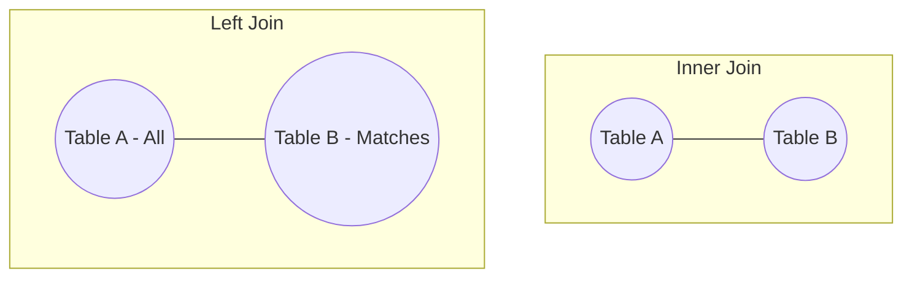

# 🔗 Joins: Connecting the Dots
> **Objective:** Master how to combine data from multiple tables using Inner, Left, Right, and Full Joins | **Language:** Hinglish | **Standard:** 2026 Expert Framework

---

## 🧭 1. Beginner-Friendly Hinglish Explanation
Joins ka matlab hai "Do ya do se zyada tables ko aapas mein jodna".

- **The Problem:** Hum saara data ek hi table mein nahi rakhte (normalization). Users ek table mein hain, Orders dusri table mein. Ab agar humein dekhna hai ki "Kishore ne kya order kiya?", toh humein dono tables ko milana padega.
- **The Core Types:** 
  1. **INNER JOIN:** Sirf wahi data dikhao jo dono tables mein match ho. (e.g., Only users who have placed at least one order).
  2. **LEFT JOIN:** Left table ka saara data dikhao, aur right table ka sirf matching data. Agar matching nahi hai, toh NULL dikhao. (e.g., All users, including those who haven't ordered yet).
  3. **FULL JOIN:** Dono tables ka saara data dikhao.
- **Intuition:** Ye ek "Matching game" ki tarah hai. Aapke paas "Keys" (ID) hain. Aap check karte hain ki Table A ki ID, Table B ki ID se match hoti hai ya nahi.

---

## 🧠 2. Deep Technical Explanation
### 1. INNER JOIN (The Most Common):
Returns records that have matching values in both tables.
- **Venn Diagram:** The intersection of two circles.

### 2. LEFT (OUTER) JOIN:
Returns all records from the left table, and the matched records from the right table.
- **Venn Diagram:** The entire left circle.

### 3. CROSS JOIN (Cartesian Product):
Returns every row from Table A combined with every row from Table B. 
- **Warning:** If Table A has 100 rows and Table B has 100, you get 10,000 rows!

### 4. SELF JOIN:
Joining a table with itself. (e.g., An `employees` table where each employee has a `manager_id` pointing to another row in the same table).

---

## 🏗️ 3. Database Diagrams (The Join Venn)


---

## 💻 4. Query Execution Examples
```sql
-- 1. Inner Join (Users with Orders)
SELECT users.name, orders.order_date, orders.amount 
FROM users 
INNER JOIN orders ON users.id = orders.user_id;

-- 2. Left Join (All Users, including non-buyers)
SELECT users.name, orders.amount 
FROM users 
LEFT JOIN orders ON users.id = orders.user_id;

-- 3. Self Join (Manager Name)
SELECT e.name AS Employee, m.name AS Manager
FROM employees e
LEFT JOIN employees m ON e.manager_id = m.id;
```

---

## 🌍 5. Real-World Production Examples
- **Invoice Generation:** Joining `Invoices`, `Customers`, and `LineItems`.
- **Social Media:** Joining `Posts` with `Authors` and `Comments`.
- **E-commerce:** Joining `Products` with `Categories` and `Inventory`.

---

## ❌ 6. Failure Cases
- **Ambiguous Column Name:** Both tables have a `name` column. **Fix: Use table aliases (e.g., `u.name`).**
- **Wrong Join Key:** Joining on `email` when one table has lowercase and the other has uppercase.
- **The CROSS JOIN Accident:** Forgetting the `ON` clause in some DBs or old syntax.

---

## 🛠️ 7. Debugging Guide
| Symptom | Reason | Solution |
| :--- | :--- | :--- |
| **Missing Rows** | INNER JOIN used by mistake | Use LEFT JOIN if you want to keep rows even if there is no match in the second table. |
| **Too many Rows** | Duplicate keys | Check if the right table has multiple rows for one ID in the left table (One-to-Many). |

---

## ⚖️ 8. Tradeoffs
- **Normalized Tables (Joins needed - Slower)** vs **Denormalized Tables (No joins - Faster but messy).**

---

## 🛡️ 9. Security Concerns
- **Sensitive Data Leak:** Accidentally joining with a `passwords` table and selecting more columns than needed.

---

## 📈 10. Scaling Challenges
- **Large Joins:** Joining two tables with 10 million rows each can be very slow. **Fix: Ensure columns in the 'ON' clause are INDEXED.**

---

## ✅ 11. Best Practices
- **Always use table aliases** (`u` for users, `o` for orders).
- **Only select the columns you need.**
- **Prefer INNER JOIN if you don't need NULLs** (it's slightly faster).
- **Check the 'Explain Plan' for large joins.**

---

## ⚠️ 13. Common Mistakes
- **Joining on non-indexed columns.**
- **Thinking LEFT JOIN and RIGHT JOIN are always interchangeable.** (Sequence matters!).

---

## 📝 14. Interview Questions
1. "Difference between INNER JOIN and LEFT JOIN?"
2. "How would you find users who have NEVER placed an order?" (Hint: Left Join where Order ID IS NULL).
3. "What is a Self Join and when would you use it?"

---

## 🚀 15. Latest 2026 Production Database Patterns
- **Hash Joins:** Modern DB engines use Hash Maps internally to perform joins in $O(N)$ time instead of nested loops.
- **Lateral Joins:** A powerful type of join that allows you to join a table with a subquery that refers to the previous table (Great for "Top 3 posts per user").
漫
