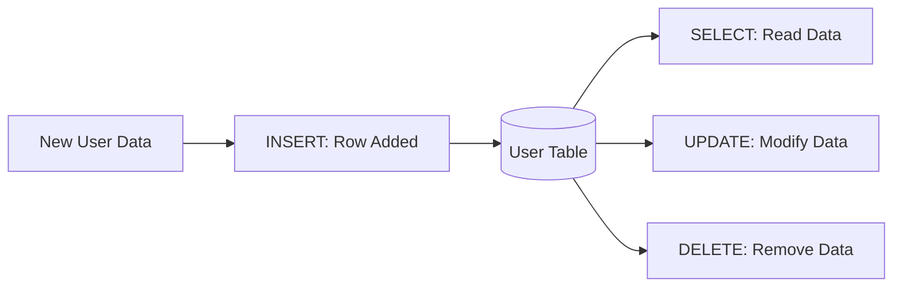

# 📊 SQL Basics: The Foundation of Data
> **Objective:** Master the core CRUD operations (Create, Read, Update, Delete) in SQL | **Language:** Hinglish | **Standard:** 2026 Expert Framework

---

## 🧭 1. Beginner-Friendly Hinglish Explanation
SQL Basics ka matlab hai "Database se baat karne ki bhasha".

- **The Goal:** Humein data ko table mein dalna hai, dekhna hai, badalna hai, aur hatana hai.
- **The Commands (CRUD):** 
  1. **INSERT (Create):** Naya data dalna (e.g., Register a user).
  2. **SELECT (Read):** Data dekhna (e.g., View profile).
  3. **UPDATE (Update):** Data badalna (e.g., Change password).
  4. **DELETE (Delete):** Data hatana (e.g., Delete account).
- **Intuition:** Socho SQL ek "Librarian" hai. Aap use orders dete hain: "Ek naya member add karo", "Mujhe Sameer ka phone number do", ya "Is member ko hata do".

---

## 🧠 2. Deep Technical Explanation
### 1. SELECT (The Read):
Retrieves data from one or more tables.
- **Syntax:** `SELECT columns FROM table WHERE conditions;`
- **Tip:** Use `SELECT *` only for debugging. In production, always select specific columns to save bandwidth.

### 2. INSERT (The Create):
Adds new rows to a table.
- **Syntax:** `INSERT INTO table (col1, col2) VALUES (val1, val2);`
- **Safety:** Always define columns explicitly to avoid errors if the table schema changes later.

### 3. UPDATE (The Edit):
Modifies existing records.
- **CRITICAL:** Always use a `WHERE` clause. If you forget it, you will update EVERY row in the table!

### 4. DELETE (The Remove):
Removes records.
- **CRITICAL:** Like Update, always use `WHERE`.

---

## 🏗️ 3. Database Diagrams (The CRUD Lifecycle)


---

## 💻 4. Query Execution Examples
```sql
-- 1. Create a user
INSERT INTO users (username, email, age) 
VALUES ('sameer_dev', 'sameer@susa.com', 25);

-- 2. Read the user
SELECT username, email FROM users 
WHERE email = 'sameer@susa.com';

-- 3. Update the age
UPDATE users SET age = 26 
WHERE username = 'sameer_dev';

-- 4. Delete the user
DELETE FROM users 
WHERE username = 'sameer_dev';
```

---

## 🌍 5. Real-World Production Examples
- **Sign-up Form:** Triggers an `INSERT` query.
- **Login:** Triggers a `SELECT` query to verify credentials.
- **Edit Profile:** Triggers an `UPDATE` query.

---

## ❌ 6. Failure Cases
- **Constraint Violation:** Trying to `INSERT` a user with an email that already exists (Unique constraint).
- **Data Type Mismatch:** Trying to `INSERT` a string "abc" into the `age` (integer) column.
- **The "Missing WHERE" Disaster:** Running `DELETE FROM users;` and wiping out your whole company's data.

---

## 🛠️ 7. Debugging Guide
| Error | Reason | Solution |
| :--- | :--- | :--- |
| **Duplicate entry** | Unique constraint | Check if the record already exists before inserting. |
| **Row not found** | Wrong WHERE clause | Verify your IDs or strings (check for spaces or case-sensitivity). |

---

## ⚖️ 8. Tradeoffs
- **`DELETE` (Permanent)** vs **`Soft Delete` (Setting a `deleted_at` column).** In production, **Soft Delete** is usually better.

---

## 🛡️ 9. Security Concerns
- **SQL Injection:** Never concatenate strings to build queries. **Fix: Use 'Prepared Statements' or 'Parameterized Queries'.**

---

## 📈 10. Scaling Challenges
- **Massive Inserts:** Inserting 1 million rows one-by-one is slow. **Fix: Use 'Bulk Insert' (one query for many rows).**

---

## ✅ 11. Best Practices
- **Always use `WHERE` for Update/Delete.**
- **Avoid `SELECT *`.**
- **Use meaningful column names.**
- **Test your queries on a staging DB first.**

---

## ⚠️ 13. Common Mistakes
- **Forgetting the semicolon `;`.**
- **Mismatching column count and value count in `INSERT`.**

---

## 📝 14. Interview Questions
1. "What is the difference between DDL and DML?"
2. "How do you avoid updating all rows by mistake?"
3. "Why is SELECT * discouraged in production?"

---

## 🚀 15. Latest 2026 Production Database Patterns
- **UPSERT:** A single query that "Inserts if not exists, else Updates". (e.g., `INSERT ... ON CONFLICT DO UPDATE` in Postgres).
- **JSONB in SQL:** Storing unstructured data inside a regular SQL table column for flexibility.
漫
