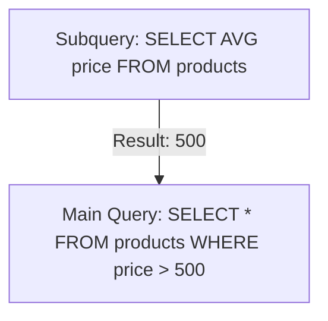

# 📦 Subqueries: A Query inside a Query
> **Objective:** Master how to nest SQL queries to solve complex data problems | **Language:** Hinglish | **Standard:** 2026 Expert Framework

---

## 🧭 1. Beginner-Friendly Hinglish Explanation
Subqueries ka matlab hai "Ek query ke andar dusri query".

- **The Problem:** Aapko wahi users chahiye jinhone "Kal" order kiya tha. Par pehle aapko dhoondhna padega ki "Kal ki date kya thi?" ya "Kal ki order IDs kya thi?". 
- **The Solution:** Aap ek query likhte hain result dhoondhne ke liye, aur dusri query us result ko filter karne ke liye use karte hain.
- **The Types:** 
  1. **Scalar Subquery:** Jo sirf ek value return kare (e.g., Average price).
  2. **Multi-row Subquery:** Jo ek list return kare (e.g., List of user IDs).
  3. **Correlated Subquery:** Jo outer query ke data par depend kare (The "Slow" kind).
- **Intuition:** Ye ek "Inner Envelope" ki tarah hai. Pehle aap andar wala envelope (Subquery) kholte hain, uska result nikaalte hain, aur phir use bahar wale envelope (Main query) mein use karte hain.

---

## 🧠 2. Deep Technical Explanation
### 1. Where can you use Subqueries?
- **In `WHERE` clause:** `SELECT * FROM users WHERE id IN (SELECT user_id FROM orders);`
- **In `SELECT` clause:** To show a calculated value for each row.
- **In `FROM` clause:** Treating the subquery result as a temporary table (Derived Table).

### 2. Scalar Subquery:
Returns exactly one column and one row. If it returns more, the query fails with an error.

### 3. Correlated Subquery:
A subquery that uses values from the outer query. It is executed once for **every row** processed by the outer query.
- **Performance Alert:** This can be very slow ($O(N^2)$). Always check if a `JOIN` can do the same job.

### 4. `EXISTS` vs `IN`:
- `IN` works well for a small, static list.
- `EXISTS` is better for checking if a row exists in another table, as it stops as soon as it finds the first match (Lazy evaluation).

---

## 🏗️ 3. Database Diagrams (The Execution Order)


---

## 💻 4. Query Execution Examples
```sql
-- 1. Subquery in WHERE (Find top spenders)
SELECT name FROM users 
WHERE id IN (
    SELECT user_id FROM orders WHERE amount > 1000
);

-- 2. Scalar Subquery in SELECT (Compare price to average)
SELECT name, price, 
  (SELECT AVG(price) FROM products) AS global_avg
FROM products;

-- 3. EXISTS (Find users who have at least one order)
SELECT name FROM users u
WHERE EXISTS (
    SELECT 1 FROM orders o WHERE o.user_id = u.id
);
```

---

## 🌍 5. Real-World Production Examples
- **Reporting:** "Find employees whose salary is higher than the average of their department."
- **Cleanup:** "Delete users who haven't logged in since the last maintenance date."
- **Financials:** "Find the last transaction date for every account."

---

## ❌ 6. Failure Cases
- **More than 1 value:** Using a subquery that returns 5 rows in a place where only 1 is expected.
- **Null Issues:** If the subquery returns a list with a `NULL`, using `NOT IN` might result in an empty set for the entire main query. **Fix: Use `NOT EXISTS`.**
- **Deadlocks:** Complex correlated subqueries on large tables can lock the database.

---

## 🛠️ 7. Debugging Guide
| Error | Reason | Solution |
| :--- | :--- | :--- |
| **Subquery returns more than 1 row** | Non-scalar subquery used with `=` | Change `=` to `IN` or use `LIMIT 1` in the subquery. |
| **Query is very slow** | Correlated subquery | Rewrite it using an `INNER JOIN` or a `CTE`. |

---

## ⚖️ 8. Tradeoffs
- **Subquery (Easier to read/write)** vs **Join (Faster performance).**

---

## 🛡️ 9. Security Concerns
- **Performance DDoS:** A malicious subquery can be crafted to use $100\%$ CPU, effectively bringing down the database.

---

## 📈 10. Scaling Challenges
- **The N+1 Problem:** Correlated subqueries are the SQL version of the N+1 problem. They don't scale well to millions of rows.

---

## ✅ 11. Best Practices
- **Use `EXISTS` over `IN` for large datasets.**
- **Avoid correlated subqueries if possible.**
- **Keep subqueries simple.**
- **Use CTEs (Common Table Expressions) for better readability.**

---

## ⚠️ 13. Common Mistakes
- **Forgetting to alias a derived table** in the `FROM` clause.
- **Using `SELECT *` inside a subquery.** (Use `SELECT 1` or specific columns).

---

## 📝 14. Interview Questions
1. "Difference between IN and EXISTS?"
2. "What is a correlated subquery and why is it slow?"
3. "Can you rewrite a subquery as a JOIN? Give an example."

---

## 🚀 15. Latest 2026 Production Patterns
- **LATERAL Subqueries:** (Postgres) Allows subqueries to refer to columns of preceding tables in the `FROM` clause, acting like a `foreach` loop in SQL.
- **Subquery Decorrelation:** Modern optimizers (like in DuckDB or Google Spanner) automatically turn your slow subqueries into fast Joins behind the scenes.
漫
