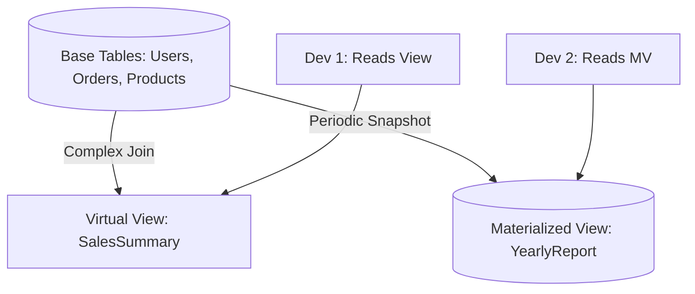

# 🖼️ Views and Materialized Views: Virtual Tables
> **Objective:** Understand how to simplify complex queries and improve performance using virtual and physical views | **Language:** Hinglish | **Standard:** 2026 Expert Framework

---

## 🧭 1. Beginner-Friendly Hinglish Explanation
Views aur Materialized Views ka matlab hai "Ek badi query ko ek choti table ka naam dena".

- **The Problem:** Aapke paas ek bahut badi query hai jisme 5 Joins aur 3 Aggregations hain. Har baar itna bada code likhna mushkil hai.
- **The Solution (View):** Aap us query ko ek "View" bana dete hain. Ab aap sirf `SELECT * FROM my_view` likhte hain aur piche wo puri query apne aap chal jati hai.
- **The Difference:** 
  1. **View (Virtual):** Ye sirf ek shortcut hai. Isme data save nahi hota. Har baar query dobara chalti hai. (Slow but always fresh).
  2. **Materialized View (Physical):** Ye result ko disk par save kar leta hai. (Super fast but data can be old/stale).
- **Intuition:** View ek "Youtube Playlist" ki tarah hai (Sirf links hain). Materialized View ek "Downloaded Video" ki tarah hai (File disk par hai, offline bhi dekh sakte ho par update ke liye redownload karna padega).

---

## 🧠 2. Deep Technical Explanation
### 1. Simple View:
A virtual table based on the result-set of an SQL statement.
- **Security:** You can give a user access to a View (showing only safe columns) instead of the whole Table.
- **Abstraction:** Hides the complexity of joins from the frontend developer.

### 2. Materialized View (MV):
A database object that contains the results of a query.
- **Storage:** It occupies physical disk space.
- **Refresh:** The data must be refreshed (e.g., `REFRESH MATERIALIZED VIEW`) to pick up changes from the original tables.
- **Use Case:** Heavy reports or dashboards that don't need real-time data.

### 3. Updatable Views:
In some cases, you can `INSERT` or `UPDATE` a View, and it will update the underlying table. (Requires many conditions, e.g., no Joins, no Aggregates).

---

## 🏗️ 3. Database Diagrams (The View Layer)


---

## 💻 4. Query Execution Examples
```sql
-- 1. Create a View
CREATE VIEW active_users AS
SELECT id, username, email 
FROM users 
WHERE status = 'active' AND last_login > NOW() - INTERVAL '30 days';

-- Now use it like a table
SELECT * FROM active_users;

-- 2. Create a Materialized View
CREATE MATERIALIZED VIEW monthly_revenue AS
SELECT EXTRACT(MONTH FROM created_at) AS month, SUM(amount) AS total
FROM orders
GROUP BY 1;

-- Refresh it every night
REFRESH MATERIALIZED VIEW monthly_revenue;
```

---

## 🌍 5. Real-World Production Examples
- **Dashboards:** Using Materialized Views to show "Top 10 Sellers" so the database doesn't have to re-calculate it for every user.
- **Access Control:** Creating a View that masks the `salary` column but shows `employee_name` for the HR department.
- **Legacy Migrations:** Renaming a table but creating a View with the old name so the old code doesn't break.

---

## ❌ 6. Failure Cases
- **Stale Data (MV):** The Materialized View shows a sale that was actually cancelled 1 hour ago because it hasn't been refreshed.
- **Nested Views:** Creating a View based on another View based on another View. This leads to extremely slow performance.
- **Resource Exhaustion:** Refreshing a giant Materialized View during peak traffic hours can crash the server.

---

## 🛠️ 7. Debugging Guide
| Symptom | Reason | Solution |
| :--- | :--- | :--- |
| **Data is wrong** | MV is stale | Run `REFRESH MATERIALIZED VIEW`. |
| **Simple query is slow** | View is complex | Check the underlying query of the view using `EXPLAIN`. |

---

## ⚖️ 8. Tradeoffs
- **View (Fresh data / Slower execution)** vs **Materialized View (Stale data / Instant execution).**

---

## 🛡️ 9. Security Concerns
- **Definer vs Invoker Security:** Does the View run with the permissions of the person who created it, or the person who is reading it? This is critical for data leaks.

---

## 📈 10. Scaling Challenges
- **Refresh Locks:** In some DBs, refreshing a Materialized View locks it, meaning users can't read it while it's updating. **Fix: Use `CONCURRENTLY` (Postgres).**

---

## ✅ 11. Best Practices
- **Use Views for security and abstraction.**
- **Use Materialized Views for heavy analytical queries.**
- **Avoid deep nesting of views.**
- **Schedule MV refreshes during off-peak hours.**

---

## ⚠️ 13. Common Mistakes
- **Forgetting that a Materialized View needs space on the disk.**
- **Thinking a View will make a slow query faster.** (It won't, only MV will).

---

## 📝 14. Interview Questions
1. "Difference between a View and a Materialized View?"
2. "When would you prefer a View over a direct query?"
3. "How do you refresh a Materialized View without locking the table?"

---

## 🚀 15. Latest 2026 Production Database Patterns
- **Incremental Refresh:** Modern databases (like Snowflake or specialized Postgres plugins) can refresh only the part of the Materialized View that changed, instead of re-calculating everything.
- **Auto-Refresh Views:** Views that refresh themselves automatically whenever the source data changes (Real-time Views).
漫
