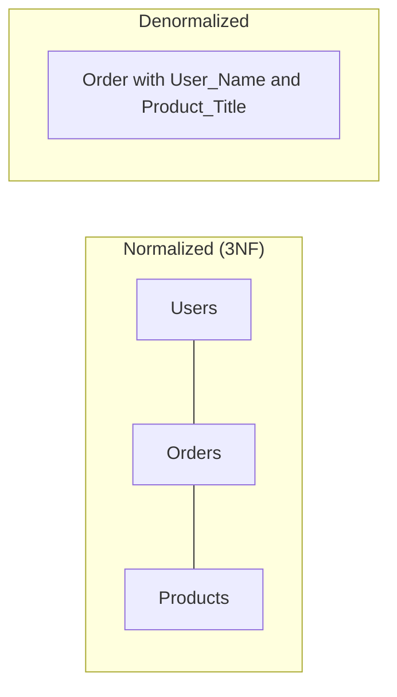

# 🏎️ Denormalization: Breaking Rules for Speed
> **Objective:** Understand when and why to intentionally duplicate data to optimize read performance | **Language:** Hinglish | **Standard:** 2026 Expert Framework

---

## 🧭 1. Beginner-Friendly Hinglish Explanation
Denormalization ka matlab hai "Database design ke rules ko jaan-bujhkar todna takki speed badh sake".

- **The Problem:** Normalization (3NF) data ko saaf rakhta hai, par iska matlab hai bahut saare "Joins". Agar aapki site par 1 crore users hain aur har baar profile ke liye 5 tables join ho rahi hain, toh site slow ho jayegi.
- **The Solution:** Kuch data ko repeat hone do. (e.g., Order table mein hi `User_Name` likh do, takki User table join na karni pade).
- **The Goal:** **Read performance** badhana.
- **Intuition:** Normalization "Organized Library" hai. Denormalization "Quick-Access Desk" hai jahan aapne apni roz ki zaroorat ki books pehle se rakhi hui hain, bhale hi wo library mein bhi hain.

---

## 🧠 2. Deep Technical Explanation
### 1. When to Denormalize?
- When Joins are too expensive.
- When you have a very high Read-to-Write ratio (e.g., Social media feeds).
- When you need to run complex aggregations frequently.

### 2. Common Techniques:
- **Redundant Columns:** Storing `category_name` in the `products` table.
- **Calculated Columns:** Storing `total_order_price` instead of calculating `SUM(price * quantity)` every time.
- **Summary Tables:** Creating a separate table for "Daily Total Sales" instead of scanning the `orders` table.

### 3. The Risk (Data Inconsistency):
If a user changes their name, you must update it in the `Users` table AND the `Orders` table. If you forget, the data becomes "Out of Sync".

---

## 🏗️ 3. Database Diagrams (Speed vs Cleanliness)


---

## 💻 4. Query Execution Examples
```sql
-- 🚀 Fast Read (Denormalized)
SELECT order_id, user_name, product_name FROM orders_denormalized;

-- 🐌 Slow Read (Normalized)
SELECT o.id, u.name, p.name 
FROM orders o 
JOIN users u ON o.user_id = u.id 
JOIN products p ON o.product_id = p.id;
```

---

## 🌍 5. Real-World Production Examples
- **Amazon:** Showing your "Order History". They don't want to join 10 tables for every historical order. They snapshot your info at the time of purchase.
- **Social Media:** Storing `like_count` in the `posts` table instead of doing `COUNT(*)` from the `likes` table every time someone views a post.

---

## ❌ 6. Failure Cases
- **Stale Data:** User changed their email, but the old email is still showing in old invoices because it was denormalized and never updated.
- **Wasted Space:** Storing huge strings in every row of a billion-row table can explode disk usage.
- **Complex Writes:** Your `UpdateProfile` code is now 50 lines long because it has to update data in 10 different tables.

---

## 🛠️ 7. Debugging Guide
| Problem | Reason | Solution |
| :--- | :--- | :--- |
| **Data Mismatch** | Sync failure | Create a "Cron Job" or "Database Trigger" to sync denormalized data. |
| **High Write Latency** | Too many updates | Consider if you really need to denormalize for THIS specific feature. |

---

## ⚖️ 8. Tradeoffs
- **Read Speed (Fast)** vs **Write Speed (Slow)** vs **Data Integrity (Risky).**

---

## 🛡️ 9. Security Concerns
- **PII Leak:** If you denormalize "User Address" into the "Public Posts" table by mistake, you have a massive privacy leak.

---

## 📈 10. Scaling Challenges
- **Large-scale Sync:** Updating 1 million rows because a "Category Name" changed is a nightmare. **Fix: Use 'ID' and denormalize only very stable data.**

---

## ✅ 11. Best Practices
- **Always start with 3NF.** Only denormalize if you have proof (performance metrics) that it's needed.
- **Use Triggers or Hooks** to keep data in sync.
- **Denormalize "Snapshots"** (Data that shouldn't change, like price at the time of order).

---

## ⚠️ 13. Common Mistakes
- **Denormalizing too early** (Premature optimization).
- **Not having a plan to sync data.**

---

## 📝 14. Interview Questions
1. "What is Denormalization and why is it used?"
2. "Explain the risks of Denormalization."
3. "How do you handle data consistency in a denormalized database?"

---

## 🚀 15. Latest 2026 Production Database Patterns
- **Virtual Denormalization:** Using **Materialized Views** to get the speed of denormalization without messing up your clean table structure.
- **Read Models (CQRS):** Maintaining a completely separate database (like Elasticsearch) for reads, which is fully denormalized, while the main SQL DB remains 3NF for writes.
漫
