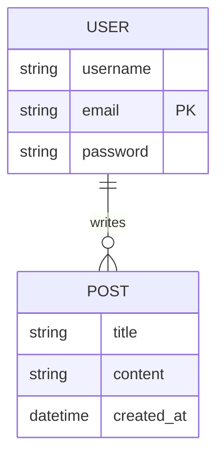

# 📊 ER Diagrams: Mapping the Reality
> **Objective:** Master how to visualize database structures using Entity-Relationship (ER) modeling | **Language:** Hinglish | **Standard:** 2026 Expert Framework

---

## 🧭 1. Beginner-Friendly Hinglish Explanation
ER Diagrams (Entity-Relationship) ka matlab hai "Database ka Blue-print (Naksha)".

- **The Problem:** Code likhne se pehle humein ye samajhna hota hai ki "Kaunsa data kis se juda hai?". Sidha tables banana start karoge toh galti hogi.
- **The Solution:** Ek drawing banavo jisme teen cheezein ho:
  1. **Entities (Dabba):** Real-world objects (e.g., User, Product).
  2. **Attributes (Oval):** Entities ki details (e.g., Name, Price).
  3. **Relationships (Diamond):** Entities ke beech ka link (e.g., User *buys* Product).
- **Intuition:** Ye ek "Family Tree" ki tarah hai. Aap pehle paper par draw karte hain ki kaun kiska bache hai, aur phir asli rishte banate hain.

---

## 🧠 2. Deep Technical Explanation
### 1. Entities:
A thing or object in the real world that is distinguishable from other objects.
- **Strong Entity:** Can exist on its own (User).
- **Weak Entity:** Depends on another entity (Order Items depend on Order).

### 2. Attributes:
Properties of an entity.
- **Key Attribute:** Uniquely identifies (Primary Key).
- **Composite Attribute:** Can be divided (Name -> First Name, Last Name).
- **Multi-valued Attribute:** Can have multiple values (Phone Numbers).
- **Derived Attribute:** Can be calculated (Age from Date of Birth).

### 3. Relationships:
How entities interact.
- **Degree:** Number of entities involved (Binary is most common).
- **Cardinality:** 1:1, 1:N, or M:N.

---

## 🏗️ 3. Database Diagrams (The ER Standard)


---

## 💻 4. Query Execution Examples (ER to SQL)
```sql
-- An ER diagram showing 1:N relationship between Dept and Employee
CREATE TABLE departments (
    dept_id INT PRIMARY KEY,
    name VARCHAR(100)
);

CREATE TABLE employees (
    emp_id INT PRIMARY KEY,
    name VARCHAR(100),
    dept_id INT,
    FOREIGN KEY (dept_id) REFERENCES departments(dept_id)
);
```

---

## 🌍 5. Real-World Production Examples
- **Hospital Management:** `Doctor` treats `Patient` (M:N Relationship).
- **Bank:** `Customer` has `Account` (1:N Relationship).

---

## ❌ 6. Failure Cases
- **Missing Relationships:** Designing a `Student` and `Course` table but forgetting the `Enrollment` table to link them.
- **Confusion between Attributes and Entities:** Making `City` an attribute of `User` when it should have been its own Entity to avoid redundancy.
- **Wrong Cardinality:** Marking a relationship as 1:1 when it's actually 1:N (e.g., A person can have multiple bank accounts!).

---

## 🛠️ 7. Debugging Guide
| Symptom | Reason | Solution |
| :--- | :--- | :--- |
| **Circular Dependency** | Loop in Relationships | Re-evaluate if you really need both tables to point to each other. |
| **Many-to-Many Issue** | No Bridge Table | In SQL, you cannot have M:N directly. You MUST create a third 'Junction' table. |

---

## ⚖️ 8. Tradeoffs
- **Complex ER (Accurate but hard to manage)** vs **Simplified ER (Fast but might have data gaps).**

---

## 🛡️ 9. Security Concerns
- **Data Privacy:** Marking sensitive attributes (like `Aadhar_Number`) in your ER diagram helps engineers know which columns need encryption later.

---

## 📈 10. Scaling Challenges
- **Large ERs:** A diagram with 200+ tables is impossible to read. **Fix: Group them into 'Sub-schemas' or 'Domains' (e.g., Auth, Payments, Inventory).**

---

## ✅ 11. Best Practices
- **Always identify the Primary Key for every entity.**
- **Specify Cardinality (1:1, 1:N) clearly.**
- **Use standard notation (Chen's or Crow's Foot).**
- **Keep it simple; don't over-complicate attributes.**

---

## ⚠️ 13. Common Mistakes
- **Treating a Primary Key as a simple attribute.**
- **Forgetting weak entity dependencies.**

---

## 📝 14. Interview Questions
1. "What is the difference between a Strong and a Weak entity?"
2. "How do you represent a Many-to-Many relationship in an ER diagram?"
3. "Explain Cardinality and Modality."

---

## 🚀 15. Latest 2026 Production Database Patterns
- **Visual Schema Evolution:** Tools like **Prisma** or **Drizzle** that generate your database schema directly from a visual or text-based ER model.
- **Living Diagrams:** Modern tools that sync with your actual database and auto-generate the ER diagram whenever a table changes.
漫
