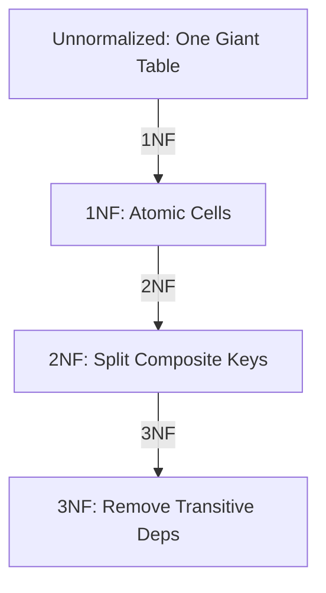

# 🧹 Normalization: Organizing Data for Integrity
> **Objective:** Master the art of splitting tables to reduce data redundancy and improve consistency | **Language:** Hinglish | **Standard:** 2026 Expert Framework

---

## 🧭 1. Beginner-Friendly Hinglish Explanation
Normalization ka matlab hai "Data ko sahi dheron (Tables) mein bantna".

- **The Problem:** Socho aap ek hi table mein `User Name`, `User Address`, aur `Order Name` sab likh rahe ho. Agar ek user 10 orders karega, toh uska `Name` aur `Address` 10 baar likhna padega. Waste of space! Aur agar address badlega, toh 10 jagah change karna padega.
- **The Solution:** Data ko "Categories" mein todo. User ki info User table mein, Order ki info Order table mein.
- **The Goals:** 
  1. **Redundancy khatam karna:** Data repeat nahi hona chahiye.
  2. **Anomalies rokna:** Update, Delete, aur Insert karte waqt koi error na aaye.
- **Intuition:** Ye "Cupboard organize" karne jaisa hai. Kapde alag, joote alag, aur files alag. Agar sab mix karoge (Denormalized), toh kuch dhoondhna mushkil ho jayega.

---

## 🧠 2. Deep Technical Explanation
### 1. 1st Normal Form (1NF) - Atomicity:
- Each cell must have only one value (Atomic).
- No repeating groups/arrays.
- Each row must be unique (Primary Key).

### 2. 2nd Normal Form (2NF) - No Partial Dependency:
- Must be in 1NF.
- Every non-key column must depend on the **whole** primary key (only relevant for Composite Keys).

### 3. 3rd Normal Form (3NF) - No Transitive Dependency:
- Must be in 2NF.
- No non-key column should depend on another non-key column. (e.g., `City` depends on `ZipCode`, not directly on `User_ID`).

### 4. Boyce-Codd Normal Form (BCNF):
- A stricter version of 3NF for tables with overlapping candidate keys.

---

## 🏗️ 3. Database Diagrams (The Normalization Journey)


---

## 💻 4. Query Execution Examples (Normalization in Action)
```sql
-- ❌ Bad Design (Unnormalized)
-- Student_ID, Name, Course, Teacher, Teacher_Phone
-- 1, Sameer, Math, Mr. X, 999
-- 1, Sameer, Science, Mr. Y, 888

-- ✅ Good Design (Normalized to 3NF)
-- Students Table: id, name
-- Teachers Table: id, name, phone
-- Courses Table: id, name, teacher_id
-- Enrollments Table: student_id, course_id
```

---

## 🌍 5. Real-World Production Examples
- **E-commerce:** Moving `ShippingAddress` out of `Orders` into a separate `Addresses` table so users can save multiple addresses.
- **SaaS:** Separating `BillingInfo` from `UserAccount` data.

---

## ❌ 6. Failure Cases
- **Update Anomaly:** Updating a teacher's phone number in one row but forgetting the other 50 rows where they teach.
- **Insertion Anomaly:** You can't add a new teacher unless they are assigned to a student (in a bad design).
- **Deletion Anomaly:** Deleting the last student in a class accidentally deletes the teacher's info too.

---

## 🛠️ 7. Debugging Guide
| Symptom | Reason | Solution |
| :--- | :--- | :--- |
| **Data Mismatch** | Redundancy | Check if the same info is stored in two tables. |
| **Logic is too complex** | Under-normalization | Split the table into more logical units. |

---

## ⚖️ 8. Tradeoffs
- **Normalized (Clean/Small/Slow Joins)** vs **Denormalized (Messy/Large/Fast Reads).** In production, we usually stay in 3NF and denormalize only for performance.

---

## 🛡️ 9. Security Concerns
- **Granular Permissions:** Normalization allows you to give someone access to the `Orders` table without giving them access to the `Users` (PII) table.

---

## 📈 10. Scaling Challenges
- **Join Complexity:** 3NF can lead to "Join Hell" (joining 10 tables for one page). **Fix: Use Caching (Redis) or Materialized Views.**

---

## ✅ 11. Best Practices
- **Aim for 3NF by default.**
- **Don't over-normalize** (Creating a separate table for just 'Color' might be overkill).
- **Use meaningful relationships.**

---

## ⚠️ 13. Common Mistakes
- **Creating 1:1 relationships everywhere.** (Usually, those should be one table).
- **Storing calculated values** (like `TotalAmount`) instead of calculating them on the fly.

---

## 📝 14. Interview Questions
1. "Explain the 3 Normal Forms with an example."
2. "What is a Transitive Dependency?"
3. "When would you intentionally break normalization rules?"

---

## 🚀 15. Latest 2026 Production Database Patterns
- **Functional Normalization:** In Microservices, we normalize data within a service but might duplicate some data across services to ensure "Database per Service" independence.
- **Schema-on-Read:** NoSQL approach where you don't normalize, and the application handles the logic (Useful for Big Data).
漫
