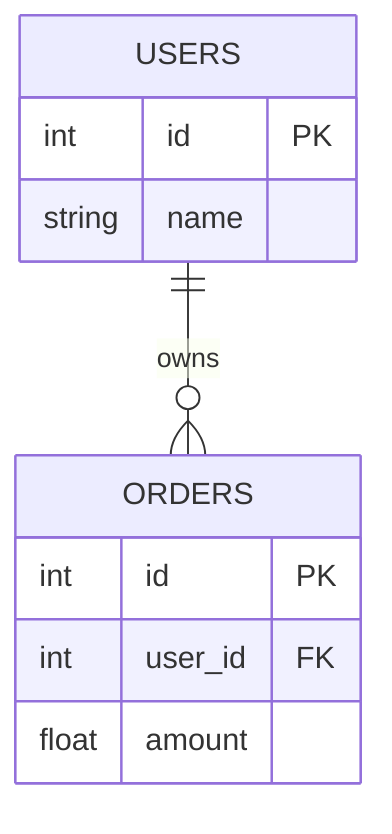

# 🔑 Primary and Foreign Keys: The DNA of Relationships
> **Objective:** Master how to uniquely identify rows and link tables together using keys | **Language:** Hinglish | **Standard:** 2026 Expert Framework

---

## 🧭 1. Beginner-Friendly Hinglish Explanation
Keys ka matlab hai "Table ke records ki Pehchan aur unka Rishta".

- **Primary Key (PK):** Ye ek aisi column hai jo har row ko unique banati hai. (e.g., Aapka Roll Number ya Aadhaar Card). Ye kabhi `NULL` nahi ho sakti.
- **Foreign Key (FK):** Ye ek table ki column hoti hai jo dusri table ki Primary Key se judi hoti hai. (e.g., Order table mein `user_id` jo batata hai ki ye order kisne kiya).
- **The Purpose:** PK ensure karta hai ki data repeat na ho. FK ensure karta hai ki tables ke beech mein sahi "Connection" rahe.
- **Intuition:** Primary Key aapke ghar ka "Unique Address" hai. Foreign Key aapke "Relative ke ghar ka address" hai jo aapne apni diary mein likha hai takki aap unse mil saken.

---

## 🧠 2. Deep Technical Explanation
### 1. Primary Key (PK):
- Must be unique and non-null.
- Only one PK per table (though it can be a **Composite Key** made of multiple columns).
- **Surrogate Key:** An artificial ID (like `AUTO_INCREMENT` integer or `UUID`).
- **Natural Key:** A real-world value that is unique (like `Social Security Number`). **Best Practice: Use Surrogate Keys.**

### 2. Foreign Key (FK):
- A column that refers to a PK in another table.
- **Referential Integrity:** It ensures you cannot have an order for a user that doesn't exist.
- **Actions on Change:**
  - `ON DELETE CASCADE`: If User is deleted, delete their orders too.
  - `ON DELETE SET NULL`: If User is deleted, keep orders but set `user_id` to NULL.
  - `ON DELETE RESTRICT`: Don't allow deleting User if they have orders.

### 3. Candidate & Super Keys:
- **Super Key:** Any set of columns that uniquely identify a row.
- **Candidate Key:** A minimal Super Key (no extra columns). One of these is chosen as the Primary Key.

---

## 🏗️ 3. Database Diagrams (Linking Tables)


---

## 💻 4. Query Execution Examples
```sql
-- Creating table with Primary and Foreign Keys
CREATE TABLE categories (
    id SERIAL PRIMARY KEY,
    name VARCHAR(50) NOT NULL
);

CREATE TABLE products (
    id SERIAL PRIMARY KEY,
    name VARCHAR(100),
    category_id INT,
    CONSTRAINT fk_category
      FOREIGN KEY(category_id) 
	  REFERENCES categories(id)
	  ON DELETE CASCADE
);
```

---

## 🌍 5. Real-World Production Examples
- **WhatsApp:** Your `Phone Number` (or Internal ID) is the Primary Key. Your messages have a Foreign Key pointing to your ID.
- **E-commerce:** `OrderItems` table has Foreign Keys pointing to both `Orders` and `Products`.

---

## ❌ 6. Failure Cases
- **Key Collisions:** Two different rows getting the same ID (Happens if logic is in code instead of DB).
- **Orphan Rows:** Having a child row with a Foreign Key that points to nothing. **Fix: Always use DB-level Foreign Key constraints.**
- **Slow Deletes:** Deleting a parent row with `CASCADE` can be very slow if there are millions of child rows.

---

## 🛠️ 7. Debugging Guide
| Error | Reason | Solution |
| :--- | :--- | :--- |
| **Cannot delete or update a parent row** | Restrict constraint | Delete the child records first, or change the constraint to `CASCADE`. |
| **Integrity constraint violation** | Inserting an invalid FK | Check if the ID you are inserting actually exists in the parent table. |

---

## ⚖️ 8. Tradeoffs
- **Integers (Fast/Small)** vs **UUIDs (Global unique/Large/Slower).** **2026 Trend: Use ULID or UUIDv7 for distributed systems.**

---

## 🛡️ 9. Security Concerns
- **ID Enumeration:** If your IDs are `1, 2, 3`, an attacker can guess other user's data by changing the URL. **Fix: Use UUIDs for public-facing IDs.**

---

## 📈 10. Scaling Challenges
- **Foreign Key Overhead:** Checking FK constraints on every insert adds latency. High-scale apps (like YouTube) sometimes disable FKs at the DB level and handle them in code. (Dangerous!).

---

## ✅ 11. Best Practices
- **Use Surrogate Keys (ID) for most tables.**
- **Always define Foreign Keys to keep data clean.**
- **Index your Foreign Key columns** (Most DBs don't do this automatically, and it speeds up Joins).

---

## ⚠️ 13. Common Mistakes
- **Using a column that can change (like Email) as a Primary Key.**
- **Forgetting `NOT NULL` on Foreign Key columns.**

---

## 📝 14. Interview Questions
1. "Difference between Primary Key and Unique Key?" (Unique key can be NULL).
2. "What is a Composite Key?"
3. "Explain ON DELETE CASCADE."

---

## 🚀 15. Latest 2026 Production Database Patterns
- **UUIDv7:** A time-ordered UUID that is as fast to index as an integer but globally unique.
- **Soft FKs:** Using "Logical" foreign keys in distributed databases where "Physical" constraints are too expensive to maintain across nodes.
漫
