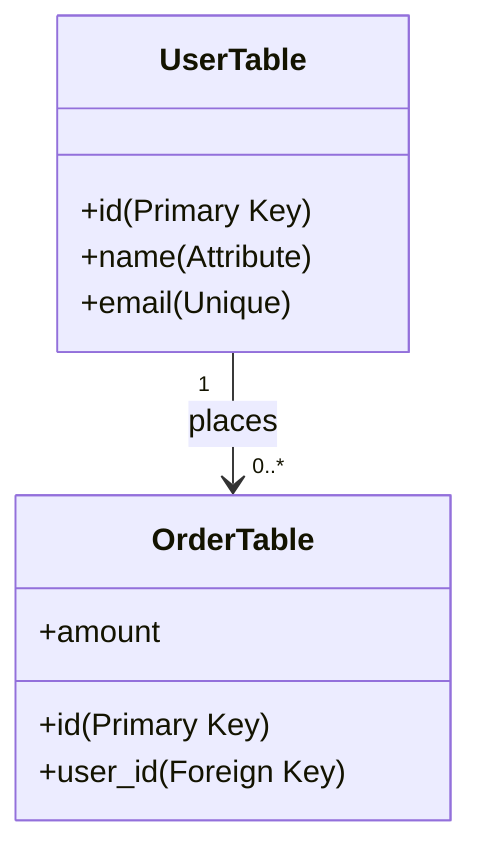

# 📐 The Relational Model: Organizing Data in Tables
> **Objective:** Understand the mathematical foundation of modern databases (Tables, Rows, and Columns) | **Language:** Hinglish | **Standard:** 2026 Expert Framework

---

## 🧭 1. Beginner-Friendly Hinglish Explanation
Relational Model ka matlab hai "Data ko Tables (Relation) mein fit karna".

- **The Idea:** Duniya ki har information ko hum ek Table (Relation) mein rakh sakte hain. Har table mein Rows (Tuples) aur Columns (Attributes) hote hain.
- **Why Relational?** Kyunki ye Tables aapas mein "Relate" karti hain. Ek User table, ek Order table se jud sakti hai.
- **The Core Parts:** 
  1. **Relation:** Table ka technical naam.
  2. **Tuple:** Row ka technical naam.
  3. **Attribute:** Column ka technical naam.
  4. **Domain:** Column mein kya data aa sakta hai (e.g., Integer, String).
- **Intuition:** Ye ek "Excel Workbook" ki tarah hai. Har sheet ek table hai. Har row ek entry hai. Aur aap "VLOOKUP" jaisa kuch karke (Joins) sheets ko connect karte hain.

---

## 🧠 2. Deep Technical Explanation
### 1. Mathematical Foundation:
Relational model is based on **Set Theory** and **Predicate Logic**. A relation is a set of tuples. This is why duplicate rows are technically not allowed in a pure relational model.

### 2. Properties of Relations:
- **Atomicity:** Every cell must contain only one value (No lists/arrays inside a cell).
- **No Order:** The order of rows or columns doesn't matter mathematically.
- **Unique Names:** Columns in a table must have unique names.
- **Primary Key:** Every row must be uniquely identifiable.

### 3. Constraints (The Rules):
- **Entity Integrity:** Primary key cannot be NULL.
- **Referential Integrity:** Foreign key must point to a valid Primary Key in another table.

---

## 🏗️ 3. Database Diagrams (The Table Structure)


---

## 💻 4. Query Execution Examples (Schema Definition)
```sql
-- Defining a Relation (Table)
CREATE TABLE employees (
    emp_id INT PRIMARY KEY,      -- Entity Integrity
    first_name VARCHAR(50),      -- Attribute
    salary DECIMAL(10,2),        -- Domain
    dept_id INT,
    FOREIGN KEY (dept_id) REFERENCES departments(id) -- Referential Integrity
);
```

---

## 🌍 5. Real-World Production Examples
- **University System:** `Students` table related to `Courses` table via a `Enrollments` table.
- **E-commerce:** `Products` related to `Suppliers` and `Inventory`.

---

## ❌ 6. Failure Cases
- **Data Anomaly:** If you store a user's address in the `Orders` table, and the user moves, you have to update 100 rows. If you miss one, you have "Inconsistent Data". **Fix: Normalize into separate tables.**
- **Orphan Records:** Deleting a User but keeping their Orders. The Orders now point to "Nobody". **Fix: Use Foreign Key constraints.**

---

## 🛠️ 7. Debugging Guide
| Error | Reason | Solution |
| :--- | :--- | :--- |
| **Foreign Key Violation** | Parent record doesn't exist | Ensure you create the User before you create their Order. |
| **Not in 1NF** | Multiple values in one cell | Split the values into separate rows or a separate table. |

---

## ⚖️ 8. Tradeoffs
- **Relational (Structured/Rigid)** vs **NoSQL (Unstructured/Flexible).** Relational is better when data integrity is the top priority.

---

## 🛡️ 9. Security Concerns
- **Schema Exposure:** If an attacker knows your relational structure, they can guess Join paths for SQL Injection.

---

## 📈 10. Scaling Challenges
- **Join Explosion:** As the number of related tables grows, queries become slower. **Fix: Use Indexing or limited Denormalization.**

---

## ✅ 11. Best Practices
- **Every table must have a Primary Key.**
- **Enforce Referential Integrity with Foreign Keys.**
- **Keep data 'Atomic' (1st Normal Form).**
- **Use meaningful table and column names.**

---

## ⚠️ 13. Common Mistakes
- **Using a table as a dump for all data** (The "God Table").
- **Ignoring constraints** (Thinking the code will handle it).

---

## 📝 14. Interview Questions
1. "What are the core properties of a Relation?"
2. "Explain Entity Integrity vs Referential Integrity."
3. "Why are duplicate rows discouraged in the Relational Model?"

---

## 🚀 15. Latest 2026 Production Database Patterns
- **Post-Relational Features:** Modern RDBMS like Postgres adding support for JSON, XML, and Arrays, breaking the "Atomicity" rule strictly to provide NoSQL-like flexibility where needed.
- **Immutable Databases:** Storing every change as a new row (Relational + Event Sourcing) so you never "Update" or "Delete" data, you only "Add" to it.
漫
