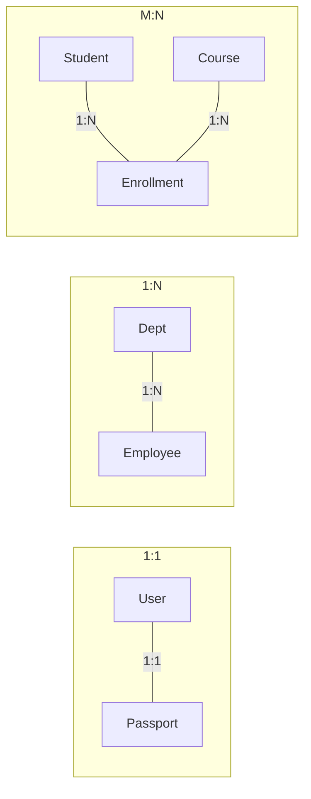

# 🔗 Relationship Types: Connecting Entities
> **Objective:** Master how entities interact using One-to-One, One-to-Many, and Many-to-Many relationships | **Language:** Hinglish | **Standard:** 2026 Expert Framework

---

## 🧭 1. Beginner-Friendly Hinglish Explanation
Relationship Types ka matlab hai "Do tables ke beech ka rishta kaisa hai?".

- **1. One-to-One (1:1):** Ek item ke liye sirf ek hi dusra item. (e.g., Ek Insaan ka sirf ek hi Passport ho sakta hai).
- **2. One-to-Many (1:N):** Ek item ke liye bahut saare dusre items. (e.g., Ek Mother ke bahut saare bache ho sakte hain, par har bache ki ek hi biological mother hoti hai). **Sabse common yahi hai.**
- **3. Many-to-Many (M:N):** Bahut saare items, bahut saare dusre items se jude hain. (e.g., Ek Student bahut saare Courses le sakta hai, aur ek Course mein bahut saare Students ho sakte hain).
- **Intuition:** Ye "Social Network" ki tarah hai. Aapka kisi ke saath "Sibling" relationship hai, kisi ke saath "Friend" relationship hai, aur kisi ke saath "Group Member" relationship hai.

---

## 🧠 2. Deep Technical Explanation
### 1. One-to-One (1:1):
- **Implementation:** Both tables have the same Primary Key, or one table has a Unique Foreign Key pointing to the other.
- **Use Case:** Splitting a large table into two for security or performance (e.g., `User` and `UserSecrets`).

### 2. One-to-Many (1:N):
- **Implementation:** The "Many" side table has a Foreign Key pointing to the "One" side's Primary Key.
- **Example:** `Departments` (1) and `Employees` (N).

### 3. Many-to-Many (M:N):
- **Implementation:** Cannot be done directly in SQL. You need a **Junction Table** (also called Bridge or Associative table).
- **Example:** `Students`, `Courses`, and the junction table `Enrollments` (which contains `student_id` and `course_id`).

---

## 🏗️ 3. Database Diagrams (Relationship Logic)


---

## 💻 4. Query Execution Examples (Implementing M:N)
```sql
-- Implementing Many-to-Many
CREATE TABLE students (
    id SERIAL PRIMARY KEY,
    name VARCHAR(100)
);

CREATE TABLE courses (
    id SERIAL PRIMARY KEY,
    title VARCHAR(100)
);

-- The Junction Table (Enrollment)
CREATE TABLE enrollments (
    student_id INT REFERENCES students(id),
    course_id INT REFERENCES courses(id),
    enrollment_date DATE,
    PRIMARY KEY (student_id, course_id) -- Composite Key
);
```

---

## 🌍 5. Real-World Production Examples
- **Amazon:** `Customers` to `Orders` (1:N). `Orders` to `Products` (M:N via `OrderItems`).
- **Slack:** `Workspace` to `Channels` (1:N). `Users` to `Channels` (M:N).

---

## ❌ 6. Failure Cases
- **M:N directly in one table:** Trying to store a comma-separated list of IDs in a single column. **Fix: Use a Junction Table.**
- **Wrong Relationship Choice:** Using 1:1 for `Users` and `Profiles` when a user should actually be allowed to have multiple profiles.
- **Dangling Joins:** Not using Foreign Keys, leading to relationships that point to deleted records.

---

## 🛠️ 7. Debugging Guide
| Problem | Reason | Solution |
| :--- | :--- | :--- |
| **Duplicate Relationships** | Missing Unique constraint | For 1:1, ensure the Foreign Key is `UNIQUE`. |
| **Slow Query on M:N** | Missing Indexes | Always index both Foreign Keys in the Junction table. |

---

## ⚖️ 8. Tradeoffs
- **Junction Table (Clean/Scalable)** vs **Array column (Fast but hard to query/index).**

---

## 🛡️ 9. Security Concerns
- **Relationship Traversal:** Ensure that a user can't "Join" their way into data they aren't supposed to see (e.g., Joining from a Public Post to a Private User Profile).

---

## 📈 10. Scaling Challenges
- **Junction Table Explosion:** If you have 1 billion users and 1 billion products, the `Likes` junction table can reach trillions of rows. **Fix: Partitioning or Sharding.**

---

## ✅ 11. Best Practices
- **Use 1:N as the default for most connections.**
- **Always use a Junction table for M:N.**
- **Name junction tables logically** (`Student_Courses` or `Enrollments`).

---

## ⚠️ 13. Common Mistakes
- **Forgetting that M:N needs a third table.**
- **Using 1:1 when 1:N was needed.**

---

## 📝 14. Interview Questions
1. "How do you implement a Many-to-Many relationship in SQL?"
2. "What is a Composite Key and where is it commonly used?" (Junction tables).
3. "Can you have a 1:1 relationship in the same table?" (Self-referencing).

---

## 🚀 15. Latest 2026 Production Database Patterns
- **Graph Extensions:** Using PostgreSQL's **Apache AGE** extension to handle complex Many-to-Many relationships as a "Graph" instead of joining massive junction tables.
- **Relational Embeddings:** Storing related data as JSONB arrays for performance, but with Z-order indexing to maintain query speed.
漫
