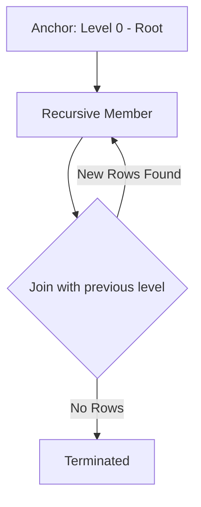

# 🌳 CTEs and Recursive Queries: Writing Readable SQL
> **Objective:** Master Common Table Expressions (CTEs) for query organization and Recursive queries for hierarchical data | **Language:** Hinglish | **Standard:** 2026 Expert Framework

---

## 🧭 1. Beginner-Friendly Hinglish Explanation
CTEs (Common Table Expressions) ka matlab hai "Temp variables in SQL".

- **The Problem:** Jab aapki SQL query 100 lines ki ho jati hai aur usme 5 subqueries hoti hain, toh code padhna impossible ho jata hai.
- **The Solution (CTE):** Aap `WITH` keyword use karke subqueries ko naam de dete hain (e.g., `WITH total_sales AS (...)`). Ab aap niche main query mein `total_sales` ko ek table ki tarah use kar sakte hain.
- **Recursive CTE:** Ye ek special power hai. Ye query "Apne aap ko call karti hai" (Loop ki tarah).
- **Intuition:** CTE ek "Rough work" space ki tarah hai. Aap pehle rough calculation karte hain, use ek naam dete hain, aur phir final fair query likhte hain.

---

## 🧠 2. Deep Technical Explanation
### 1. Standard CTE (Non-Recursive):
A temporary result set which you can reference within another SELECT, INSERT, UPDATE, or DELETE statement.
- **Scope:** Exists only during the execution of the query.
- **Readability:** Replaces nested subqueries with a clean, top-down structure.

### 2. Recursive CTE:
Used to query hierarchical data (Trees, Graphs).
- **Structure:**
  1. **Anchor Member:** The starting point (e.g., The CEO in an Org Chart).
  2. **Recursive Member:** Joins the CTE with the anchor (The "Loop").
  3. **Termination Condition:** When to stop (Implicitly when no more rows are returned).

---

## 🏗️ 3. Database Diagrams (The Recursive Loop)


---

## 💻 4. Query Execution Examples
```sql
-- 1. Standard CTE (Query Organization)
WITH user_scores AS (
    SELECT user_id, SUM(score) AS total 
    FROM activities GROUP BY user_id
),
top_users AS (
    SELECT user_id FROM user_scores WHERE total > 100
)
SELECT u.name, us.total 
FROM users u 
JOIN user_scores us ON u.id = us.user_id
WHERE u.id IN (SELECT user_id FROM top_users);

-- 2. Recursive CTE (Organization Hierarchy)
WITH RECURSIVE org_chart AS (
    -- Anchor: Find the CEO
    SELECT id, name, manager_id, 1 AS level
    FROM employees WHERE manager_id IS NULL
    UNION ALL
    -- Recursive: Find everyone reporting to the previous level
    SELECT e.id, e.name, e.manager_id, oc.level + 1
    FROM employees e
    INNER JOIN org_chart oc ON e.manager_id = oc.id
)
SELECT * FROM org_chart;
```

---

## 🌍 5. Real-World Production Examples
- **Comments Threads:** Infinite nested comments (Reddit style).
- **Organization Structure:** Finding all subordinates of a manager.
- **Supply Chain:** "Bill of Materials" (Product -> Parts -> Raw Materials).

---

## ❌ 6. Failure Cases
- **Infinite Loops:** Forgetting a termination condition in a Recursive CTE. **Fix: Use `MAXRECURSION` limit.**
- **Performance:** CTEs in some older DBs (like MySQL < 8.0) were not optimized and ran as slow subqueries.
- **Memory Usage:** Large recursive results can exhaust server memory.

---

## 🛠️ 7. Debugging Guide
| Problem | Reason | Solution |
| :--- | :--- | :--- |
| **Query hangs** | Infinite Recursion | Check your `JOIN` logic in the recursive member. |
| **Code is messy** | Nested Subqueries | Refactor into multiple named CTEs. |

---

## ⚖️ 8. Tradeoffs
- **CTE (Readable/Maintainable)** vs **Subquery (Sometimes faster in older optimizers).** In 2026, always prefer CTEs.

---

## 🛡️ 9. Security Concerns
- **Depth-based Attacks:** An attacker crafting data that causes a very deep recursion, leading to a Denial of Service (DoS).

---

## 📈 10. Scaling Challenges
- **Recursive Overhead:** Querying 50 levels of hierarchy is fast, but 5,000 levels can become a bottleneck. **Fix: Use 'Path' or 'Nested Set' models for very deep trees.**

---

## ✅ 11. Best Practices
- **Use meaningful names for your CTEs.**
- **Keep CTEs small and focused.**
- **Always test Recursive CTEs with a `LIMIT` first.**

---

## ⚠️ 13. Common Mistakes
- **Forgetting the `RECURSIVE` keyword.**
- **Trying to reference a CTE before it is defined.**

---

## 📝 14. Interview Questions
1. "Difference between a Subquery and a CTE?"
2. "How do you handle an infinite loop in a Recursive CTE?"
3. "Can a CTE be used with an UPDATE statement?" (Yes).

---

## 🚀 15. Latest 2026 Production Database Patterns
- **Materialized CTEs:** (Postgres 12+) Using `MATERIALIZED` hint to force the DB to calculate the CTE once and reuse the result, preventing redundant calculations.
- **Graph Queries:** Using CTEs to implement "Shortest Path" algorithms directly in SQL without needing a specialized Graph DB.
漫
