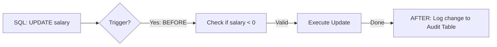

# ⚡ Triggers: Automated Database Actions
> **Objective:** Master how to automatically execute SQL code in response to Insert, Update, or Delete events | **Language:** Hinglish | **Standard:** 2026 Expert Framework

---

## 🧭 1. Beginner-Friendly Hinglish Explanation
Triggers ka matlab hai "Database ke sensors jo kisi event par automatic react karte hain".

- **The Problem:** Aap chahte hain ki jab bhi koi user `Password` badle, toh ek entry `audit_logs` table mein apne aap ho jaye. Aap nahi chahte ki har baar developer ko yaad rakhna pade audit log likhna.
- **The Solution:** Aap ek "Trigger" banate hain jo `users` table ko watch karta hai. Jaise hi `UPDATE` hota hai, Trigger apne aap audit code chala deta hai.
- **The Timing:** 
  1. **BEFORE Trigger:** Event hone se pehle (e.g., Data validate karna).
  2. **AFTER Trigger:** Event hone ke baad (e.g., Dusri table update karna).
- **Intuition:** Ye ek "Burglar Alarm" ki tarah hai. Aapko alarm bajana nahi padta, wo "Darwaza khulne" (Event) par apne aap baj jata hai.

---

## 🧠 2. Deep Technical Explanation
### 1. Definition:
A trigger is a stored procedure that automatically runs when an event occurs in the database server.
- **DML Triggers:** React to `INSERT`, `UPDATE`, `DELETE`.
- **DDL Triggers:** React to `CREATE`, `ALTER`, `DROP` (Used for auditing schema changes).

### 2. The `OLD` and `NEW` Keywords:
- **NEW:** Referencing the values being inserted or updated.
- **OLD:** Referencing the values before they were updated or deleted.

### 3. Row-Level vs Statement-Level:
- **Row-Level:** Runs once for every row affected. (e.g., Updating 10 rows triggers it 10 times).
- **Statement-Level:** Runs once per SQL statement, regardless of how many rows are changed.

---

## 🏗️ 3. Database Diagrams (The Trigger Chain)


---

## 💻 4. Query Execution Examples
```sql
-- 1. Create a function for the trigger (Postgres)
CREATE OR REPLACE FUNCTION log_price_change()
RETURNS TRIGGER AS $$
BEGIN
    IF OLD.price <> NEW.price THEN
        INSERT INTO price_history(product_id, old_price, new_price, changed_at)
        VALUES (OLD.id, OLD.price, NEW.price, NOW());
    END IF;
    RETURN NEW;
END;
$$ LANGUAGE plpgsql;

-- 2. Attach the trigger to a table
CREATE TRIGGER tr_price_history
AFTER UPDATE ON products
FOR EACH ROW
EXECUTE FUNCTION log_price_change();
```

---

## 🌍 5. Real-World Production Examples
- **Audit Logs:** Keeping track of who changed what and when.
- **Data Validation:** Preventing "Negative balance" or "Invalid dates" before they hit the table.
- **Derived Data Sync:** Automatically updating `total_spent` in the `Users` table whenever a new order is added.

---

## ❌ 6. Failure Cases
- **Recursive Triggers:** Table A updates Table B, which triggers an update back to Table A. This causes a loop and crashes the DB.
- **Performance Drag:** A heavy trigger on a table with 1,000 inserts per second will slow down the entire system.
- **"Hidden" Logic:** Developers might get confused because data is changing "automatically" and they can't find the code in the backend.

---

## 🛠️ 7. Debugging Guide
| Symptom | Reason | Solution |
| :--- | :--- | :--- |
| **Transaction Fails** | Trigger Error | If a trigger fails, the whole INSERT/UPDATE is rolled back. Check the trigger's syntax and logic. |
| **Data out of sync** | Trigger didn't fire | Check if you used a `Statement-level` trigger when you needed a `Row-level` one. |

---

## ⚖️ 8. Tradeoffs
- **Triggers (Guaranteed Integrity)** vs **Application Hooks (Easier to debug/version control).**

---

## 🛡️ 9. Security Concerns
- **Bypassing Triggers:** Some commands (like `TRUNCATE` or bulk loads) might bypass triggers in certain DBs. Attackers can use this to delete data without leaving audit logs.

---

## 📈 10. Scaling Challenges
- **Lock Contention:** Triggers extend the duration of a transaction, meaning rows are locked for longer. This kills performance in high-concurrency systems.

---

## ✅ 11. Best Practices
- **Keep triggers very small and fast.**
- **Don't use triggers for "Business Logic"** (e.g., sending emails).
- **Document all triggers clearly** so other developers know they exist.
- **Avoid deep trigger nesting** (Trigger calling another trigger).

---

## ⚠️ 13. Common Mistakes
- **Forgetting that a trigger is part of the transaction.**
- **Using triggers to perform long-running tasks.**

---

## 📝 14. Interview Questions
1. "Difference between BEFORE and AFTER triggers?"
2. "What are the risks of using too many triggers?"
3. "Explain OLD and NEW pseudo-records."

---

## 🚀 15. Latest 2026 Production Database Patterns
- **Serverless Triggers:** Databases like **Supabase** or **AWS Aurora** can trigger a Lambda function or an Edge function directly from a DB event. (DB to Code instead of DB to DB).
- **Constraint Triggers:** Special triggers that only fire at the very end of a transaction (Deferred triggers).
漫
